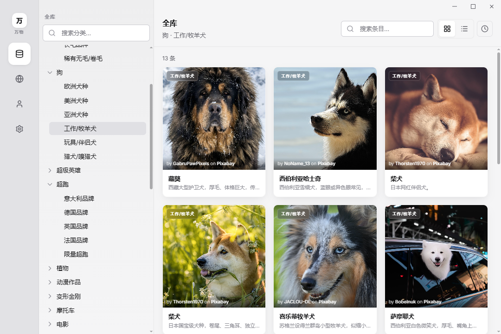
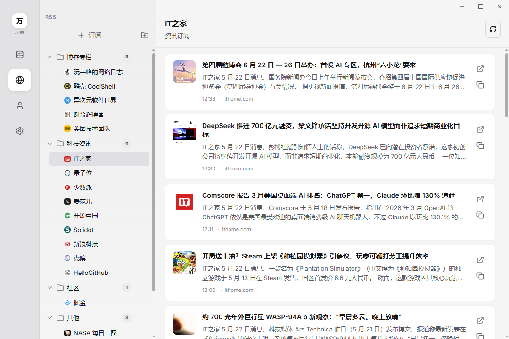
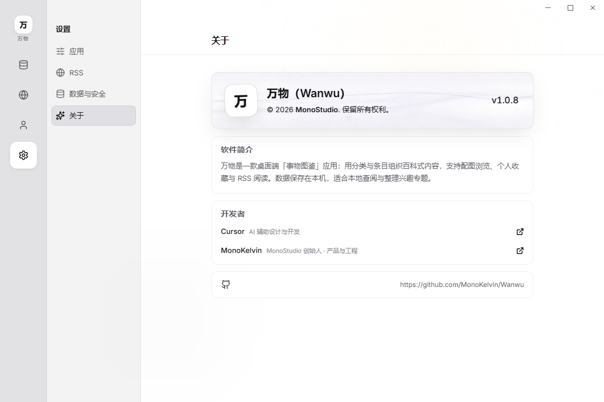
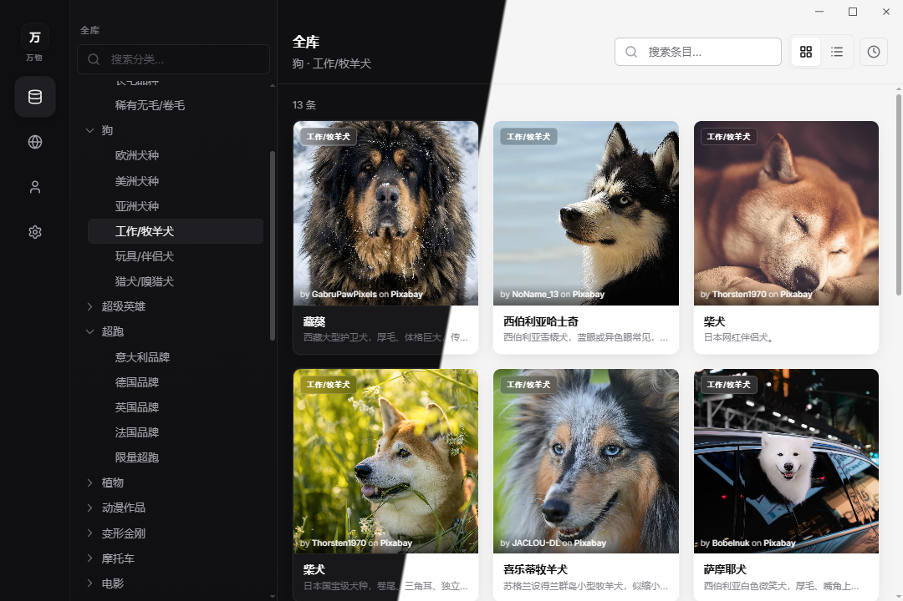

# 万物（Wanwu）

> 本仓库中**所有代码、文档与资源**均由 [**Cursor Agent**](https://cursor.com) 参与生成；部分图片和文档信息经由 [**Trae SOLO**](https://solo.trae.cn/) 收集并整理；开发者本人负责监督和取餐。鼠鼠我呀，是一行代码都不想写了~(￣▽￣)~*
> 
> **郑重声明：** 本项目仅供学习与非商业使用；素材可能涉及第三方版权，商业使用及由此产生的法律责任由使用者自行承担。

<p align="center">
  
</p>

**万物** 是一款安装在您电脑上的桌面软件，用来**分类浏览、收藏和阅读**各类「事物」——例如猫狗品种、植物、电影、书籍、腕表、美食等。内容以图文卡片形式呈现，像一本可搜索、可收藏的多主题图鉴；同时支持订阅网络资讯（RSS），在个人中心统一管理收藏与资料。

<p align="center">
  
</p>

---

## 这个项目是做什么的？

可以把万物理解成三部分能力组合在一起：

| 能力 | 通俗说明 |
|------|----------|
| **内置图鉴库** | 软件自带大量已整理好的条目（名称、简介、参数、配图与长文介绍），按「大类 → 子类」浏览 |
| **个人空间** | 给喜欢的条目点收藏、分组；可填写昵称、头像等简单资料 |
| **资讯订阅** | 自行添加 RSS 订阅源，在软件内阅读拉取到的文章列表 |

适合：想**离线或本地查阅**兴趣知识、做主题收藏、顺带读订阅资讯的用户。  
不适合：需要多人协作编辑、实时云端同步或复杂办公场景——万物更偏向**个人本地查阅与整理**。

---

## 功能架构

### 主要模块

| 模块 | 您能看到什么 | 常见操作 |
|------|----------------|----------|
| **全库** | 左侧选大类与子类；中间为条目卡片列表；点卡片进入详情 | 搜索、看图与文字介绍、规格参数 |
| **RSS** | 订阅源列表与文章条目 | 添加/删除订阅、阅读摘要、在浏览器打开原文 |
| **云斋** | 三维展车与车身定制（v1.1） | 浏览车型、切换车身颜色等 |
| **个人** | 头像昵称、收藏分组与已收藏条目 | 管理收藏、查看历史浏览（若已启用） |
| **设置** | 主题、导航样式、数据目录、备份与诊断等 | 切换浅色/深色、查看本机数据路径 |

### 界面预览

<p align="center">
  <strong>全库</strong><br />
  
</p>

<p align="center">
  <strong>RSS</strong><br />
  
</p>

<p align="center">
  <strong>个人</strong><br />
  
</p>

<p align="center">
  <strong>设置</strong><br />
  
</p>

<p align="center">
  
</p>

内置图鉴含多个顶层大类与数百条条目；配图与正文遵守各来源授权说明。

---

## 如何使用（给日常用户）

1. **启动**后进入 **全库**，左侧选类，中间浏览卡片，点击进入详情。
2. 可将条目 **加入收藏**，在 **个人** 中按分组查看。
3. 在 **RSS** 中添加订阅并阅读；完整网页通过系统浏览器打开。
4. 在 **设置** 中切换外观、查看 **数据保存位置** 与备份相关选项。

用户数据保存在本机（常见为 `%APPDATA%\wanwu\` 或设置里显示的路径）；卸载程序不会自动删除该目录。

---

## 如何获得软件？

| 方式 | 说明 |
|------|------|
| **Windows 安装包** | 执行 `npm run pack` 生成安装程序与图鉴数据包（详见 `pack/windows/`） |
| **从源码运行** | `npm install` 后 `npm run dev` |

---

## 设计文档与反馈

更完整的产品与设计说明见 [doc/](doc/) 目录。

- 问题与建议：[GitHub Issues](https://github.com/MonoKelvin/Wanwu/issues)
- 许可证：[MIT](LICENSE) © 2026 MonoStudio · [MonoKelvin](https://github.com/MonoKelvin)

---

## 开发人员说明

### 技术栈

Electron · Vue 3 · Pinia · PrimeVue · better-sqlite3 · electron-vite · TypeScript。云斋展车使用 Three.js 与自研 `scene-renderer` 模块。

### 环境要求

Node.js **≥ 20.19**（推荐 22 LTS）、npm **≥ 10**。Windows 上需能编译 `better-sqlite3` 原生模块（Visual Studio「使用 C++ 的桌面开发」）；失败时可 `npm run rebuild`。

### 常用命令

| 命令 | 用途 |
|------|------|
| `npm run dev` | 开发模式 |
| `npm run build` | 编译应用与图鉴数据包 |
| `npm run pack` | Windows 安装包 |
| `npm run typecheck` | 前端类型检查 |
| `npm run rebuild` | 重编 Electron 原生依赖 |

更多脚本说明见 [scripts/README.md](scripts/README.md)。

### 从源码启动

```bash
git clone https://github.com/MonoKelvin/Wanwu.git
cd Wanwu
npm install
npm run dev
```

### 代码模块（概要）

| 区域 | 职责 |
|------|------|
| `electron/` | 主进程：窗口、IPC、数据库、RSS、图鉴数据包 |
| `src/app/` | 应用壳、路由、主题 |
| `src/modules/library` | 全库浏览与条目 |
| `src/modules/rss` | 订阅与阅读 |
| `src/modules/cloud-abode` | 云斋（展车、车型配置） |
| `src/modules/scene-renderer` | 通用 WebGL / Three.js 渲染 |
| `src/modules/personal`、`settings` | 个人与设置 |
| `assets/` | 图鉴种子与媒体、云斋 3D 资源、应用图标等 |

开发与发布时的资源约定、逆向与里程碑等细节放在 `doc/design/`，发布前再统一整理对外说明。

### 赞助支持

| 支付宝 | 微信 |
|:---:|:---:|
|  |  |
