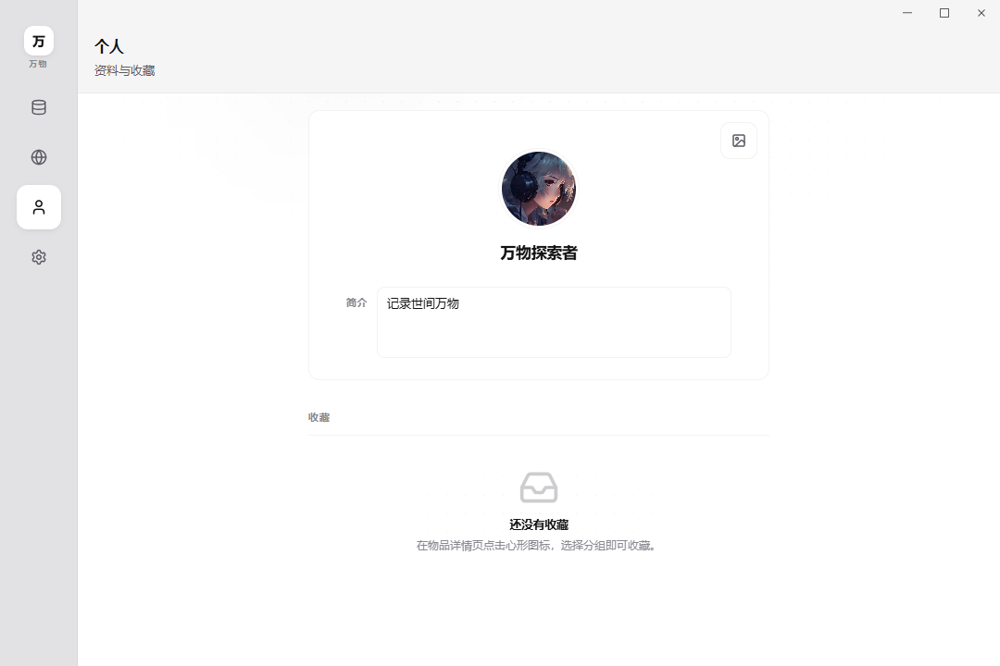

# 万物（Wanwu）

> 本仓库中**所有代码、文档与资源**均由 [**Cursor Agent**](https://cursor.com) 参与生成；部分图片和文档信息经由 [**Trae SOLO**](https://solo.trae.cn/) 收集并整理；开发者本人负责监督和取餐。鼠鼠我呀，是一行代码都不想写了~(￣▽￣)~*
> 
> **郑重声明：** 本项目仅供学习与非商业使用；素材可能涉及第三方版权，商业使用及由此产生的法律责任由使用者自行承担。

<p align="center">
  
</p>

**万物** 是一款安装在您电脑上的桌面软件，用来**分类浏览、收藏和阅读**各类「事物」——例如猫狗品种、植物、电影、书籍、腕表、美食等。内容以图文卡片形式呈现，像一本可搜索、可收藏的多主题图鉴；同时支持订阅网络资讯（RSS），在个人中心统一管理收藏与资料。

<p align="center">
  
</p>

---

## 这个项目是做什么的？

可以把万物理解成三部分能力组合在一起：

| 能力 | 通俗说明 |
|------|----------|
| **内置图鉴库** | 软件自带大量已整理好的条目（名称、简介、参数、配图与长文介绍），按「大类 → 子类」浏览 |
| **个人空间** | 给喜欢的条目点收藏、分组；可填写昵称、头像等简单资料 |
| **资讯订阅** | 自行添加 RSS 订阅源，在软件内阅读拉取到的文章列表 |

适合：想**离线或本地查阅**兴趣知识、做主题收藏、顺带读订阅资讯的用户。
不适合：需要多人协作编辑、实时云端同步或复杂办公场景——万物更偏向**个人本地查阅与整理**。

---

## 功能架构

### 四大模块说明

| 模块 | 您能看到什么 | 常见操作 |
|------|----------------|----------|
| **全库** | 左侧选大类（如猫、植物、电影…）与子类；中间为条目卡片列表；点卡片进入详情 | 搜索、看大图与文字介绍、看规格参数、切换多张配图 |
| **RSS** | 订阅源列表与文章条目 | 添加/删除订阅、阅读摘要、打开原文链接（在系统浏览器中） |
| **个人** | 头像昵称、收藏分组与已收藏条目 | 管理收藏、查看历史浏览（若已启用） |
| **设置** | 主题、导航样式、数据目录、备份与诊断等 | 切换浅色/深色、查看本机数据路径、导出诊断信息 |

### 界面预览

以下为各主要模块的主界面示意。

<p align="center">
  <strong>全库</strong><br />
  
</p>

<p align="center">
  <strong>RSS</strong><br />
  
</p>

<p align="center">
  <strong>个人</strong><br />
  
</p>

<p align="center">
  <strong>设置</strong><br />
  
</p>

**外观主题**

万物提供**浅色**与**深色**两套界面，可在「设置 → 应用」中切换；也可跟随系统深浅色自动变化。下图以全库为例对比两种主题（左侧深色、右侧浅色）：

<p align="center">
  
</p>

### 内置图鉴规模

| 项目 | 数量级 |
|------|--------|
| 顶层大类 | **36** 个（猫、狗、植物、电影、书籍、腕表、美食、航空等） |
| 图鉴条目 | **600+** 条（随版本更新，以 `items/` 种子 JSON 为准） |
| 每条内容 | 名称、摘要、标签、规格表、封面与图集；正文多为独立 Markdown 文件 |

配图来自图库网站，详情页会标注作者与来源链接，使用者需要遵守授权说明。

---

## 如何使用（给日常用户）

以下假设您已取得可运行的程序（见下文「如何获得软件」）。

1. **启动**后，一般会进入 **全库**；在左侧选择大类与子类，中间出现条目卡片。
2. **点击卡片**进入详情：上方大图，下方文字与规格；有多张图时可在底部缩略图切换。
3. 在详情页可将条目 **加入收藏**，到 **个人** 模块按分组查看。
4. 在 **RSS** 中添加订阅地址，选中源后阅读列表；需要完整网页时，通过「在浏览器中打开」。
5. 在 **设置** 中可切换外观、查看 **数据保存位置**，必要时做备份相关操作。

### 数据保存在哪里？

所有与您相关的数据都在**本机文件夹**中，卸载程序**不会自动删除**该文件夹，便于您自行备份或迁移。

| 内容 | 说明 |
|------|------|
| 收藏、个人资料、RSS 订阅与文章缓存 | 用户数据目录下的 `wanwu` 文件夹（Windows 常见路径：`%APPDATA%\wanwu\` 或设置里显示的自定义路径） |
| 内置图鉴条目与图片 | 随安装包提供的 `assets` 资源；首次运行会解压/同步到本地数据库，之后浏览更快 |

在 **设置 → 数据** 中可查看当前路径。迁移电脑时，复制整个 `wanwu` 文件夹即可保留收藏与订阅。

---

## 如何获得软件？

| 方式 | 说明 |
|------|------|
| **Windows 安装包** | `npm run pack` → `release/wanwu-win-x64-x.y.z.exe` + 单独分发的 `library-data-pack-x.y.z.zip` |
| **从源码运行（需一定技术基础）** | 克隆本仓库后安装 Node.js，执行 `npm install` 与 `npm run dev`，适合体验最新开发版 |

打包说明见 [pack/windows/README.md](pack/windows/README.md)。

---

## 设计文档与反馈

更完整的产品说明见仓库内 [doc/](doc/) 目录（需求、设计、优化路线图、编码规范等）。

- 问题与建议：[GitHub Issues](https://github.com/MonoKelvin/Wanwu/issues)
- 许可证：[MIT](LICENSE) © 2026 MonoStudio · [MonoKelvin](https://github.com/MonoKelvin)

---

## 开发人员说明

以下面向需要**编译、调试或参与维护**的开发者；若您只使用软件，阅读上文即可。

### 技术栈

| 层级 | 技术 |
|------|------|
| 桌面壳 | Electron |
| 界面 | Vue 3、Vue Router、Pinia、PrimeVue、Tailwind |
| 本地库 | better-sqlite3（用户库、RSS 库、按分类的图鉴库） |
| 构建 | electron-vite、TypeScript |

### 环境要求

- Node.js **≥ 20.19**（推荐 22 LTS）
- npm **≥ 10**
- Windows 上首次 `npm install` 会编译 SQLite 原生模块，需已安装 **Visual Studio 生成工具**（勾选「使用 C++ 的桌面开发」）；若失败可执行 `npm run rebuild`
- 系统分享依赖 `electron-native-share`，未安装 VS 时应用仍可运行/打包，但该功能不可用

### 常用命令

| 命令 | 用途 |
|------|------|
| `npm run dev` | 开发模式（检查环境、SQLite、启动 Electron Vite） |
| `npm run build` | 生成图鉴数据包 + 编译应用到 `out/` |
| `npm run pack` | Windows 安装包 + 图鉴 zip 单独产出；`-- --skip-library-pack` 可跳过重新压缩图鉴 |
| `npm run typecheck` | 前端 TypeScript 检查 |
| `npm run rebuild` | 强制为 Electron 重编 `better-sqlite3`（并尝试 `electron-native-share`） |

脚本说明见 [scripts/README.md](scripts/README.md)。

### 从源码启动

```bash
git clone https://github.com/MonoKelvin/Wanwu.git
cd Wanwu
npm install
npm run dev
```

### 项目结构（简图）

```
electron/                 主进程：窗口、IPC、数据库、RSS、图鉴数据包
  services/               按 core / data / media / library / rss / app 分模块
src/
  app/                    应用壳、路由、主题与全局样式
  modules/                四大页面：library、rss、personal、settings
  features/item/          条目卡片、详情、配图展示
  shared/                 公共类型、组件与工具
assets/
  seed/library/           图鉴种子（JSON、catalog、categories）
  library/                配图与 content.md 正文
  packed/                 构建产物：library-data-pack.zip（git 忽略）
  logo/                   应用图标
  screenshots/            README 用界面截图（01–04、light、theme-split）
scripts/                  run.mjs、build-library-pack.ts
doc/                      项目文档（见 doc/README.md）
pack/windows/             Windows 打包（pack.mjs、wanwu.iss、builder.json）
```

**数据流（构建与首次启动）**

1. 维护 `assets/seed/library/items/` 下各 JSON 与 `assets/library/` 下 `content.md`。
2. `npm run build` 生成 `assets/packed/library-data-pack.zip`；`npm run pack` 单独发布该 zip。安装包仅含程序与 `logo`，不含 `seed`/`library`。
3. 用户首次启动时，主进程异步解压数据包到用户目录下的数据库，避免长时间阻塞界面；catalog 未变时可跳过重复入库。

维护细则见 [assets/seed/library/README.md](assets/seed/library/README.md)、[electron/services/README.md](electron/services/README.md)。

### 相关文档

| 类别 | 入口 |
|------|------|
| 文档索引 | [doc/README.md](doc/README.md) |
| v1.1 变更 | [doc/optimization/release-v1.1.md](doc/optimization/release-v1.1.md) |
| 优化路线图 | [doc/optimization/roadmap-performance-packaging.md](doc/optimization/roadmap-performance-packaging.md) |
| 软件需求 | [doc/requirements/software-requirements-v1.0.txt](doc/requirements/software-requirements-v1.0.txt) |
| content.md 规范 | [doc/guidelines/content-md-guidelines.md](doc/guidelines/content-md-guidelines.md) |

---

## 赞助支持

如果万物对你有帮助，欢迎点杯奶茶支持一下，感谢 🙏

| 支付宝 | 微信 |
|:---:|:---:|
|  |  |
