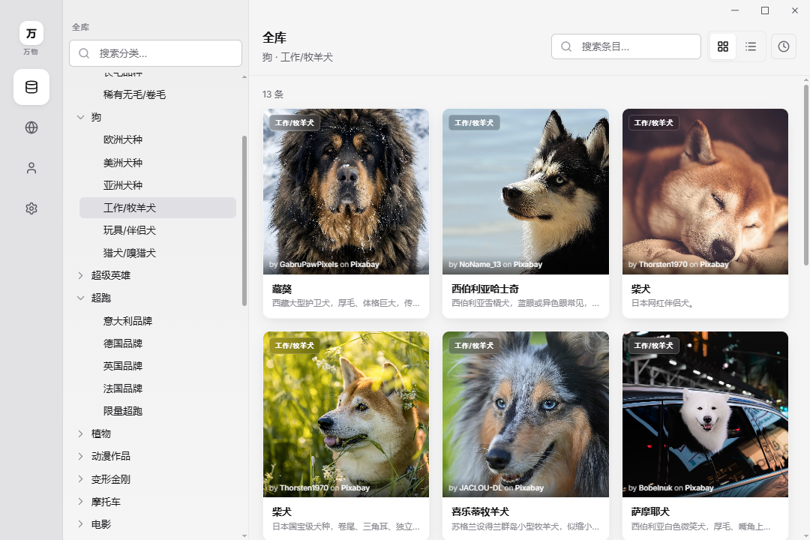
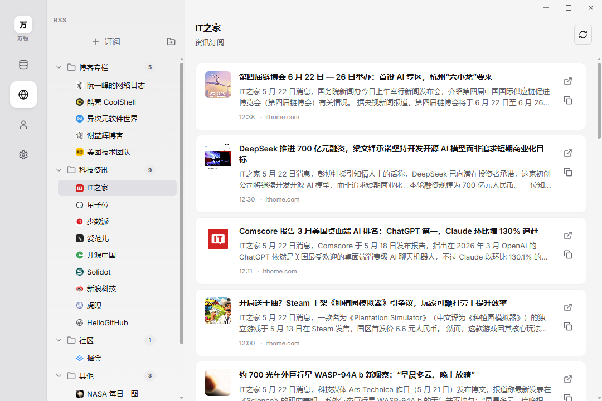
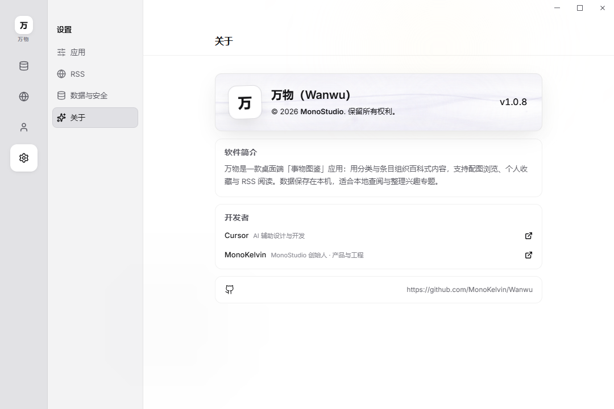
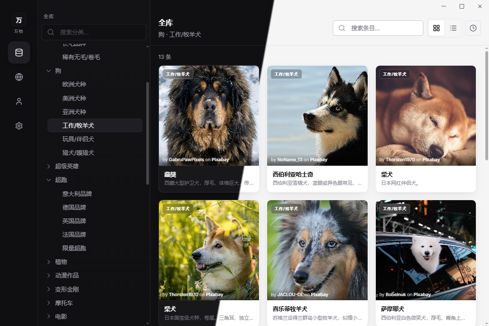

# 万物（Wanwu）

> 本仓库中**所有代码、文档与资源**均由 [**Cursor Agent**](https://cursor.com) 参与生成；部分图片和文档信息经由 [**Trae SOLO**](https://solo.trae.cn/) 收集并整理；开发者本人负责监督和取餐。鼠鼠我呀，是一行代码都不想写了~(￣▽￣)~*
>
> **郑重声明：** 本项目仅供学习与非商业使用；素材可能涉及第三方版权，商业使用及由此产生的法律责任由使用者自行承担。

<p align="center">
  
</p>

**万物** 是一款安装在您电脑上的桌面软件，用来**分类浏览、收藏和整理**各类「事物」——图鉴条目、便笺、链接书签、流程图，以及 RSS 资讯与音乐播放。内容以图文卡片、画布与列表形式呈现；个人中心统一管理收藏与资料。

<p align="center">
  
</p>

**当前版本：v1.2.5**

---

## 这个项目是做什么的？

可以把万物理解成几块能力组合在一起：

| 能力 | 通俗说明 |
|------|----------|
| **全库** | 便笺、链接、流程图、图鉴四大子模块；本地 SQLite 持久化，按分组浏览与管理 |
| **RSS** | 自行添加订阅源，在软件内阅读拉取到的文章列表 |
| **音乐** | 聚合网易云等平台能力，发现、播放与歌单管理（需登录对应平台） |
| **个人空间** | 收藏分组、浏览历史、头像昵称等简单资料 |
| **设置** | 主题、导航样式、数据目录、备份与诊断等 |

适合：想**离线或本地查阅**兴趣知识、整理便笺与书签、绘制流程图、顺带读 RSS 与听音乐的用户。  
不适合：需要多人协作编辑、实时云端同步或复杂办公场景——万物更偏向**个人本地查阅与整理**。

---

## 功能架构

### 主模块

| 模块 | 您能看到什么 | 常见操作 |
|------|----------------|----------|
| **全库** | 侧栏四大分类与子分组；中间为列表或画布 | 见下表「全库子模块」 |
| **RSS** | 订阅源列表与文章条目 | 添加/删除订阅、阅读摘要、在浏览器打开原文 |
| **音乐** | 发现、歌单、排行榜、播放器与迷你播放条 | 搜索、播放、收藏、查看 MV |
| **个人** | 头像昵称、收藏分组与已收藏条目 | 管理收藏、查看历史浏览（若已启用） |
| **设置** | 主题、导航样式、数据目录、备份与诊断等 | 切换浅色/深色、查看本机数据路径 |

### 全库子模块

| 子模块 | 说明 | 常见操作 |
|--------|------|----------|
| **便笺** | TipTap 富文本，支持图片 | 新建/编辑/置顶、独立弹出窗口 |
| **链接** | 浏览器书签与网址收藏 | 文件夹分组、导入、打开与探测 |
| **流程图** | LogicFlow 矢量画布，命令化编辑与撤销栈 | 绘图、多页文档、表格/UML 等扩展图元、导出 PNG/SVG |
| **图鉴** | 内置多主题条目（猫狗、植物、电影等） | 搜索、看图与文字介绍、规格参数、收藏 |

### 界面预览

<p align="center">
  <strong>全库</strong><br />
  
</p>

<p align="center">
  <strong>RSS</strong><br />
  
</p>

<p align="center">
  <strong>个人</strong><br />
  
</p>

<p align="center">
  <strong>设置</strong><br />
  
</p>

<p align="center">
  
</p>

内置图鉴含多个顶层大类与数百条条目；配图与正文遵守各来源授权说明。

---

## 如何使用（给日常用户）

1. **启动**后进入 **全库**，侧栏选择便笺、链接、流程图或图鉴，浏览与管理内容。
2. 图鉴条目可 **加入收藏**，在 **个人** 中按分组查看。
3. 在 **RSS** 中添加订阅并阅读；完整网页通过系统浏览器打开。
4. 在 **音乐** 中搜索与播放；部分能力需登录网易云账号。
5. 在 **设置** 中切换外观、查看 **数据保存位置** 与备份相关选项。

用户数据保存在本机（常见为 `%APPDATA%\wanwu\` 或设置里显示的路径）；卸载程序不会自动删除该目录。

---

## 如何获得软件？

| 方式 | 说明 |
|------|------|
| **Windows 安装包** | 执行 `npm run pack` 生成安装程序与图鉴数据包（详见 `pack/windows/`） |
| **从源码运行** | `npm install` 后 `npm run dev` |

---

## 设计文档与反馈

更完整的产品与设计说明见 [doc/](doc/) 目录。

- 问题与建议：[GitHub Issues](https://github.com/MonoKelvin/Wanwu/issues)
- 许可证：[MIT](LICENSE) © 2026 MonoStudio · [MonoKelvin](https://github.com/MonoKelvin)

---

## 开发人员说明

### 技术栈

Electron · Vue 3 · Pinia · Vue Router · PrimeVue · Tailwind CSS · better-sqlite3 · electron-vite · TypeScript。

| 领域 | 主要依赖 |
|------|----------|
| 流程图 | LogicFlow（`@logicflow/core` / `@logicflow/extension`），命令化 `DiagramCommandBus` |
| 便笺 | TipTap |
| 音乐 | 网易云增强 API、Howler、hls.js |
| 三维（云斋） | Three.js、自研 `src/renderer` 模块 |

### 环境要求

Node.js **≥ 20.19**（推荐 22 LTS）、npm **≥ 10**。Windows 上需能编译 `better-sqlite3` 原生模块（Visual Studio「使用 C++ 的桌面开发」）；失败时可 `npm run rebuild`。

### 常用命令

| 命令 | 用途 |
|------|------|
| `npm run dev` | 开发模式 |
| `npm run build` | 编译应用与图鉴数据包 |
| `npm run pack` | Windows 安装包 |
| `npm run typecheck` | 前端类型检查 |
| `npm run check:mechanisms` | 校验命令/事务机制边界 |
| `npm run rebuild` | 重编 Electron 原生依赖 |

更多脚本说明见 [scripts/README.md](scripts/README.md)。

### 从源码启动

```bash
git clone https://github.com/MonoKelvin/Wanwu.git
cd Wanwu
npm install
npm run dev
```

### 代码模块（概要）

| 区域 | 职责 |
|------|------|
| `electron/` | 主进程：窗口、IPC、SQLite、RSS、图鉴/便笺/链接/流程图数据 |
| `src/app/` | 应用壳、路由、主题、模块导航 |
| `src/modules/library/` | 全库壳层与子模块 |
| `src/modules/library/notes` | 便笺 |
| `src/modules/library/links` | 链接收藏 |
| `src/modules/library/diagrams` | 流程图（LogicFlow 适配、命令事务、形状扩展） |
| `src/modules/library/illustrated-handbook` | 图鉴浏览 |
| `src/modules/rss` | 订阅与阅读 |
| `src/modules/music` | 音乐发现与播放 |
| `src/modules/personal`、`settings` | 个人与设置 |
| `src/shared/` | 通用组件、stores、工具与常量 |
| `src/renderer/` | 通用 WebGL / Three.js 渲染 |
| `assets/` | 图鉴种子与媒体、应用图标等 |

流程图模块的设计细节见 [doc/design/flowchart-v1.2-requirements.md](doc/design/flowchart-v1.2-requirements.md) 与 [doc/design/transaction-command-architecture.md](doc/design/transaction-command-architecture.md)。

### 赞助支持

| 支付宝 | 微信 |
|:---:|:---:|
|  |  |
