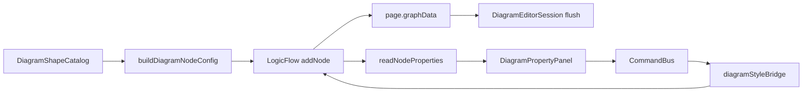

# 流程图 · 可扩展特殊图形机制 — 技术设计（TRD）

| 项 | 内容 |
|----|------|
| 文档版本 | v1.0 |
| 日期 | 2026-06-09 |
| 目标版本 | Wanwu **v1.2.x → v1.3**（大功能，第三位版本已升至 **1.2.2** 作为基线） |
| 项目代号 | `library-diagrams` / `shape-extension` |
| 状态 | **设计评审 · Phase 0 待开发** |
| 参考 | [StarUML Class Diagram](https://docs.staruml.io/working-with-uml-diagrams/class-diagram)、LogicFlow 自定义节点 |

---

## 0. 导读

### 0.1 问题陈述

当前流程图模块中，所有图形共享同一套「扁平文本 + 通用外观」模型：

- UML 类（`dg-uml-class`）仅有一条 header 分隔线，字段/方法全部挤在 `text` 多行字符串里；
- 属性面板无图形类型插件机制，特例（组合框、图片）靠 `v-if` 硬编码；
- 无法为单个图形提供 **结构化编辑**（增删成员、可见性 `+/#/-/~`、静态/抽象修饰等）；
- 后续「用户自定义图形」无统一扩展点。

用户期望（以 UML 类为标杆，参考 StarUML）：

1. 图形顶部：**分类器类型**（类 / 接口 / 抽象类 / 枚举…）与 **名称** 独立编辑；
2. **属性区、操作区** 分 compartment 展示，支持 `+/-` 增删行；
3. 每行可选：**可见性**、**静态**、**抽象**、名称、类型、返回值等；
4. 抽象类/接口/静态成员在画布上有 **斜体 / 下划线** 等 UML 惯例；
5. 同类机制可扩展到 BPMN 任务、泳道、架构节点等 **领域特殊图形**；
6. 架构上支持 **继承基础图形 + 注册扩展**，为将来用户自定义图形包铺路。

### 0.2 设计原则（Karpathy / 项目规约）

| 原则 | 落地 |
|------|------|
| 最小破坏 | **不推翻** LogicFlow `graphData` 与现有 `properties.style`；增量引入 `properties.dgShape` |
| 开闭原则 | 新图形 = 新 `ShapeDefinition` 注册项，**不改** `DiagramPropertyPanel` 主模板 |
| 单一职责 | Catalog（面板）/ LF 注册（渲染）/ Bridge（读写）/ Editor（属性 UI）/ Commands（变更）分层 |
| 可验证 | 每 Phase 有明确验收：UML 类可增删属性且持久化往返一致 |
| 不做 speculative | v1 不做完整 UML 关系线、Port、Template Parameter；仅类图元结构化 |

### 0.3 成功标准

```
1. 注册表：新增一种特殊图形只需添加 definition 文件 + 一行 register，无需改 PropertyPanel 核心
2. UML 类：属性面板顶部有「类/接口/抽象类」切换；可增删 attribute/operation；可见性图标可点选
3. 画布：三 compartment 渲染；高度随成员行数自动增长（可选手动缩放锁定）
4. 持久化：保存 → 重开 → 结构化数据完整恢复；旧纯 text 类图可自动迁移
5. 命令化：结构化变更走 CommandBus（支持撤销/重做）
```

---

## 1. 现状分析

### 1.1 数据流（简图）



### 1.2 关键局限

| 层级 | 现状 | 缺口 |
|------|------|------|
| `DiagramNodeProperties` | 扁平通用字段 | 无 shape 专用投影 |
| `diagramStyleBridge` | 读写 style/text/geometry | 无 `dgShape` 通道 |
| `diagramShapeRegs.ts` | 每 shape 一个 `regXxx` 闭包 | 无继承/组合注册表 |
| `DiagramPropertyPanel` | 硬编码 section | 无插件 slot |
| 持久化 | `properties` 开放字典 | 无 schema version / kind 约定 |

### 1.3 可复用先例

- **组合框** `dg-group-frame`：`properties.dgGroupMembers` + 专用 panel section + 专用 View；
- **图片** `dg-image`：`properties.dgAssetId` + 资源解析；
- **多边形**：`properties.dgPolyPoints` 存储顶点。

说明：`properties` 自定义键 + 条件 UI 的模式已验证可行，缺的是 **统一抽象**。

---

## 2. 总体架构：Shape Extension Framework

### 2.1 核心概念

```
DiagramShapeItem (palette)     → 用户拖入时的 catalog 元数据（已有）
LogicFlow type (lfType)        → 运行时节点 type（已有）
ShapeKind (新)                 → 结构化语义类型，如 'uml.classifier' | 'bpmn.task' | 'generic'
ShapeDefinition (新)           → 一种 ShapeKind 的完整扩展描述（注册表条目）
dgShape payload (新)           → 节点 properties 内结构化数据信封
```

**关系：**

- 一个 `lfType` 可对应一个或多个 palette `id`（已有，如 `dg-uml-package` → `dg-uml-class`）；
- 一个 `lfType` 绑定 **一个** `ShapeDefinition`（渲染 + 默认 payload）；
- palette `id` 可在 `buildDiagramNodeConfig` 时注入 **不同的默认 dgShape**（如 interface 预设 `classifierKind: 'interface'`）。

### 2.2 `properties.dgShape` 信封格式

```typescript
/** 所有特殊图形的统一根结构 */
interface DiagramShapePayloadEnvelope {
  /** 载荷 schema 版本，便于迁移 */
  schemaVersion: 1
  /** 注册表 kind，与 ShapeDefinition.kind 一致 */
  kind: string
  /** 各 kind 自定义数据 */
  data: unknown
}
```

**与现有字段分工：**

| 字段 | 职责 |
|------|------|
| `text` | 兼容/导出/简单图形；特殊图形可由 definition 同步生成摘要或留空 |
| `properties.style` / `textStyle` | 通用外观（已有） |
| `properties.dgShape` | **结构化语义**（新） |
| `properties.nodeSize` | 几何（已有） |

**formatVersion：** `DiagramContent.formatVersion` 保持 `2`，不强制升 `3`。迁移在 **加载 graph** 时按节点 `type` + 缺失 `dgShape` 触发（与 draw.io 导入同理）。若未来需要文档级特性再升 `formatVersion`。

### 2.3 ShapeDefinition 接口

建议路径：`src/modules/library/diagrams/domain/shapes/`

```typescript
/** 图形扩展定义 — 注册表核心接口 */
export interface IDiagramShapeDefinition<TData = unknown> {
  /** 全局唯一 kind，如 'uml.classifier' */
  readonly kind: string

  /** 绑定的 LogicFlow type(s) */
  readonly lfTypes: readonly string[]

  /** palette 创建时的默认结构化数据 */
  createDefaultData(paletteItem?: DiagramShapeItem): TData

  /** 从旧 text 迁移（可选） */
  migrateFromLegacy?(node: LogicFlow.NodeConfig): TData | null

  /** 注册 LogicFlow Model/View（可继承基础图形） */
  register(lf: LogicFlow): void

  /** LF Model → 属性面板投影（合并到 DiagramNodeProperties 或子对象） */
  readPayload(model: LogicFlow.BaseNodeModel): TData

  /** 属性面板 → LF properties（返回需 setProperties 的片段） */
  applyPayload(model: LogicFlow.BaseNodeModel, data: TData): void

  /** 根据 data 计算推荐尺寸（动态 compartment 高度） */
  computeLayout?(data: TData, width: number): { width: number; height: number }

  /** 同步 text 用于搜索/导出/无障碍（可选） */
  serializeText?(data: TData): string

  /** 属性面板 Vue 组件（异步加载） */
  readonly PropertyEditor: Component

  /** 是否在通用「文本」区块之前渲染（StarUML 式类型设置优先） */
  readonly propertyEditorOrder?: 'before-common' | 'after-common' | 'replace-text'
}
```

**注册表：**

```typescript
// domain/shapes/DiagramShapeDefinitionRegistry.ts
class DiagramShapeDefinitionRegistry {
  register(def: IDiagramShapeDefinition): void
  getByLfType(lfType: string): IDiagramShapeDefinition | undefined
  getByKind(kind: string): IDiagramShapeDefinition | undefined
  registerAllLogicFlowShapes(lf: LogicFlow): void
}
```

组合根（`diagramEditorBootstrap` 或 `registerAllDiagramShapes` 旁）统一 `registry.register(new UmlClassifierShapeDefinition())`。

### 2.4 基础图形继承层次（LogicFlow 层）

```
DiagramRectResizeModel/View     ← 现有（diagramRectResizeBase.ts）
    ├── GenericRectShape        ← 默认矩形类（无 dgShape）
    ├── UmlClassifierModel/View ← 读取 dgShape.data 渲染三 compartment + 行内文本
    ├── BpmnTaskModel/View      ← Phase 2
    └── UserCustomModel/View    ← 将来：由 JSON pack 描述 compartment 布局
```

**要点：**

- **继承** `DiagramRectResizeModel` 保留缩放、锚点、组合框行为；
- 特殊 View 重写 `getResizeShape()` + **自定义文本层**（LogicFlow `getText()` 可能不够，需在 SVG 内自绘 compartment 文本，或隐藏 LF 默认 text 改自绘）；
- Model 在 `setAttributes()` / `properties` 变更时调用 `definition.computeLayout` 更新 `height`。

### 2.5 属性面板插件化

```vue
<!-- DiagramPropertyPanel.vue 伪代码 -->
<DiagramShapePropertyHost
  v-if="selection.node && shapeDefinition"
  :definition="shapeDefinition"
  :node="selection.node"
  @patch="onShapePayloadPatch"
/>
<!-- 通用外观 section：definition.propertyEditorOrder !== 'replace-text' 时显示 -->
```

`DiagramShapePropertyHost`：

- 根据 `lfType` 查 registry；
- 动态 `<component :is="definition.PropertyEditor" />`；
- patch 走 `canvas.updateNode` 命令，携带 `properties.dgShape` 片段。

### 2.6 命令与撤销

扩展 `canvas.updateNode` payload：

```typescript
{
  nodeId: string
  properties?: Record<string, unknown>  // 已有
  dgShape?: DiagramShapePayloadEnvelope // 新：专用通道，handler 内 merge
}
```

**细粒度命令（Should，Phase 1 末）：**

- `canvas.uml.addAttribute` / `removeAttribute` / `moveAttribute`
- 便于快捷键与后续 AI；初期可在 PropertyEditor 内合并为一次 `updateNode`。

---

## 3. UML Classifier — 首个特殊图形（StarUML 对齐）

### 3.1 参考行为（StarUML）

来源：[StarUML Class Diagram 文档](https://docs.staruml.io/working-with-uml-diagrams/class-diagram)

| 能力 | StarUML | Wanwu v1 范围 |
|------|---------|---------------|
| Classifier 类型 | Class, Interface, Enum, Component… | **Class / Interface / AbstractClass** |
| Compartment | 名称 / Attributes / Operations | ✓ 三区 |
| 可见性 | `+` `#` `-` `~` | ✓ 四态 |
| Attribute 语法 | `visibility name : type [multiplicity] = default` | name + type（v1）；multiplicity 可选 |
| Operation 语法 | `visibility name(params) : return` | ✓ 简版 |
| 静态 | 下划线 | ✓ 下划线 |
| 抽象 | 斜体 | ✓ 斜体 |
| 接口 stereotype | `<<interface>>` | ✓ 自动根据 classifierKind |
| 增删成员 | Ctrl+Enter / Ctrl+Shift+Enter | UI `+/-` 按钮 |
| Suppress 区 | 可隐藏 attributes/operations | Should：折叠区 |

### 3.2 数据结构 `UmlClassifierData`

```typescript
type UmlVisibility = 'public' | 'protected' | 'private' | 'package'

type UmlClassifierKind = 'class' | 'interface' | 'abstractClass' | 'enum'

interface UmlClassifierMemberBase {
  id: string
  name: string
  visibility: UmlVisibility
  isStatic: boolean
  stereotype?: string
}

interface UmlAttribute extends UmlClassifierMemberBase {
  type?: string
  defaultValue?: string
}

interface UmlOperation extends UmlClassifierMemberBase {
  isAbstract: boolean
  parameters: Array<{ name: string; type?: string }>
  returnType?: string
}

interface UmlClassifierData {
  classifierKind: UmlClassifierKind
  name: string
  attributes: UmlAttribute[]
  operations: UmlOperation[]
  /** 显示选项 */
  showAttributes: boolean
  showOperations: boolean
}
```

**`kind`:** `'uml.classifier'`

**默认 palette：**

| palette id | 默认 classifierKind |
|------------|---------------------|
| `dg-uml-class` | `class` |
| `dg-uml-interface` | `interface` |
| `dg-uml-package` | `class`（stereotype `package`，v1.1） |

### 3.3 画布渲染规则

```
┌─────────────────────────────┐
│   «interface»               │  ← stereotype（接口/枚举等）
│   ClassName                   │  ← name（抽象类整体斜体）
├─────────────────────────────┤
│ + id: string                │  ← attributes（静态→下划线）
│ # count: number             │
├─────────────────────────────┤
│ + getName(): string         │  ← operations（抽象→斜体）
│ + {abstract} save(): void   │
└─────────────────────────────┘
```

**布局常量（可配置）：**

- `HEADER_H`：根据是否有 stereotype 32–40px
- `ROW_H`：18px / 行
- `COMPARTMENT_PAD`：4px
- `MIN_WIDTH`：120px
- 空 compartment 显示 `—` 或留空（与 StarUML 一致用 `—`）

**文本：** 隐藏 LogicFlow 默认中心 text（`textMode: 'none'` 或空 text），由 View 在 compartment 内 `<text>` 绘制，避免与 autoWrap 冲突。

### 3.4 属性面板 UI（`UmlClassifierPropertyEditor.vue`）

**区块顺序（`propertyEditorOrder: 'before-common'`）：**

1. **分类器类型** — 分段按钮：类 / 接口 / 抽象类
2. **名称** — InputText
3. **属性** — 列表编辑器
   - 行：可见性下拉（图标 `+/#/-/~`）、名称、类型、静态 toggle、删除
   - 底部：`+ 添加属性`
4. **操作** — 列表编辑器
   - 行：可见性、名称、参数简写、返回类型、静态/抽象 toggle、删除
   - 底部：`+ 添加操作`
5. （下方）通用外观：填充、边框、字体大小（作用于 compartment 文本）

### 3.5 旧数据迁移

检测：`type === 'dg-uml-class' && !properties.dgShape && text 含换行`

解析器（宽松）：

```
Line0: name 或 «interface» Name
Line1: —  分隔
后续: +/-/# 开头 → attribute 或 operation（含 `(` 判定为 operation）
```

迁移后写入 `dgShape`，保留原 `text` 一份在 `properties._legacyText` 可选。

---

## 4. 其他模块特殊图形（路线图）

| ShapeKind | lfType | 结构化数据示例 | Phase |
|-----------|--------|----------------|-------|
| `uml.classifier` | `dg-uml-class` | 见 §3 | **1** |
| `bpmn.task` | `dg-process` | `{ taskType, markers[] }` | 2 |
| `bpmn.event` | `dg-circle` | `{ eventKind, definition }` | 2 |
| `diagram.swimlane` | `dg-swimlane` | `{ lanes: [{ id, label, size }] }` | 2 |
| `arch.node` | `dg-server` 等 | `{ tier, protocol, notes }` | 3 |
| `annotation.callout` | `dg-comment` | `{ pointer, richText }` | 3 |
| `user.custom` | 用户定义 | JSON pack 描述 compartments | 4 |

每种仅实现 **一个** Definition 文件 + Editor 组件，不污染通用面板。

---

## 5. 用户自定义图形（远期）

### 5.1 Shape Pack 概念

```json
{
  "packId": "my-shapes",
  "version": 1,
  "shapes": [{
    "kind": "user.my-card",
    "label": "卡片",
    "extends": "rect",
    "compartments": [
      { "id": "title", "binding": "data.title", "style": "header" },
      { "id": "body", "binding": "data.body", "style": "multiline" }
    ],
    "fields": [
      { "key": "title", "type": "string", "label": "标题" },
      { "key": "body", "type": "text", "label": "内容" }
    ]
  }]
}
```

运行时：

1. 加载 pack → 动态 `registry.register(createUserShapeDefinition(pack))`；
2. 通用 **表单生成器** 根据 `fields` 渲染 PropertyEditor；
3. View 根据 `compartments` 模板渲染（限制比完全自由 SVG 更可控）。

**v1 不实现**，但 `IDiagramShapeDefinition` 与 `dgShape` 信封必须与 pack 字段兼容。

---

## 6. 目录结构（建议）

```
src/modules/library/diagrams/
├── domain/
│   └── shapes/
│       ├── IDiagramShapeDefinition.ts
│       ├── DiagramShapeDefinitionRegistry.ts
│       ├── DiagramShapePayload.ts          # 信封类型 + type guards
│       ├── uml/
│       │   ├── umlClassifierTypes.ts
│       │   ├── UmlClassifierShapeDefinition.ts
│       │   ├── umlClassifierLayout.ts
│       │   ├── umlClassifierMigrate.ts
│       │   └── umlClassifierRegs.ts        # LF Model/View
│       └── index.ts
├── components/
│   └── shape-properties/
│       ├── DiagramShapePropertyHost.vue
│       └── UmlClassifierPropertyEditor.vue
├── lib/
│   ├── diagramShapeBridge.ts               # 统一 read/apply dgShape
│   └── diagramShapeRegs.ts                 # 改为调用 registry.registerAll
```

---

## 7. 实现阶段（PR 切分）

| Phase | 内容 | 验收 |
|-------|------|------|
| **0** | Registry 接口 + 空实现 + PropertyHost 骨架 + `dgShape` 读写桥 | 单元测试：register/lookup |
| **1a** | UML Model/View 三 compartment 渲染 + 动态高度 | 拖入类图，手改 json 可见正确图形 |
| **1b** | UmlClassifierPropertyEditor 全功能 | 增删改成员、切换类型、撤销重做 |
| **1c** | 迁移 + 模板更新 | 旧文件打开自动迁移 |
| **2** | BPMN 任务 / 泳道择一 | 同上模式复用 |
| **3** | 导出文本/PlantUML 片段（可选） | 结构化 → 文本序列化 |

**预估：** Phase 0–1 约 3–4 个 PR，是整个 v1.3 的核心。

---

## 8. 风险与决策记录

| 决策 | 选择 | 理由 |
|------|------|------|
| 是否重构 graphData | **否** | LogicFlow 原生格式已是业界通用；`properties.dgShape` 足够 |
| text 字段 | 保留，definition 可选同步 | 兼容导出、全文搜索、旧工具链 |
| 自绘 text vs LF text | **自绘** | 多 compartment 无法用一个 text 框表达 |
| 接口与 class 同 lfType | 保持，靠 palette 默认 + classifierKind 区分 | 减少 LF type 爆炸 |
| 属性面板 | Vue 动态组件 | 与现有技术栈一致，比 JSON Form 更灵活 |

| 风险 | 缓解 |
|------|------|
| 动态高度与缩放冲突 | 默认「自动高度」；手动缩放后设 `layoutMode: 'fixed'` |
| 多选编辑 | v1 禁用结构化多选，仅显示「选中 N 个图形」 |
| 性能（大量成员） | 超 50 行折叠 + 虚拟列表仅 Editor 内 |

---

## 9. 附录：可见性图标映射

| 值 | 符号 | 含义 |
|----|------|------|
| `public` | `+` | 公开 |
| `protected` | `#` | 保护 |
| `private` | `-` | 私有 |
| `package` | `~` | 包内 |

---

## 10. 变更记录

| 版本 | 日期 | 说明 |
|------|------|------|
| v1.0 | 2026-06-09 | 初稿：Shape Extension Framework + UML Classifier 详细设计 |
