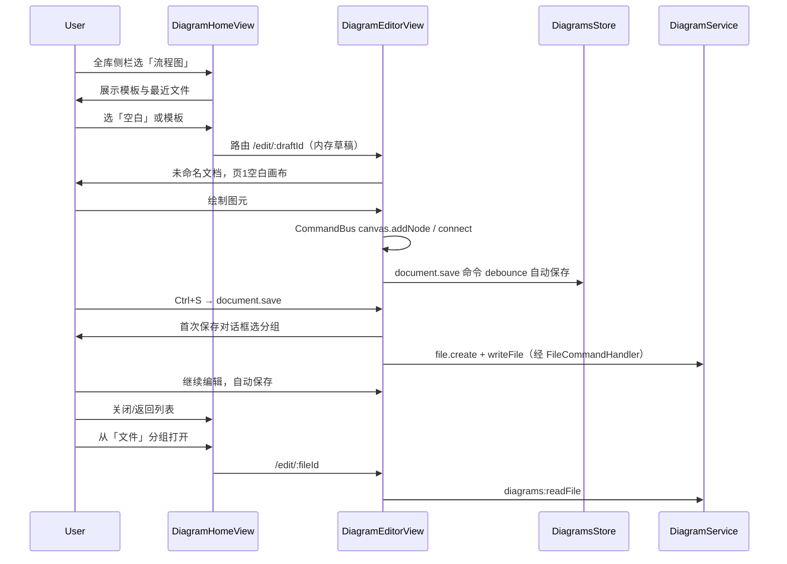
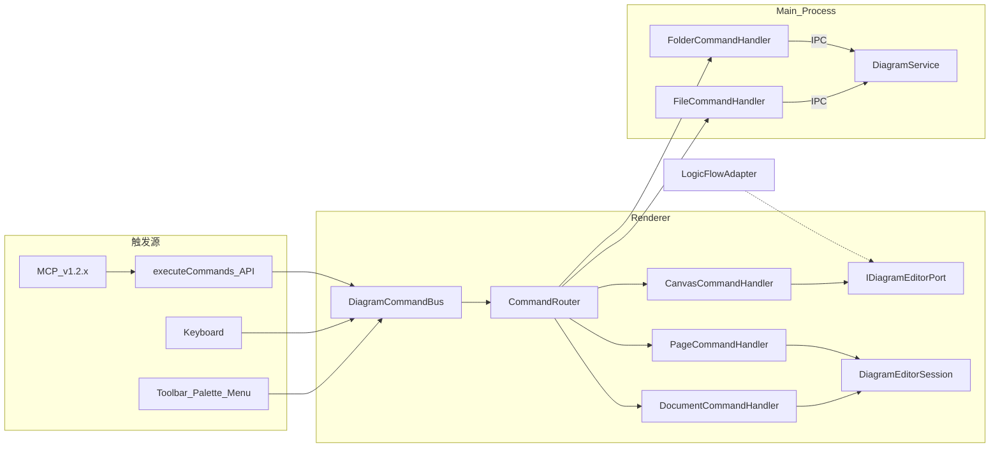
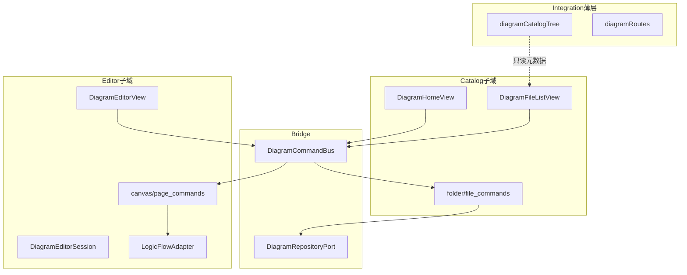

# 全库 · 流程图模块 — v1.2 技术需求文档（TRD）

| 项 | 内容 |
|----|------|
| 文档版本 | v1.1 |
| 日期 | 2026-06-02 |
| 目标版本 | Wanwu **v1.2** |
| 项目代号 | `library-diagrams` |
| 状态 | **TRD 待评审 · 未开发** |
| 引擎选型 | **LogicFlow**（`@logicflow/core` + `@logicflow/extension`） |
| 多画布模型 | **单文件多页**（类 draw.io pages） |
| **核心设计** | **命令化（Command）**：UI / 快捷键 / 后续 MCP·AI 共用同一执行管线 |

---

## 0. 导读与落地路径

### 0.1 读本文档的顺序

1. **§8 命令化与模块边界** — 实现前必须遵守的架构约束（最高优先级）
2. **§7 数据模型** + **§9 IPC** — 主进程与持久化
3. **§4 UI** + **§5 能力** — 页面与编辑器 Must
4. **§17 开发任务拆解** — 按 PR 切分（约 8 个 PR）

### 0.2 落地原则

| 原则 | 落地方式 |
|------|----------|
| 能画出来 | 先打通 `LogicFlowDiagramAdapter` + 10 条画布命令 |
| 能存下来 | 再接通 `FileCommandHandler` + SQLite/JSON |
| 能管文件 | 首页/列表/分组 CRUD 全部走 `FolderCommandHandler` / `FileCommandHandler` |
| 能给 AI 用 | v1.2 交付 **可序列化命令 + `executeCommands` API**；MCP Server 包装放 v1.2.x，不阻塞首发 |
| 低耦合 | 见 §8.4 依赖禁令；违反者在 Code Review 拒绝 |

### 0.3 v1.2 与 MCP/AI 的边界

| 层级 | v1.2 Must | v1.2.x / 后续 |
|------|-----------|----------------|
| 命令定义与校验 | `DiagramCommand` 联合类型 + JSON Schema 草案 | 发布 schema 供外部工具 |
| 命令执行 | 渲染进程 `DiagramCommandBus`；文件类命令经 IPC | — |
| 外部调用 | `window.wanwu.diagrams.executeCommands` + 可选 IPC `diagrams:executeCommands` | Cursor MCP tool 映射到同一 IPC |
| AI 场景 | 单会话批量命令（如「画 3 个框并连线」） | 自然语言 → 命令序列的 Agent 层 |

---

## 1. 版本目标与范围

### 1.1 产品目标

在全库（library）中新增第四大分类 **「流程图」**（major id: `diagrams`），位于 **链接之下、图鉴之上**。提供：

- 本地流程图绘制（矢量画布、网格、对齐、连线）
- **单文件多画布页** 管理
- 分组与文件管理（首页、草稿、文件、回收站、用户自定义分组）
- 异步自动保存 + 显式保存（Ctrl+S）
- 导出 **PNG / SVG**（当前页；整文件多页可选 ZIP）
- 与万物现有视觉体系一致的简约 UI

### 1.2 用户价值（与万物定位的关系）

万物是「本地个人整理与查阅」工具。流程图模块补足 **结构化表达** 能力（架构草图、步骤说明、个人笔记类图示），数据与图鉴/便笺/链接一样落在用户数据目录，纳入备份，无需第三方 SaaS。

### 1.3 In Scope（v1.2 Must）

| 类别 | 内容 |
|------|------|
| 全库集成 | major 注册、侧栏树、路由、LibraryShellView 子路由 |
| 文件管理 | 系统分组 + 用户自定义分组；新建/重命名/移动/软删除/恢复/永久删除 |
| 首页 | 模板（3–5 个）+ 空白新建 + 最近打开 |
| 编辑器 | LogicFlow 画布；基础图元；连线；撤销/重做；网格/吸附；小地图；缩放 |
| 多页 | 页签栏：新增/重命名/删除/切换；每页独立 graph |
| 持久化 | SQLite 元数据 + JSON 正文文件；debounce 自动保存 |
| 导出 | PNG、SVG（当前页）；菜单入口 |
| 主题 | 浅色/深色画布与 UI 跟随 `--ww-*` |
| 快捷键 | 见 §6.5；**均映射为命令**，不得绕过 CommandBus |
| **命令化架构** | 统一 `DiagramCommandBus`；可序列化命令；`executeCommands` 批量 API（§8） |

### 1.4 Should（v1.2 有余力则做）

- 文件列表缩略图（首页或列表格）
- 复制页、页顺序拖拽排序
- 导出整文件全部页为 ZIP（每页一张 PNG/SVG）
- 模板预览图

### 1.5 Out of Scope（v1.2 明确不做）

| 项 | 说明 |
|----|------|
| draw.io / mxGraph 整库移植 | 仅 UX 参考；见 §12 |
| draw.io / Visio 文件导入 | v1.2.x 再评估 |
| 实时多人协同 | — |
| BPMN / UML 全量符号库 | 仅基础流程图图元 |
| 云厂商图标库（AWS/Azure 等） | — |
| 自动布局（ELK/Dagre） | — |
| 流程执行 / 脚本节点 | — |
| 图元插件市场 | — |
| 版本历史树（除编辑器 undo 栈外） | — |
| 独立主导航模块 | 仅全库子模块 |
| macOS/Linux 专项优化 | Windows 优先；其他平台随主应用 |
| **完整 MCP Server 实现** | v1.2 仅预留命令 API；MCP 工具注册放 v1.2.x |

### 1.6 参考产品（信息来源）

| 来源 | URL | 借鉴点 |
|------|-----|--------|
| SpaceSniffer / 磁盘立项 | 内部 doc | 无直接关联；v1.2 可并列里程碑 |
| draw.io (diagrams.net) | https://github.com/jgraph/drawio | 多页、文件分组、导出、下钻交互 |
| LogicFlow | https://github.com/didi/LogicFlow | **运行时引擎**、extension、主题 API |
| FlowCraft 示例 | https://github.com/Galaxykaito/flowchart | Vue3 + LogicFlow 本地作品管理 |
| Vue Flow | https://github.com/bcakmakoglu/vue-flow | 小地图/控件 UX 对照（不采用为引擎） |
| Excalidraw / tldraw | 社区文档 | 手绘风与万物简约正式风不符，不采用 |

---

## 2. 用户场景与主流程

### 2.1 角色

- **个人用户**：在本地创建、整理流程图，偶尔导出插入文档。

### 2.2 主流程（Happy Path）



### 2.3 分支流程

| 场景 | 行为 |
|------|------|
| 未保存关闭 | 提示保存/丢弃；丢弃则删除内存草稿 |
| 移入回收站 | `softDelete`；列表不可见，回收站可恢复 |
| 永久删除 | 仅回收站内；二次确认；删除 DB 行 + `media/diagrams/{id}/` |
| 移动文件到其他分组 | `moveFile` 更新 `folder_id` |
| 新建自定义分组 | `createFolder`；侧栏 `dg:folder:{id}` |
| 删除自定义分组 | 组内文件必须先移走或一并移入回收站 |
| 保存冲突 | `updatedAt` 不一致时提示重新加载或另存为 |
| 离开全库 major | 销毁 LogicFlow 实例，flush 自动保存 |

### 2.4 系统分组语义

| 分组 ID | 名称 | 行为 |
|---------|------|------|
| `dg-home` | 首页 | **虚拟入口**，不存文件；路由 `/library/diagrams` |
| `dg-drafts` | 草稿 | 未正式归类或自动保存的新文件默认区 |
| `dg-files` | 文件 | 用户正式保存的默认目标 |
| `dg-recycle` | 回收站 | 软删除文件；可恢复/清空 |
| `dg-custom-{uuid}` | 用户自定义 | 用户创建；可重命名/删除 |

---

## 3. 信息架构与路由

### 3.1 全库侧栏树

顺序（`LIBRARY_MAJORS`）：

1. 便笺 `notes`
2. 链接 `links`
3. **流程图 `diagrams`** ← 新增
4. 图鉴 `illustrated-handbook`

树节点 key 约定：

| 类型 | key 格式 | 示例 |
|------|----------|------|
| major 行 | `major:diagrams` | 点击进首页 |
| 系统分组 | `dg:sys:{id}` | `dg:sys:dg-drafts` |
| 自定义分组 | `dg:folder:{id}` | `dg:folder:dg-custom-abc` |

### 3.2 路由表（草案）

挂载于 `/library` 的 `children`（与链接、图鉴一致，经 `LibraryShellView`）：

| path | name | 组件 | meta |
|------|------|------|------|
| `diagrams` | `library-diagrams-home` | `DiagramHomeView` | `major: diagrams` |
| `diagrams/f/:folderId` | `library-diagrams-folder` | `DiagramFileListView` | `major: diagrams` |
| `diagrams/edit/:fileId` | `library-diagrams-editor` | `DiagramEditorView` | `major: diagrams`, `fullscreen: false` |
| `diagrams/new` | `library-diagrams-new` | redirect → editor 带 query `template` | — |

**不**提升为 `/notes` 式顶层路由（LogicFlow 体量小于 Tiptap，且走 LibraryShellView remount 即可 teardown）。

### 3.3 路由与侧栏同步

- `selectionFromRoute`：根据 `folderId` / 首页 / editor 反推选中 key
- `persistSelection`：写入 `localStorage` key `wanwu:library:diagrams-catalog-selection`（仿 links/handbook）
- `navigateMajor('diagrams')` → `{ name: 'library-diagrams-home' }`

---

## 4. UI 规范（万物统一风格）

### 4.1 设计原则

- 扁平、低装饰：避免多余阴影/粗边框；使用 `tokens.css` / `theme-dark.css`
- 复用：`ModulePageLayout`、`PageHeader`、`EmptyState`、`WwButton`、`WwContextMenu`、`WwInputIcon`
- 编辑器 chrome 参考链接工具栏密度，**不要** draw.io 式密集图标墙
- 画布区背景与 `--ww-content` / `--ww-inset` 协调；网格线使用 `--ww-border-faint`

### 4.2 页面线框

**首页（DiagramHomeView）**

```
┌─────────────────────────────────────────────────────────────┐
│ PageHeader: 流程图 · 本地绘制与整理                          │
├─────────────────────────────────────────────────────────────┤
│ [ 空白新建 ]  [ 模板卡片 × N ]                               │
│ 最近打开 ─────────────────────────────────────────────────  │
│   名称 · 分组 · 修改时间 · 页数                              │
└─────────────────────────────────────────────────────────────┘
```

**分组文件列表（DiagramFileListView）**

```
┌─────────────────────────────────────────────────────────────┐
│ PageHeader: {分组名}  [新建] [搜索]                          │
├─────────────────────────────────────────────────────────────┤
│ 列表/网格：缩略图 | 名称 | 页数 | 更新时间 | ⋯菜单            │
└─────────────────────────────────────────────────────────────┘
```

**编辑器（DiagramEditorView）**

```
┌─────────────────────────────────────────────────────────────┐
│ 顶栏：← 返回 | 未命名.flow ▾ | 保存 另存为 | 导出 ▾ | ⋯      │
├──────┬──────────────────────────────────────────┬───────────┤
│ 图元 │                                          │ 属性      │
│ 面板 │              画布 (LogicFlow)             │ 面板      │
│ 窄栏 │         [网格] [小地图] [缩放控件]         │ 可折叠    │
├──────┴──────────────────────────────────────────┴───────────┤
│ 页签：[ 页1 ] [ 页2 ] [ + ]    右键：重命名/删除/复制页        │
└─────────────────────────────────────────────────────────────┘
```

### 4.3 图元面板（左栏，Must）

| 图元 | LogicFlow 类型 |
|------|----------------|
| 矩形 | `rect` |
| 圆角矩形 | `rounded-rect`（自定义） |
| 椭圆/圆 | `circle` / `ellipse` |
| 菱形 | `diamond` |
| 文本 | `text` 或 `text-node` |
| 注释框 | 自定义简化 `note` |

拖拽到画布创建；单击选中后在右侧属性面板编辑。

### 4.4 属性面板（右栏，Must）

仅暴露常用项，避免 draw.io 级全量格式：

| 对象 | 属性 |
|------|------|
| 图形 | 填充色、边框色、边框宽、圆角（若适用） |
| 文本 | 字号、字重、对齐、颜色 |
| 连线 | 线型（直线/折线）、箭头、颜色、线宽 |
| 画布页 | 背景色（浅色/深色斑点网格） |

### 4.5 画布主题

| 模式 | 画布背景 | 网格 |
|------|----------|------|
| 浅色 | `#ffffff` 或 `--ww-content` | `--ww-border-faint` |
| 深色 | `--ww-content`（dark） | 低对比网格 |

LogicFlow `theme` 配置在 `LogicFlowDiagramAdapter` 内集中维护，读取 `document.documentElement.dataset.theme`。

---

## 5. 编辑器能力清单

### 5.1 Must

- 平移、缩放（滚轮 + 控件）
- 网格显示/隐藏、吸附对齐
- 小地图（`@logicflow/extension` MiniMap）
- 撤销 / 重做（LogicFlow history）
- 框选、多选、删除
- 节点拖拽、连线调整
- 复制 / 粘贴（Ctrl+C/V，页内）
- 当前页导出 PNG、SVG（Snapshot 或 canvas API）
- 多页：至少支持 20 页/文件（软限制，可配置）

### 5.2 Should

- 页拖拽排序
- 复制页
- 列表缩略图（`media/diagrams/{id}/thumb-{pageId}.png`）

### 5.3 Won't（v1.2）

- 图片嵌入节点（v1.2.x）
- 组合/锁定图层
- 对齐分布工具栏（除网格吸附外）
- 打印

---

## 6. 交互与快捷键

### 6.1 保存策略

| 时机 | 行为 |
|------|------|
| 编辑中 | debounce **1500ms** `diagrams:writeFile`（已有 fileId） |
| Ctrl+S | 立即保存；无 fileId 则弹分组选择（另存为流程） |
| 切页前 | flush 当前页 graph 到内存 `pages[]` |
| 路由离开 | `onBeforeRouteLeave` flush + destroy LogicFlow |
| 窗口关闭 | `beforeunload` 钩子（未保存提示） |

### 6.2 乐观锁

- 文件表字段 `updated_at`（ISO 字符串）
- `writeFile` 携带 `baseUpdatedAt`；不匹配返回 `{ conflict: true, server: ... }`
- UI：对话框三选一 — 重新加载 / 覆盖保存 / 另存为

### 6.3 未命名文件

- 新建后标题：`未命名流程图`
- 首次保存可改标题；扩展名概念仅导出时使用，**内部无扩展名**，存 DB `title`

### 6.4 模板（内置 seed）

| 模板 ID | 名称 | 内容 |
|---------|------|------|
| `tpl-blank` | 空白 | 单页空图 |
| `tpl-flow-h` | 横向流程 | 3 框 + 箭头示例 |
| `tpl-flow-v` | 纵向流程 | 3 框 + 箭头示例 |
| `tpl-swimlane` | 简易泳道 | 2 泳道矩形（无 BPMN） |
| `tpl-mind` | 中心发散 | 1 中心 + 4 分支（示意） |

模板存于 `assets/seed/diagrams/templates/*.json`，首次启动或空库时随应用只读加载。

### 6.5 快捷键表（Must）

快捷键 **不得** 直接调用 LogicFlow / Store；统一 `commandBus.dispatch({ type, payload })`。

| 快捷键 | 命令 type |
|--------|-----------|
| Ctrl+S | `document.save` |
| Ctrl+Shift+S | `document.saveAs` |
| Ctrl+Z | `canvas.undo` |
| Ctrl+Y / Ctrl+Shift+Z | `canvas.redo` |
| Delete / Backspace | `canvas.deleteSelection` |
| Ctrl+C / Ctrl+V | `canvas.copy` / `canvas.paste` |
| Ctrl+A | `canvas.selectAll` |
| Ctrl+滚轮 | `canvas.zoom`（payload: delta） |
| Space+拖拽 | `canvas.pan`（交互态，非单次命令） |
| Ctrl+0 | `canvas.zoomToFit` |
| Ctrl+1 | `canvas.zoomReset` |
| Ctrl+PageUp/Down | `page.prev` / `page.next` |

---

## 7. 文件与数据模型

### 7.1 磁盘布局

```
{wanwu根}/
├── db/
│   └── library_diagrams.sqlite    # 元数据
└── media/
    └── diagrams/
        └── {fileId}/
            ├── content.json     # 正文（pages + graph）
            ├── thumb-{pageId}.png   # 可选缩略图
            └── export/            # 临时导出缓存（可清理）
```

### 7.2 SQLite Schema（草案）

**diagram_folders**

| 列 | 类型 | 说明 |
|----|------|------|
| id | TEXT PK | 如 `dg-drafts`、`dg-custom-uuid` |
| name | TEXT | 显示名 |
| kind | TEXT | `system` \| `custom` |
| parent_id | TEXT NULL | 预留层级；v1.2 扁平 |
| sort_order | INT | 侧栏排序 |
| created_at | TEXT | ISO |
| deleted_at | TEXT NULL | 软删分组（可选 v1.2） |

**diagram_files**

| 列 | 类型 | 说明 |
|----|------|------|
| id | TEXT PK | uuid |
| folder_id | TEXT FK | 所属分组 |
| title | TEXT | 显示标题 |
| page_count | INT | 冗余，便于列表 |
| content_path | TEXT | 相对路径 `diagrams/{id}/content.json` |
| thumbnail_path | TEXT NULL | 首页缩略图相对路径 |
| created_at | TEXT | |
| updated_at | TEXT | 乐观锁 |
| deleted_at | TEXT NULL | 非空即回收站 |

### 7.3 content.json Schema

```json
{
  "format": "wanwu-diagram",
  "formatVersion": 1,
  "engine": "logicflow",
  "engineVersion": "2.2.x",
  "meta": {
    "title": "未命名流程图",
    "defaultPageId": "page-1"
  },
  "pages": [
    {
      "id": "page-1",
      "name": "页1",
      "sortOrder": 0,
      "viewport": { "x": 0, "y": 0, "zoom": 1 },
      "graphData": {
        "nodes": [],
        "edges": []
      }
    }
  ]
}
```

- `graphData` 与 LogicFlow `getGraphData()` 输出对齐，adapter 负责版本迁移。
- 切换页时：**仅当前页** 与 LogicFlow 实例双向同步；其他页只存 JSON。

### 7.4 类型定义位置

`src/shared/types/diagrams.ts` — 与 IPC、`useDiagramsStore` 共用。

---

## 8. 命令化架构与模块边界（核心设计）

> **设计目标**：人类操作（点击、快捷键）与机器操作（未来 MCP / AI Agent）走 **同一条命令管线**，避免「UI 一套逻辑、自动化再写一套」的双轨腐化。

### 8.1 总体数据流



### 8.2 命令模型（可序列化 · 可校验 · 可批量）

所有命令为 **纯 JSON 友好** 结构，定义于 `src/modules/library/diagrams/app/command/domain/`（`ids.ts`、`payloads.ts`、`types.ts` 等，按域拆分避免单文件膨胀）。

```ts
/** 命令信封：便于 MCP 批量下发与审计日志 */
export interface DiagramCommandEnvelope {
  /** 客户端生成的幂等键，可选 */
  id?: string
  type: DiagramCommandType
  payload?: Record<string, unknown>
}

export type DiagramCommandResult =
  | { ok: true; data?: unknown }
  | { ok: false; code: DiagramCommandErrorCode; message: string }

export interface DiagramCommandContext {
  /** 当前打开的编辑器会话；文件类命令可无 session */
  sessionId: string | null
  fileId: string | null
  activePageId: string | null
}
```

**命名约定**：`{域}.{动作}`，全小写，点分隔。域划分：

| 域 | 职责 | 执行位置 |
|----|------|----------|
| `canvas.*` | 图元、连线、选择、视口 | 渲染进程 · 需活跃 Session |
| `page.*` | 多页增删改排序、切换 | 渲染进程 · Session |
| `document.*` | 保存、另存为、导出、关闭 | 渲染进程协调 + IPC |
| `file.*` | 文件 CRUD、移动、软删 | 主进程（经 IPC） |
| `folder.*` | 分组 CRUD、排序 | 主进程（经 IPC） |

### 8.3 命令目录（v1.2 Must 实现）

开发按此表逐项验收；**UI 与快捷键只允许调用表中命令**。

#### 画布 `canvas.*`

| type | payload 要点 | 说明 |
|------|----------------|------|
| `canvas.addNode` | `shape`, `x`, `y`, `text?`, `style?` | 新增图元 |
| `canvas.updateNode` | `nodeId`, `patch` | 改文案/样式/位置 |
| `canvas.deleteSelection` | `nodeIds?`, `edgeIds?` | 空则删选中 |
| `canvas.connect` | `sourceNodeId`, `targetNodeId`, `style?` | 连线 |
| `canvas.updateEdge` | `edgeId`, `patch` | 连线样式 |
| `canvas.select` | `nodeIds`, `edgeIds?`, `append?` | 选中 |
| `canvas.selectAll` | — | 全选 |
| `canvas.clearSelection` | — | 取消选中 |
| `canvas.copy` | — | 剪贴板 |
| `canvas.paste` | `x?`, `y?` | 粘贴 |
| `canvas.undo` | — | 撤销 |
| `canvas.redo` | — | 重做 |
| `canvas.zoom` | `delta` 或 `scale` | 缩放 |
| `canvas.zoomToFit` | — | 适应视口 |
| `canvas.zoomReset` | — | 100% |
| `canvas.setGrid` | `visible`, `snap?` | 网格 |

#### 页面 `page.*`

| type | payload 要点 |
|------|----------------|
| `page.add` | `name?` |
| `page.rename` | `pageId`, `name` |
| `page.delete` | `pageId` |
| `page.duplicate` | `pageId` |
| `page.reorder` | `pageId`, `sortOrder` |
| `page.switch` | `pageId` |

#### 文档 `document.*`

| type | payload 要点 |
|------|----------------|
| `document.open` | `fileId` 或 `templateId` |
| `document.save` | — |
| `document.saveAs` | `folderId`, `title?` |
| `document.export` | `pageId?`, `format: png\|svg` |
| `document.close` | `discard?` |

#### 文件 `file.*`（主进程）

| type | payload 要点 |
|------|----------------|
| `file.create` | `folderId`, `title`, `content?` |
| `file.rename` | `fileId`, `title` |
| `file.move` | `fileId`, `folderId` |
| `file.softDelete` | `fileId` |
| `file.restore` | `fileId` |
| `file.purge` | `fileId` |
| `file.list` | `folderId` |
| `file.read` | `fileId` |

#### 分组 `folder.*`（主进程）

| type | payload 要点 |
|------|----------------|
| `folder.create` | `name` |
| `folder.rename` | `folderId`, `name` |
| `folder.delete` | `folderId` |
| `folder.reorder` | `orders[]` |
| `folder.list` | — |

### 8.4 DiagramCommandBus（渲染进程）

```ts
export interface IDiagramCommandBus {
  dispatch(cmd: DiagramCommandEnvelope): Promise<DiagramCommandResult>
  dispatchBatch(cmds: DiagramCommandEnvelope[]): Promise<DiagramCommandResult[]>
  /** 订阅执行结果，供 UI Toast / AI 回执 */
  onResult(handler: (cmd, result) => void): () => void
}
```

**路由规则**：

1. `canvas.*` / `page.*` → 无活跃 `DiagramEditorSession` 时返回 `{ ok: false, code: 'NO_SESSION' }`
2. `document.save*` → 先 `page.switch` 隐式 flush 当前页 graph 到 Session 内存，再 IPC 写盘
3. `file.*` / `folder.*` → **不经过** LogicFlow；直接 `window.wanwu.diagrams.*` 或内部 `DiagramRepositoryPort`
4. 批量执行：顺序执行；任一失败时 **默认停止**（`stopOnError: true`），AI 场景可配置继续

**与 UI 的关系**：

- `DiagramToolbar.vue`：按钮 `@click="bus.dispatch({ type: 'document.save' })"`
- `DiagramShapePalette.vue`：拖拽结束 → `canvas.addNode`
- `DiagramPropertyPanel.vue`：表单变更 → `canvas.updateNode` / `canvas.updateEdge`（debounce 300ms）
- `DiagramPageTabs.vue`：切页 → `page.switch`

### 8.5 低耦合：子模块边界与依赖禁令

模块内部分为 **5 个正交子域**，之间仅通过接口或命令总线通信，**禁止**跨子域直接 import 实现类：



| 层级 | 允许依赖 | **禁止** |
|------|----------|----------|
| `views/*` | `composables/useDiagramCommandBus`、`domain` 类型 | `@logicflow/*`、`electron`、`Pinia` 直接 IPC |
| `app/*` | `interfaces/*`、`app/command/domain` | Vue 组件、LogicFlow |
| `interfaces/*` | 仅类型 | 任何实现 |
| `services/LogicFlowDiagramAdapter` | `@logicflow/*` | Pinia、Router、IPC |
| `composables/*` | `interfaces`、`app` | LogicFlow（除 adapter 工厂注入） |
| `lib/diagramCatalogTree` | `domain`、Store **只读** API | Editor、LogicFlow |
| `electron/services/diagrams` | Node fs、sqlite | Vue、LogicFlow |
| **全库 core** | `libraryModules` 注册、`CatalogNode` 类型 | diagrams 内部实现 |

**与便笺/链接/图鉴的隔离**：

- 不共用 Store；`useDiagramsStore` 独立命名空间 `library-diagrams`
- 不修改便笺路由特例；diagrams 仅走 `LibraryShellView`
- 侧栏仅通过 `LibrarySubmoduleConfig.buildSectionTree` 暴露树节点，**不**在 `LibraryCategoryPanel` 写 diagrams 业务 if-else 大块（抽 `diagramCatalogTree.ts`）

### 8.6 端口接口（依赖倒置）

```ts
/** 画布引擎 — 唯一 LogicFlow 入口 */
export interface IDiagramEditorPort {
  mount(el: HTMLElement): void
  destroy(): void
  loadGraph(data: unknown): void
  getGraph(): unknown
  applyPatch(patch: CanvasGraphPatch): void
  setTheme(resolved: 'light' | 'dark'): void
  exportPng(): Promise<Blob>
  exportSvg(): Promise<string>
}

/** 持久化 — 渲染进程对主进程的抽象 */
export interface IDiagramRepositoryPort {
  listFolders(): Promise<DiagramFolder[]>
  listFiles(folderId: string): Promise<DiagramFileMeta[]>
  readFile(fileId: string): Promise<DiagramFileRecord>
  writeFile(fileId: string, content: DiagramContent, baseUpdatedAt: string): Promise<WriteResult>
  // ...与 file.*/folder.* 命令对齐
}

/** 命令处理器 — 可独立单测 */
export interface IDiagramCommandHandler {
  readonly domain: 'canvas' | 'page' | 'document' | 'file' | 'folder'
  canHandle(type: string): boolean
  execute(cmd: DiagramCommandEnvelope, ctx: DiagramCommandContext): Promise<DiagramCommandResult>
}
```

组合根（编辑器页 `onMounted`）：

```ts
const port = new LogicFlowDiagramAdapter()
const repo = new DiagramRepositoryIpcAdapter()
const session = new DiagramEditorSession({ port, repo })
const bus = createDiagramCommandBus({ session, repo, handlers: [...] })
provide(DIAGRAM_COMMAND_BUS, bus)
```

### 8.7 MCP / AI 接入路线（可落地分阶段）

**v1.2 Must（本版本交付）**：

```ts
// preload
window.wanwu.diagrams.executeCommands(
  cmds: DiagramCommandEnvelope[],
  options?: { stopOnError?: boolean; sessionId?: string }
): Promise<DiagramCommandResult[]>

// 可选：主进程 IPC 镜像，便于未来 MCP 跑在 Node 侧
// diagrams:executeCommands → 转发到渲染进程 DiagramCommandBus
```

**v1.2.x Should**：

- 在 `electron/mcp/` 或现有 MCP 宿主注册 tools：`diagram_create_flow`、`diagram_add_nodes`、`diagram_export`
- 每个 tool 仅组装 `DiagramCommandEnvelope[]` 并调用 `executeCommands`
- 提供 `diagrams:getCommandSchema` 返回 JSON Schema（命令目录自动生成）

**AI 绘图示例（验收用例）**：

```json
[
  { "type": "document.open", "payload": { "templateId": "tpl-blank" } },
  { "type": "canvas.addNode", "payload": { "shape": "rect", "x": 100, "y": 80, "text": "开始" } },
  { "type": "canvas.addNode", "payload": { "shape": "rect", "x": 300, "y": 80, "text": "结束" } },
  { "type": "canvas.connect", "payload": { "sourceNodeId": "$last-1", "targetNodeId": "$last" } },
  { "type": "document.save", "payload": { "folderId": "dg-files", "title": "AI 生成流程" } }
]
```

> 实现说明：`$last` / `$last-1` 为批量命令的 **相对引用扩展**（v1.2 Should）；若无则 AI 需分两步并读取 `addNode` 返回的 `nodeId`。

### 8.8 目录结构（落地版）

```
src/modules/library/diagrams/
├── domain/
│   ├── commands/
│   │   ├── types.ts              # DiagramCommandEnvelope, Result
│   │   ├── canvasCommands.ts
│   │   ├── pageCommands.ts
│   │   ├── documentCommands.ts
│   │   ├── fileCommands.ts
│   │   └── folderCommands.ts
│   ├── diagramFolderIds.ts
│   ├── diagramRoutes.ts
│   └── diagramTemplates.ts
├── interfaces/
│   ├── IDiagramEditorPort.ts
│   ├── IDiagramRepositoryPort.ts
│   ├── IDiagramCommandBus.ts
│   └── IDiagramCommandHandler.ts
├── app/
│   ├── commandBus/
│   │   ├── createDiagramCommandBus.ts
│   │   ├── CommandRouter.ts
│   │   └── handlers/
│   │       ├── CanvasCommandHandler.ts
│   │       ├── PageCommandHandler.ts
│   │       ├── DocumentCommandHandler.ts
│   │       ├── FileCommandHandler.ts
│   │       └── FolderCommandHandler.ts
│   ├── DiagramEditorSession.ts
│   └── diagramCommandErrors.ts
├── services/
│   └── LogicFlowDiagramAdapter.ts    # 唯一 import @logicflow/*
├── infrastructure/
│   └── DiagramRepositoryIpcAdapter.ts
├── composables/
│   ├── useDiagramCommandBus.ts       # inject helper
│   ├── useDiagramEditor.ts
│   ├── useDiagramPages.ts
│   └── useDiagramAutosave.ts         # 监听 document.save 成功事件
├── components/ ...
├── views/ ...
└── lib/
    ├── diagramCatalogTree.ts
    └── diagramCatalogMemory.ts

src/shared/types/diagrams.ts          # IPC DTO
electron/services/diagrams/
├── schema.ts
├── diagramFileStorage.ts
├── service.ts
└── commandValidation.ts              # 主进程 file/folder 命令校验
```

### 8.9 全库集成改动清单

| 文件 | 改动 |
|------|------|
| `src/modules/library/core/config/majors.ts` | 插入 `diagrams` major |
| `src/modules/library/core/registry/libraryModules.ts` | 注册 `diagramsModule` |
| `src/modules/library/core/composables/libraryCategoryTree.ts` | `sectionTreeForMajor('diagrams')` |
| `src/modules/library/core/composables/useLibraryCatalogTrees.ts` | 加载 diagrams 子树 |
| `src/modules/library/core/components/LibraryCategoryPanel.vue` | 导航/选中/持久化 |
| `src/app/router/index.ts` | 子路由 |
| `electron/services/data/paths.ts` | `diagramsDbFile`、`diagramsMediaDir` |
| `electron/main.ts` | 注册 `DiagramService` |
| `electron/ipc/handlers.ts` | `diagrams:*` |
| `electron/preload.ts` | `window.wanwu.diagrams` |
| `electron/services/data/shutdown.ts` | `diagrams.close()` |
| `src/shared/types/api.ts` | API 类型 |

---

## 9. IPC 契约

### 9.1 通道列表

| 通道 | 参数 | 返回 |
|------|------|------|
| `diagrams:listFolders` | — | `DiagramFolder[]` |
| `diagrams:createFolder` | `{ name, parentId? }` | `DiagramFolder` |
| `diagrams:renameFolder` | `{ id, name }` | `void` |
| `diagrams:deleteFolder` | `{ id }` | `void`（组内须空或强制移走） |
| `diagrams:reorderFolders` | `{ orders: {id,sortOrder}[] }` | `void` |
| `diagrams:listFiles` | `{ folderId, includeDeleted? }` | `DiagramFileMeta[]` |
| `diagrams:createFile` | `{ folderId, title, content }` | `DiagramFileMeta` |
| `diagrams:readFile` | `{ id }` | `{ meta, content }` |
| `diagrams:writeFile` | `{ id, content, baseUpdatedAt }` | `{ ok } \| { conflict, server }` |
| `diagrams:renameFile` | `{ id, title }` | `void` |
| `diagrams:moveFile` | `{ id, folderId }` | `void` |
| `diagrams:softDelete` | `{ id }` | `void` |
| `diagrams:restore` | `{ id }` | `void` |
| `diagrams:purge` | `{ id }` | `void` |
| `diagrams:export` | `{ id, pageId, format: 'png'\|'svg' }` | `{ path }` 临时文件路径 |
| `diagrams:listRecent` | `{ limit }` | `DiagramFileMeta[]` |
| `diagrams:executeCommands` | `{ cmds, options? }` | `DiagramCommandResult[]`（转发渲染进程 CommandBus；**v1.2 Must**） |

### 9.2 Preload 暴露

```ts
window.wanwu.diagrams: {
  listFolders(): Promise<DiagramFolder[]>
  // ... CRUD 与上表一一对应
  executeCommands(
    cmds: DiagramCommandEnvelope[],
    options?: { stopOnError?: boolean; sessionId?: string }
  ): Promise<DiagramCommandResult[]>
}
```

**说明**：细粒度 IPC（`listFiles` 等）保留，供列表页 **只读** 场景高效查询；**写操作与 AI 批量** 优先走命令 API，避免双轨逻辑。

---

## 10. 性能与可靠性

| 指标 | 目标 |
|------|------|
| 打开已有文件（&lt;10 页，&lt;500 节点/页） | &lt; 300ms（本地 SSD） |
| 单页 500 图元 | 平移缩放 ≥ 30fps |
| 自动保存 | 不阻塞绘制；写盘异步 |
| 内存 | 同时仅 1 个 LogicFlow 实例；切页 destroy 旧实例 |
| 备份 | `library_diagrams.sqlite` + `media/diagrams/` 纳入整包 zip |

---

## 11. 风险与缓解

| 风险 | 缓解 |
|------|------|
| 误删 | 回收站；永久删除二次确认 |
| 大图卡顿 | 单页节点软上限提示；缩略图异步生成 |
| KeepAlive 串屏 | major 走 LibraryShellView；`libraryChildOutletKey` remount；编辑器 `onBeforeRouteLeave` destroy |
| LogicFlow 版本升级 | `formatVersion` + adapter 迁移 |
| 备份恢复 | 恢复后校验 `content.json` 存在；缺失则标记损坏 |

---

## 12. 参考源码与本地克隆

TRD 评审通过后，在 `D:\Work\Code\git` 浅克隆（**不在万物仓库内嵌第三方代码**）：

```powershell
cd D:\Work\Code\git
git clone --depth 1 https://github.com/jgraph/drawio.git
git clone --depth 1 https://github.com/didi/LogicFlow.git
git clone --depth 1 https://github.com/Galaxykaito/flowchart.git
git clone --depth 1 https://github.com/bcakmakoglu/vue-flow.git
```

### LogicFlow Extension 选型（v1.2）

| 包 | 用途 |
|----|------|
| `@logicflow/core` | 运行时 |
| `@logicflow/extension` → `MiniMap` | 导航 |
| `@logicflow/extension` → `Snapshot` | 导出图片 |
| `@logicflow/extension` → `Control` | 缩放按钮 |

---

## 13. 验收标准

| ID | 标准 |
|----|------|
| AC-01 | 侧栏「流程图」位于链接下；可进入首页、各系统分组、自定义分组 |
| AC-02 | 从模板/空白创建；默认未命名；Ctrl+S 首次保存可选分组 |
| AC-03 | 单文件 ≥2 页；页签切换；每页内容独立 |
| AC-04 | 自动保存后重启应用可恢复 |
| AC-05 | 软删除 → 回收站 → 恢复；永久删除后文件不可见 |
| AC-06 | 导出当前页 PNG/SVG 可在外部查看器打开 |
| AC-07 | 深浅色主题下图纸与 chrome 可读 |
| AC-08 | 离开流程图 major 再返回，无画布残留/串屏 |
| AC-09 | 整包备份恢复后流程图文件可打开 |
| AC-10 | 工具栏/快捷键触发的操作均可映射为 §8.3 命令；无绕过 CommandBus 的散落实现 |
| AC-11 | `executeCommands` 批量下发 3 个以上 `canvas.addNode` + `connect` 可生成可见流程图 |
| AC-12 | 文件/分组 CRUD 经 `file.*` / `folder.*` 命令或 RepositoryPort，View 不直接 `invoke` IPC |

---

## 14. 里程碑与工作量

| 阶段 | 内容 | 状态 |
|------|------|------|
| L0 | TRD + 立项（本文档） | **当前** |
| L1 | TRD 评审、UI 线框确认、参考仓库克隆 | 待开始 |
| L2 | Electron 存储 + IPC + Store | 待开始 |
| L3 | 全库集成 + 首页/列表 | 待开始 |
| L4 | LogicFlow 编辑器 + 多页 | 待开始 |
| L5 | 导出、打磨、release 说明 | 待开始 |

**粗估工作量**：TRD 评审通过后 **4–6 人周**（1 名熟悉 Vue/Electron 开发者）。

---

## 15. 开发启动 Gate

下列条件 **全部满足** 后方可合并功能代码：

1. 本文档（TRD v1.1）评审通过并定稿。
2. §15.1 开放问题已闭合或接受默认。
3. 产品确认 v1.2 排期 slot。
4. LogicFlow + Electron spike 无构建阻塞（阶段 1，约 1 人日）。

### 15.1 开放问题（L1 评审待决）

| ID | 问题 | 建议默认 |
|----|------|----------|
| Q1 | 自定义分组是否支持嵌套子文件夹？ | v1.2 **扁平**，仅一层 custom |
| Q2 | 草稿是否自动建 fileId？ | 进入编辑器即创建草稿记录于 `dg-drafts` |
| Q3 | 导出矢量是否包含页名水印？ | 否 |
| Q4 | 与「存储分析」模块入口是否互链？ | 可选 v1.2.x；无硬依赖 |
| Q5 | 命令批量是否支持 `$last` 节点引用？ | v1.2 **Should**；无则 AI 用返回 `nodeId` 两步调用 |
| Q6 | MCP tools 是否进 v1.2？ | **否**；v1.2 仅 `executeCommands` API |

---

## 16. 变更记录

| 版本 | 日期 | 说明 |
|------|------|------|
| v1.0 | 2026-06-02 | 初版 TRD；LogicFlow + 单文件多页 |
| v1.1 | 2026-06-02 | 命令化架构、低耦合边界、MCP 预留、落地任务拆解、AC-10～12 |

---

## 17. 开发任务拆解（可照此开 PR）

> 顺序依赖：后一阶段开始前，前一阶段 **命令/端口单测** 可通过。

### PR-1 领域与命令契约（约 2 天）

- [ ] `app/command/domain/*` 类型与错误码
- [ ] `shared/types/diagrams.ts` DTO
- [ ] `commandValidation.ts`（主进程 file/folder payload 校验）
- [ ] 单元测试：命令 type 校验、非法 payload 拒绝

### PR-2 主进程存储 + Repository（约 3 天）

- [ ] `paths.ts` 增加 `diagramsDbFile`、`diagramsMediaDir`
- [ ] `schema.ts` + 系统分组 seed
- [ ] `DiagramService` + `diagramFileStorage`
- [ ] IPC CRUD（可与细粒度通道并存）
- [ ] `shutdown.ts` 注册 `close()`
- [ ] `DiagramRepositoryIpcAdapter` 实现 `IDiagramRepositoryPort`

### PR-3 CommandBus 骨架（约 3 天）

- [ ] `IDiagramCommandHandler` + 五类 Handler 空壳
- [ ] `createDiagramCommandBus` + `CommandRouter`
- [ ] `FileCommandHandler` / `FolderCommandHandler` 接通 Repository
- [ ] `executeCommands` preload + IPC 转发
- [ ] 单测：批量 `folder.list` + `file.list`

### PR-4 LogicFlow 适配器 + 画布命令（约 4 天）

- [ ] `LogicFlowDiagramAdapter` 实现 `IDiagramEditorPort`
- [ ] `CanvasCommandHandler` 实现 §8.3 画布 Must 命令
- [ ] `DiagramEditorSession` 生命周期
- [ ] Spike：500 节点性能冒烟

### PR-5 多页 + 文档命令（约 3 天）

- [ ] `PageCommandHandler` + `DocumentCommandHandler`
- [ ] 页切换 flush；乐观锁保存
- [ ] `useDiagramAutosave` 监听 `document.save`

### PR-6 全库集成 + 列表/首页（约 3 天）

- [ ] majors / router / catalogTree / `LibraryCategoryPanel` 扩展
- [ ] `DiagramHomeView` / `DiagramFileListView`（经 CommandBus）
- [ ] Pinia `useDiagramsStore` 仅缓存列表态，**不写**画布逻辑

### PR-7 编辑器 UI（约 4 天）

- [ ] `DiagramEditorView` + 三栏 + 页签
- [ ] 工具栏/图元面板/属性面板 **仅 dispatch 命令**
- [ ] 快捷键表 §6.5 接通
- [ ] `onBeforeRouteLeave` teardown

### PR-8 导出与验收（约 2 天）

- [ ] `document.export` → PNG/SVG
- [ ] 深色主题、空状态、错误态
- [ ] AC-01～AC-12 走查；备份恢复冒烟

**合计**：约 **24 人日 ≈ 4.5～6 人周**（与 §14 一致）。

---

## 18. 单测与可观测性（最低要求）

| 对象 | 测什么 |
|------|--------|
| `CommandRouter` | 域路由、NO_SESSION、stopOnError |
| `CanvasCommandHandler` | mock `IDiagramEditorPort`，不启 LogicFlow |
| `FileCommandHandler` | mock Repository |
| `commandValidation` | 非法 folderId / 系统分组不可删 |
| E2E 冒烟（可选） | `executeCommands` 建图 + 保存 + 重开 |

命令执行日志（开发模式）：`DiagramCommandBus` 可选 `debug: true` 输出 `{ type, durationMs, ok }`，便于 AI 链路排查。

---

*本文档为 v1.2 流程图模块开发唯一需求基线；变更须升版本并记录 §16。*
