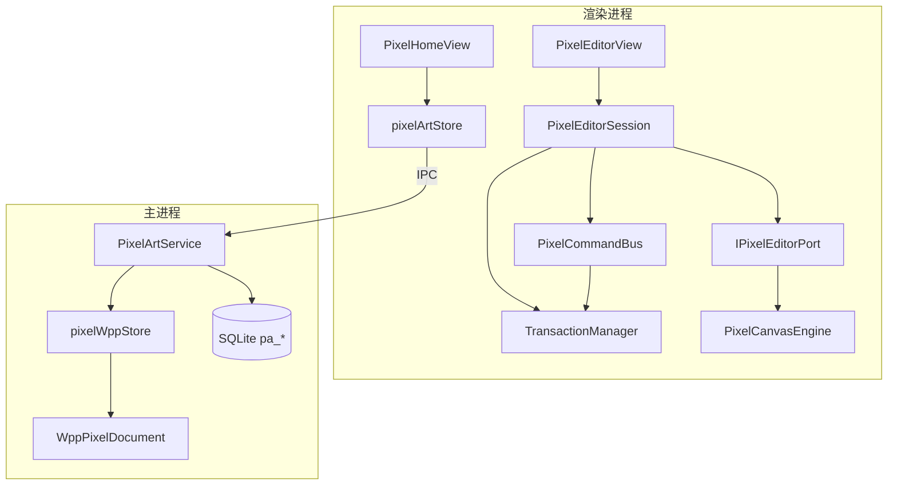

# 全库 · 像素画模块 — 详细设计（v1.2.6）

| 项 | 内容 |
|----|------|
| 文档版本 | v1.0 |
| 日期 | 2026-06-21 |
| 目标版本 | Wanwu **v1.2.6** |
| 项目代号 | `library-pixel-art` |
| 状态 | **待评审 · 未开发** |
| 需求文档 | [pixel-art-requirements-v1.2.6.md](../requirements/pixel-art-requirements-v1.2.6.md) |

---

## 0. 导读

### 0.1 设计目标

| 目标 | 说明 |
|------|------|
| 模块自治 | 业务代码集中在 `src/modules/library/pixel-art/` |
| 框架复用 | documentPackage、CommandBus、TransactionManager、Shell Outlet |
| 命令化 | UI / 快捷键 / 后续 MCP·AI 共用同一执行管线 |
| 精简目录 | 对标 diagrams 但合并文件，避免过度拆分 |
| 可扩展 | 帧动画、混合模式、Tilemap 通过数据模型预留扩展 |

### 0.2 读本文档的顺序

1. **§2 标识与路由** + **§3 目录结构**
2. **§4 .wpp 数据模型**
3. **§5 画布引擎** + **§6 命令与事务**
4. **§7 IPC 与存储**
5. **§12 开发任务拆解（PR）**

---

## 1. 架构总览



**数据流（保存）**：

```
编辑 → CommandHandler → TransactionUnit.apply → Session 内存态 dirty
  → debounce autosave → IPC writeContentPatch
  → pixelWppStore 更新 temp-work 目录 dirty 条目
  → savePackageToZip → 原子替换磁盘 .wpp
  → tx.markClean()
```

---

## 2. 标识与路由

| 项 | 值 |
|----|-----|
| 模块 ID | `wanwu.pixel-art` |
| Major ID | `pixel-art` |
| 用户可见名 | **像素画** |
| 文件扩展名 | `.wpp` |
| docType | `pixel-art` |
| major.order | `25` |
| 首页路由 | `/library/pixel-art` |
| 分组列表 | `/library/pixel-art/f/:folderId` |
| 编辑器路由 | `/pixel-art/edit/:fileId` |
| Shell Outlet ID | `wanwu.pixel-art.editor` |

### 2.1 AppModule 注册要点

仿 [`diagramsAppModule.ts`](../../src/modules/library/diagrams/app/diagramsAppModule.ts)：

```typescript
// app/pixelArtAppModule.ts（示意）
getLibrarySubmodule() {
  return {
    id: 'pixel-art',
    major: { id: 'pixel-art', name: '像素画', icon: 'grid-3x3', description: '像素图创作与整理', order: 25 },
    routeName: 'library-pixel-art-home',
    buildSectionTree: () => buildPixelCatalogTree(usePixelArtStore().folders),
    ensureLoaded: () => usePixelArtStore().loadFolders(),
    watchCatalogRefresh: (onRefresh) => { /* store 变更订阅 */ }
  }
}

registerShellOutlet(register) {
  register({
    id: 'wanwu.pixel-art.editor',
    priority: 25,
    matchesRoute: (route) => isPixelEditorRoute(route.name, route.path),
    loadComponent: () => import('../views/PixelEditorView.vue').then(m => m.default),
    keepAliveInclude: 'PixelEditorView',
    getActiveShellKey: (route) => `pixel-art-editor:${String(route.params.fileId ?? 'new')}`
  })
}
```

### 2.2 引导注册

| 进程 | 文件 | 机制 |
|------|------|------|
| 渲染 | `app/register.ts` | `import.meta.glob` 自动发现 |
| 主进程 | `main/register.ts` | `registerMainProcessModule()` |
| Preload | `preload/register.ts` | `window.wanwu.pixelArt` API |

---

## 3. 目录结构

```
src/modules/library/pixel-art/
├── app/
│   ├── register.ts
│   ├── pixelArtAppModule.ts
│   ├── PixelEditorSession.ts          # 单文档编辑会话（内存态）
│   ├── command/
│   │   ├── domain/ids.ts              # PixelCmd.*
│   │   ├── PixelCommandRegistry.ts
│   │   ├── registerPixelCommands.ts
│   │   ├── createPixelCommandBus.ts
│   │   └── handlers/                  # 按域合并：file.ts, canvas.ts, layer.ts, catalog.ts
│   └── transaction/
│       ├── createPixelTransactionManager.ts
│       ├── canvasTransaction.ts
│       ├── PixelStrokeUnit.ts
│       ├── PixelLayerSnapshotUnit.ts
│       └── PixelLayerPropertyUnit.ts
├── main/
│   ├── register.ts
│   ├── pixelArtMainModule.ts          # IPC 注册
│   ├── pixelPaths.ts
│   └── service/
│       ├── service.ts                 # PixelArtService（SQLite CRUD）
│       ├── pixelWppStore.ts           # temp-work + zip commit
│       ├── wppPixelDocument.ts        # WppPixelDocument 包装类
│       └── ipcCommands.ts
├── preload/
│   └── pixelArtApi.ts
├── domain/
│   ├── types.ts                       # PixelDocument, PixelLayer, PixelFrame…
│   ├── routes.ts
│   ├── packagePaths.ts
│   ├── folderIds.ts                   # pa-home, pa-files, pa-recycle
│   ├── constants.ts                   # MAX_SIZE, DEFAULT_SIZE, AUTOSAVE_MS
│   └── tools.ts                       # ToolId 枚举与默认参数
├── services/
│   ├── pixelArtStore.ts               # Pinia：folders, recentFiles
│   ├── PixelRepositoryIpcAdapter.ts
│   └── PixelCanvasEngine.ts           # IPixelEditorPort 默认实现
├── interfaces/
│   └── IPixelEditorPort.ts
├── views/
│   ├── PixelHomeView.vue
│   ├── PixelFileListView.vue
│   └── PixelEditorView.vue
├── components/
│   ├── PixelEditorToolbar.vue         # 顶栏 + 菜单
│   ├── PixelToolStrip.vue             # 左侧工具
│   ├── PixelSidePanel.vue             # 右侧 Tab 容器
│   ├── PixelLayerPanel.vue
│   ├── PixelPalettePanel.vue
│   ├── PixelPropertyPanel.vue
│   ├── PixelStatusBar.vue
│   └── PixelExportDialog.vue
├── composables/
│   ├── usePixelEditorBootstrap.ts
│   ├── usePixelEditorCommandSetup.ts
│   ├── usePixelPortBinding.ts
│   ├── usePixelAutosave.ts
│   ├── usePixelShortcuts.ts
│   ├── usePixelUndoRedoState.ts
│   ├── usePixelEditorLayout.ts
│   └── usePixelSaveFlow.ts
└── lib/
    ├── shapes.ts                      # Bresenham, 圆, 椭圆
    ├── floodFill.ts                   # Scanline flood fill
    ├── gradientFill.ts
    ├── selection.ts                   # 矩形选区、蚂蚁线
    ├── composite.ts                   # 图层合成
    ├── exportPng.ts
    ├── exportJpeg.ts
    ├── exportSvg.ts                   # raster + vector 两种
    └── blankDocument.ts
```

**合并原则**：handlers 按域 4 文件；components 控制在 8 个以内；不为单函数建目录。

---

## 4. .wpp 文档包

### 4.1 与 documentPackage 的关系

扩展 [`src/shared/documentPackage/types.ts`](../../src/shared/documentPackage/types.ts)：

```typescript
export type WanwuDocType = 'flow-graph' | 'generic' | 'pixel-art'
```

`.wpp` 是业务层扩展名；底层容器仍为 `wanwu-document-package` formatVersion 1。

### 4.2 包内路径约定

`domain/packagePaths.ts`：

```typescript
export const PIXEL_WPP_FILE_EXTENSION = '.wpp'

export const PIXEL_PACKAGE_PATHS = {
  meta: 'content/meta.json',
  frame: (frameId: string) => `content/frames/${frameId}.json`,
  layer: (layerId: string) => `content/layers/${layerId}.png`,
  asset: (assetId: string, ext: string) => `assets/${assetId}.${ext}`
} as const
```

### 4.3 包结构

```
manifest.json
content/meta.json
content/frames/frame-0.json
content/layers/layer-{uuid}.png
assets/{assetId}.png          # 可选：导入的参考图
```

### 4.4 content/meta.json

```typescript
interface WppMetaFile {
  format: 'wanwu-pixel'
  formatVersion: 1
  title: string
  width: number
  height: number
  background: 'transparent' | string   // '#RRGGBB'
  defaultFrameId: string               // v1.2.6 固定 'frame-0'
  activeLayerId: string
  palette: string[]                    // '#RRGGBB' | '#RRGGBBAA'
  grid: { visible: boolean; size: 1 }
  checkerboard: { visible: boolean }
}
```

### 4.5 content/frames/{frameId}.json

```typescript
interface WppFrameFile {
  id: string
  name: string
  sortOrder: number
  durationMs: number        // v1.2.6 固定 100，v1.2.7 动画用
  layerOrder: string[]      // layer id 从底到顶
}
```

v1.2.6 创建文档时仅写入 `frame-0`，`layerOrder` 含默认 `layer-1`。

### 4.6 content/layers/{layerId}.png

- 格式：PNG RGBA，尺寸 = meta.width × meta.height
- 逻辑分辨率 1:1，不含 zoom
- 透明像素 alpha=0

### 4.7 内存组装类型

```typescript
interface PixelDocument {
  format: 'wanwu-pixel'
  formatVersion: 1
  meta: WppMetaFile
  frames: PixelFrame[]
  layers: Record<string, PixelLayerBitmap>  // id → ImageData 或 Uint8ClampedArray
}

interface PixelFrame {
  id: string
  name: string
  sortOrder: number
  durationMs: number
  layerOrder: string[]
}

interface PixelLayerMeta {
  id: string
  name: string
  visible: boolean
  locked: boolean
  opacity: number   // 0–1，v1.2.6 默认 1
}
```

`PixelEditorSession` 持有 `PixelDocument` + 各层 `PixelLayerMeta`（meta 不存 PNG 外的层属性时，frame json 侧带 `layersMeta[]`）。

**推荐**：`frame-0.json` 扩展：

```typescript
interface WppFrameFile {
  // ...
  layers: PixelLayerMeta[]
}
```

### 4.8 WppPixelDocument 类

仿 [`wfgDiagramDocument.ts`](../../src/modules/library/diagrams/main/service/wfgDiagramDocument.ts)：

| 方法 | 说明 |
|------|------|
| `static create(fileId, title, size?)` | 新建包 + 默认 frame/layer |
| `static openFolder(fileId, dir)` | 从目录包打开 |
| `static openZip(fileId, path)` | 从 .wpp 打开 |
| `getContent()` | 组装 PixelDocument |
| `replaceContent(doc)` | 全量替换 |
| `patchLayer(layerId, pngBuffer)` | 增量标记 dirty |
| `patchMeta(meta)` | meta.json dirty |
| `saveDirtyToFolder(dir)` | 增量落盘 |
| `exportZip(path)` | 打包 .wpp |

### 4.9 增量保存

仿 [`diagramWfgStore.ts`](../../src/modules/library/diagrams/main/service/diagramWfgStore.ts)：

1. 打开文件 → 解压/复制到 `%TEMP%/wanwu-pixel-work/{fileId}/`
2. 编辑 → 内存 dirty 层 ID 集合
3. autosave → `writeContentPatch({ dirtyLayerIds, meta? })`
4. 主进程 `saveDirtyEntriesToFolder` + 定期 `savePackageToZip`
5. 原子替换用户目录 `media/pixel-art/{fileId}.wpp`

---

## 5. 画布引擎

### 5.1 IPixelEditorPort

仿 [`IDiagramEditorPort.ts`](../../src/modules/library/diagrams/interfaces/IDiagramEditorPort.ts)：

```typescript
export interface IPixelEditorPort {
  mount(el: HTMLElement): void
  destroy(): void

  loadDocument(doc: PixelDocument): void
  getDocument(): PixelDocument

  setActiveLayer(layerId: string): void
  getActiveLayerId(): string

  setTool(tool: ToolId, options?: ToolOptions): void
  getTool(): { id: ToolId; options: ToolOptions }

  setViewport(viewport: PixelViewport): void
  getViewport(): PixelViewport

  /** 合成可见层 */
  composite(): ImageData

  /** 某层原始像素 */
  getLayerImageData(layerId: string): ImageData | null

  /** 应用像素 patch（由 TransactionUnit 调用） */
  applyLayerPatch(layerId: string, patch: LayerPixelPatch): void

  setTheme(resolved: 'light' | 'dark'): void

  exportMergedPng(): Promise<Blob>
  exportMergedJpeg(quality: number): Promise<Blob>
  exportSvg(mode: 'raster' | 'vector', options?: SvgExportOptions): Promise<Blob>

  /** 指针事件 → 工具 handler */
  bindPointerHandlers(handlers: PixelPointerHandlers): void
}

export interface PixelViewport {
  zoom: number          // 整数倍：1, 2, 4, 8…
  panX: number
  panY: number
}

export interface LayerPixelPatch {
  /** 受影响矩形区域 + 该区域像素 RGBA */
  x: number
  y: number
  width: number
  height: number
  data: Uint8ClampedArray
}
```

### 5.2 PixelCanvasEngine 实现要点

**渲染栈**（单 `<canvas>` 或多层 OffscreenCanvas 合成）：

| 顺序 | 层 | 说明 |
|------|-----|------|
| 1 | 背景 | 棋盘格或纯色 |
| 2 | 合成层 | 各可见层 alpha 混合 |
| 3 | 网格 | 1px 像素网格线 |
| 4 | 预览层 | 形状/渐变/选区预览（TMP） |
| 5 | 选区 overlay | 蚂蚁线 |

**坐标映射**：

```
screenX → floor((screenX - panX) / zoom) = pixelX
```

仅整数 zoom；`imageSmoothingEnabled = false`。

**指针流程**：

```
pointerdown → Tool.onDown(ctx)
pointermove → Tool.onMove(ctx) → 可能产生 LayerPixelPatch
pointerup   → Tool.onUp(ctx) → CommandHandler 提交 TransactionUnit
```

### 5.3 工具注册

`domain/tools.ts` + `services/tools/`（或内联于 engine）：

```typescript
export type ToolId =
  | 'pencil' | 'eraser' | 'fill' | 'line' | 'rect' | 'ellipse'
  | 'gradient' | 'marquee' | 'eyedropper' | 'hand' | 'zoom'

export interface IToolHandler {
  onDown(ctx: ToolContext): void
  onMove(ctx: ToolContext): void
  onUp(ctx: ToolContext): void
  cancel?(): void
}
```

仿 Lospec `ToolManager.js`：工具切换时 cancel 上一工具。

---

## 6. 命令与事务

### 6.1 命令 ID

`app/command/domain/ids.ts`：

```typescript
export const PixelCmd = {
  File: {
    Open: 'Pixel.File.Open',
    Save: 'Pixel.File.Save',
    SaveAs: 'Pixel.File.SaveAs',
    Reload: 'Pixel.File.Reload',
    Export: 'Pixel.File.Export',
    Close: 'Pixel.File.Close'
  },
  Project: {
    OpenRecentFile: 'Pixel.Project.OpenRecentFile'
  },
  Document: {
    DrawStroke: 'Pixel.Document.DrawStroke',
    Fill: 'Pixel.Document.Fill',
    DrawShape: 'Pixel.Document.DrawShape',
    GradientFill: 'Pixel.Document.GradientFill',
    ClearSelection: 'Pixel.Document.ClearSelection',
    PickColor: 'Pixel.Document.PickColor',
    SetForeground: 'Pixel.Document.SetForeground',
    SetBackground: 'Pixel.Document.SetBackground',
    Undo: 'Pixel.Document.Undo',
    Redo: 'Pixel.Document.Redo',
    SetZoom: 'Pixel.Document.SetZoom',
    SetPan: 'Pixel.Document.SetPan',
    ZoomToFit: 'Pixel.Document.ZoomToFit',
    SetGrid: 'Pixel.Document.SetGrid',
    SetCheckerboard: 'Pixel.Document.SetCheckerboard'
  },
  Layer: {
    Add: 'Pixel.Layer.Add',
    Delete: 'Pixel.Layer.Delete',
    Rename: 'Pixel.Layer.Rename',
    Reorder: 'Pixel.Layer.Reorder',
    SetVisible: 'Pixel.Layer.SetVisible',
    SetLocked: 'Pixel.Layer.SetLocked',
    SetOpacity: 'Pixel.Layer.SetOpacity',
    MergeVisible: 'Pixel.Layer.MergeVisible'
  },
  Catalog: {
    File: {
      Create: 'Pixel.Catalog.File.Create',
      Rename: 'Pixel.Catalog.File.Rename',
      Move: 'Pixel.Catalog.File.Move',
      SoftDelete: 'Pixel.Catalog.File.SoftDelete',
      Restore: 'Pixel.Catalog.File.Restore',
      Purge: 'Pixel.Catalog.File.Purge'
    },
    Folder: {
      Create: 'Pixel.Catalog.Folder.Create',
      Rename: 'Pixel.Catalog.Folder.Rename',
      Delete: 'Pixel.Catalog.Folder.Delete'
    }
  }
} as const
```

### 6.2 命令总线

仿 [`createDiagramCommandBus.ts`](../../src/modules/library/diagrams/app/command/createDiagramCommandBus.ts)：

- `PixelCommandBus.execute(cmd)` → Handler → 可选 `TransactionManager`
- 同步 hook 全局 `CommandManager` 记录日志（scopeId: `module:pixel-art`）

### 6.3 事务单元

| 单元 | 触发命令 | apply | revert | tryMerge |
|------|----------|-------|--------|----------|
| `PixelStrokeUnit` | DrawStroke | 写入 patch | 恢复 before patch | 同层同工具连续笔划 |
| `PixelLayerSnapshotUnit` | Fill, DrawShape, GradientFill, Layer.MergeVisible | 层区域 before/after | 互换 | 否 |
| `PixelLayerPropertyUnit` | Layer.* | 属性变更 | 还原 | 同属性 300ms 内 |
| `PixelLayerStructureUnit` | Layer.Add/Delete/Reorder | 结构快照 | 还原 | 否 |

`PixelStrokeUnit` 存储**受影响矩形**的 before/after 像素（紧凑），非全层快照。

### 6.4 组合根

`usePixelEditorCommandSetup(session, port, tx)`：

1. 创建 `PixelCommandBus`
2. 注册 handlers
3. 绑定 `usePixelUndoRedoState(tx)`
4. 返回 `{ bus, canUndo, canRedo, undo, redo }`

### 6.5 对外 API（预留）

```typescript
// preload/pixelArtApi.ts
interface PixelArtPublicApi {
  executeCommands(fileId: string, commands: PixelCommandEnvelope[]): Promise<PixelCommandResult[]>
  readFile(fileId: string): Promise<PixelDocument>
  exportImage(fileId: string, options: ExportOptions): Promise<string /* path or base64 */>
}

// 渲染进程可选挂载
window.wanwu.pixelArt.executeCommands(...)
```

IPC：`pixel-art:executeCommands`（v1.2.6 实现骨架，MCP 映射放 v1.2.7+）。

---

## 7. 核心算法

| 功能 | 算法 | 实现文件 | 参考 |
|------|------|----------|------|
| 直线 | Bresenham | `lib/shapes.ts` | PixelCraft `lib/Shapes.js` |
| 矩形/椭圆 | 中点圆/椭圆算法 | `lib/shapes.ts` | PixelCraft / Lospec |
| 填充 | Scanline flood fill + tolerance | `lib/floodFill.ts` | Lospec `FillTool.js` |
| 渐变 | 两色线性插值 + 可选 ordered dither | `lib/gradientFill.ts` | PixlPunkt Gradient wiki |
| 笔刷 | 方形/圆形 stamp | `PixelCanvasEngine` | — |
| 合成 | 自上而下 alpha blend | `lib/composite.ts` | Lospec mergeLayers |
| 选区 | 矩形 mask + marching ants | `lib/selection.ts` | Lospec selection |

### 7.1 Scanline Flood Fill 概要

```
push seed (x,y)
while stack not empty:
  pop (x,y)
  find left/right span same color
  fill span
  push scanline seeds on rows above/below
```

- 容差：RGB 曼哈顿距离 ≤ tolerance
- 透明填充：仅填充 alpha>0 且颜色匹配区域（可配置「整层」模式）

### 7.2 SVG 导出

**raster 模式**（默认）：

```xml
<svg xmlns="http://www.w3.org/2000/svg" width="W" height="H">
  <image width="W" height="H"
    href="data:image/png;base64,..." />
</svg>
```

**vector 模式**：

1. 遍历合成 ImageData
2. 同行同色连续像素 → merge 为 `<rect x y width height fill/>`
3. 可选：单像素不合并（用户勾选「逐像素」，文件更大）
4. 完全透明像素跳过

导出对话框：模式选择 + 矢量合并策略 + 大画布体积警告（≥128×128 且 vector 时）。

### 7.3 JPEG 导出

- 透明 → 白底 `#FFFFFF` 合成后编码
- quality 默认 0.92，对话框可调

---

## 8. IPC 与存储

### 8.1 IPC 通道

| Channel | 方向 | 参数 | 返回 |
|---------|------|------|------|
| `pixel-art:listFolders` | invoke | — | `PixelFolder[]` |
| `pixel-art:createFolder` | invoke | `{ name, parentId? }` | `PixelFolder` |
| `pixel-art:renameFolder` | invoke | `{ id, name }` | `void` |
| `pixel-art:deleteFolder` | invoke | `{ id }` | `void` |
| `pixel-art:listFiles` | invoke | `{ folderId? }` | `PixelFileMeta[]` |
| `pixel-art:createFile` | invoke | `{ folderId, title, width, height }` | `PixelFileMeta` |
| `pixel-art:readFile` | invoke | `{ fileId }` | `PixelDocument` |
| `pixel-art:writeFile` | invoke | `{ fileId, content }` | `void` |
| `pixel-art:writeContentPatch` | invoke | `{ fileId, patch }` | `void` |
| `pixel-art:renameFile` | invoke | `{ fileId, title }` | `void` |
| `pixel-art:moveFile` | invoke | `{ fileId, folderId }` | `void` |
| `pixel-art:softDeleteFile` | invoke | `{ fileId }` | `void` |
| `pixel-art:restoreFile` | invoke | `{ fileId }` | `void` |
| `pixel-art:purgeFile` | invoke | `{ fileId }` | `void` |
| `pixel-art:exportImage` | invoke | `{ fileId, format, options }` | `{ path \| base64 }` |
| `pixel-art:importImage` | invoke | `{ fileId, sourcePath, asLayer? }` | `void` |
| `pixel-art:executeCommands` | invoke | `{ fileId, commands }` | `PixelCommandResult[]` |

### 8.2 SQLite 表（独立，避免耦合 diagrams）

**决策**：使用独立表前缀 `pa_`，不共用 `diagram_*` 表。

```sql
-- pa_folders
CREATE TABLE pa_folders (
  id TEXT PRIMARY KEY,
  name TEXT NOT NULL,
  sort_order INTEGER NOT NULL DEFAULT 0,
  deleted_at TEXT,
  created_at TEXT NOT NULL,
  updated_at TEXT NOT NULL
);

-- pa_files
CREATE TABLE pa_files (
  id TEXT PRIMARY KEY,
  folder_id TEXT NOT NULL REFERENCES pa_folders(id),
  title TEXT NOT NULL,
  width INTEGER NOT NULL,
  height INTEGER NOT NULL,
  pinned INTEGER NOT NULL DEFAULT 0,
  deleted_at TEXT,
  created_at TEXT NOT NULL,
  updated_at TEXT NOT NULL
);
```

索引：`pa_files(folder_id)`, `pa_files(updated_at DESC)`。

媒体路径：`{userData}/media/pixel-art/{fileId}.wpp`。

### 8.3 系统分组初始化

| ID | name | sort_order |
|----|------|------------|
| `pa-home` | 首页 | 0 |
| `pa-files` | 文件 | 1 |
| `pa-recycle` | 回收站 | 99 |

`pa-home` 为虚拟分组，不存文件。

---

## 9. UI 实现

### 9.1 PixelEditorView 生命周期

仿 `DiagramEditorView.vue`：

```
onMounted / onActivated
  → usePixelEditorBootstrap()        # 加载文档、创建 Session
  → usePixelEditorCommandSetup()     # Bus + TM
  → usePixelPortBinding()            # port 事件
  → attachPixelEditorFromRuntime()   # mount canvas
  → usePixelAutosave()               # debounce 保存
  → usePixelShortcuts()              # 快捷键 → commands
onBeforeUnmount
  → flush autosave
  → destroy port
```

### 9.2 面板布局

`usePixelEditorLayout()` 提供：

- `toolStripWidth`（固定 48px）
- `sidePanelWidth`（默认 280px，可拖拽 240–360px）
- `sidePanelCollapsed` / `toggleSidePanel()`
- 宽度持久化 `localStorage` key: `wanwu:pixel-art:editor-layout`

### 9.3 共享组件映射

| 场景 | 组件 |
|------|------|
| 按钮/图标按钮 | `WwButton`, `WwIconButton` |
| 颜色 | `WwColorInput` |
| 数值 | `WwNumberInput` |
| 对话框 | `WwGlassDialog` |
| 右键菜单 | `WwContextMenu` |
| 首页布局 | `ModulePageLayout`, `PageHeader`, `EmptyState` |

### 9.4 动效规范

| 元素 | 参数 |
|------|------|
| 面板折叠 | `transform` + `opacity`, 180ms `ease-out` |
| 工具选中 | 背景 `--ww-accent-subtle`, 120ms |
| 对话框 | `backdrop-filter: blur(12px)` |
| 蚂蚁线 | CSS `@keyframes marching-ants` 0.5s linear infinite |

---

## 10. 机制边界与依赖

### 10.1 允许的外部依赖

| 路径 | 用途 |
|------|------|
| `@shared/documentPackage` | 文档包读写 |
| `@app/command` | 全局 CommandManager 日志 |
| `@app/transaction` | TransactionManager |
| `@shared/components/*` | UI 组件 |
| `@app/composables/shellNavigation` | Shell 路由 |

### 10.2 禁止

- 在 `diagrams`、`illustrated-handbook` 等模块 import `pixel-art` 业务代码
- 在 `src/app/` 写像素画业务逻辑
- 在 `shared/` 写像素画工具/算法（除非后续提取为通用 raster 库且多模块复用）

### 10.3 机制边界检查

实现完成后运行：

```bash
node scripts/check-mechanism-boundaries.mjs
```

必要时在脚本中补充 pixel-art 白名单规则。

---

## 11. 常量与限制

`domain/constants.ts`：

```typescript
export const PIXEL_DEFAULT_SIZE = { width: 32, height: 32 } as const
export const PIXEL_SIZE_PRESETS = [16, 32, 64, 128] as const
export const PIXEL_MAX_WIDTH = 512
export const PIXEL_MAX_HEIGHT = 512
export const PIXEL_MAX_LAYERS = 32
export const PIXEL_AUTOSAVE_DEBOUNCE_MS = 2000
export const PIXEL_MAX_UNDO_STACK = 100
export const PIXEL_BRUSH_MIN = 1
export const PIXEL_BRUSH_MAX = 8
export const PIXEL_ZOOM_LEVELS = [1, 2, 4, 8, 16, 32] as const
```

---

## 12. 开发任务拆解（PR）

| PR | 内容 | 验收 |
|----|------|------|
| **PR-1 骨架** | register、路由、major order 25、空 Home/Editor 视图、Shell Outlet | 侧栏可见「像素画」，路由可达 |
| **PR-2 文档包** | `WanwuDocType` 扩展、WppPixelDocument、pixelWppStore、blankDocument | 可创建/读写 `.wpp` |
| **PR-3 画布引擎** | IPixelEditorPort、PixelCanvasEngine、棋盘格/网格/缩放/平移 | 空白画布显示，zoom 正常 |
| **PR-4 画笔/橡皮** | 工具 handler、PixelStrokeUnit、基础渲染 | 可绘制并撤销笔划 |
| **PR-5 命令/事务** | CommandBus、registerPixelCommands、undo/redo UI | Ctrl+Z/Y 有效 |
| **PR-6 形状/填充/渐变** | shapes、floodFill、gradientFill、LayerSnapshotUnit | 线/矩形/椭圆/填充/渐变可用 |
| **PR-7 图层** | Layer 命令、LayerPanel、合成 | 多图层增删排序 |
| **PR-8 文件管理** | SQLite、Home/List、保存/autosave、分组 | 完整文件 CRUD |
| **PR-9 导出** | PNG/JPEG/SVG 双模式、ExportDialog | 导出文件正确 |
| **PR-10 抛光** | 快捷键、状态栏、主题、Should 项 | 需求文档 §8 验收通过 |

建议顺序串行 PR-1→PR-8，PR-6/PR-7 可部分并行。

---

## 13. 后续版本预留

| 版本 | 内容 | 数据模型 |
|------|------|----------|
| v1.2.7 | 动画时间轴、多帧 UI、GIF 导出 | 已有 `frames[]`、`durationMs` |
| v1.2.7 | 魔棒/套索选区 | 选区 mask 可存为 layer 或 temp |
| v1.2.8 | 图层混合模式 | `PixelLayerMeta.blendMode` |
| v1.2.8 | Tilemap | 新 docType 或 meta flag |

无需 v1.2.6 → v1.2.7 文档迁移。

---

## 14. 风险

| 风险 | 缓解 |
|------|------|
| SVG vector 大文件 | 导出默认 raster；≥128×128 vector 警告 |
| 512×512 全层快照 undo 内存 | StrokeUnit 仅存矩形 diff；大操作用区域快照 |
| Shell Outlet 与 Library 双路由 | 与 diagrams 相同模式，已验证 |
| 共享 docType 改动 | 单点扩展 union type，无业务逻辑 |

---

## 15. 修订记录

| 版本 | 日期 | 说明 |
|------|------|------|
| v1.0 | 2026-06-21 | 初稿：架构、.wpp、命令/事务、IPC、PR 拆解 |
