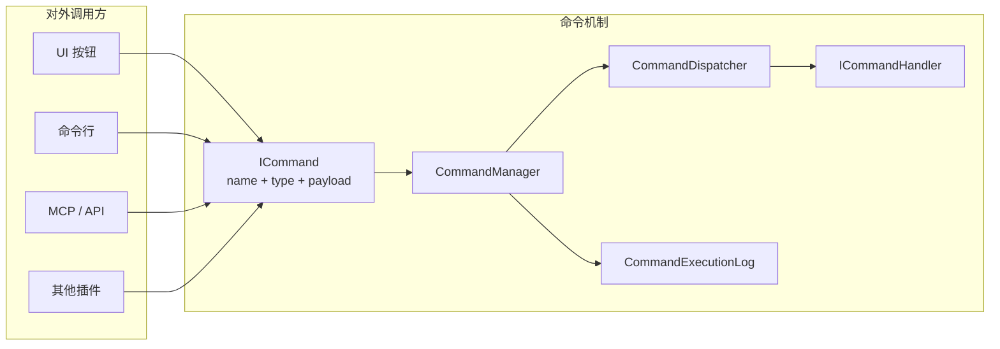
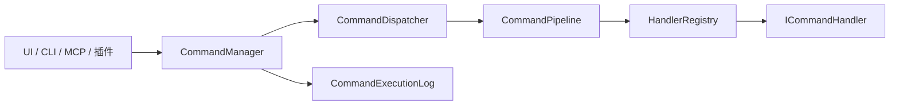
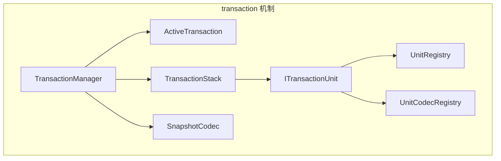
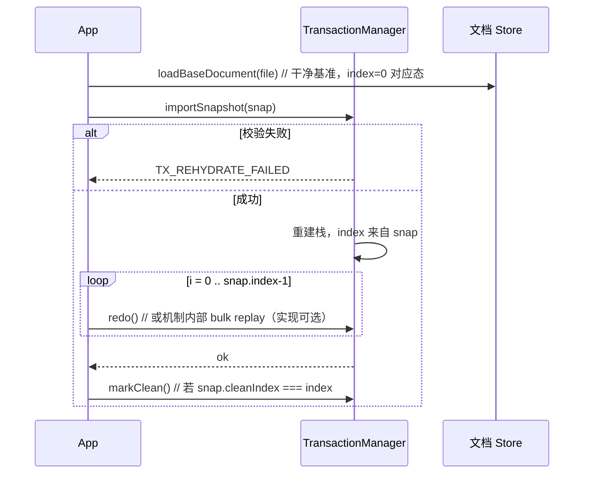
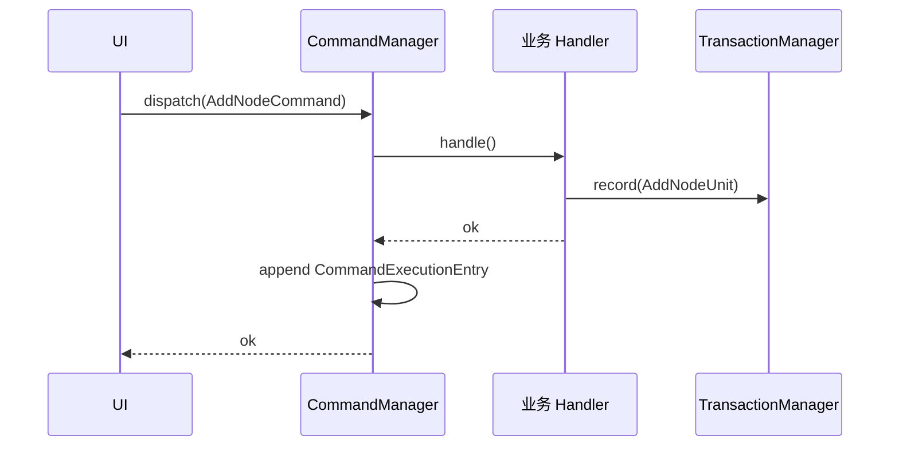
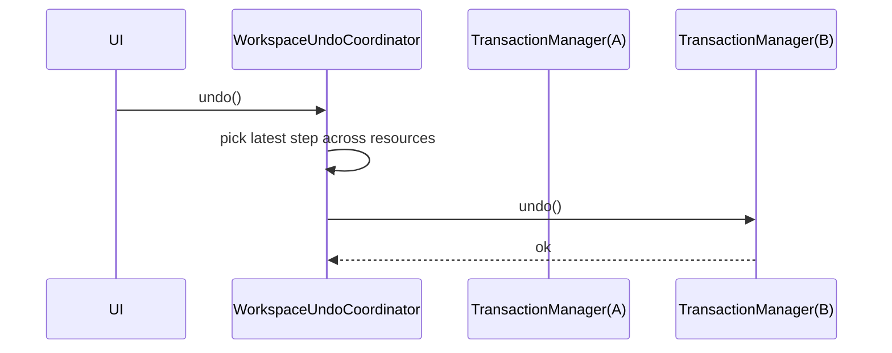
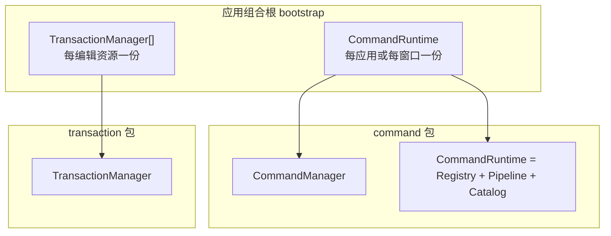
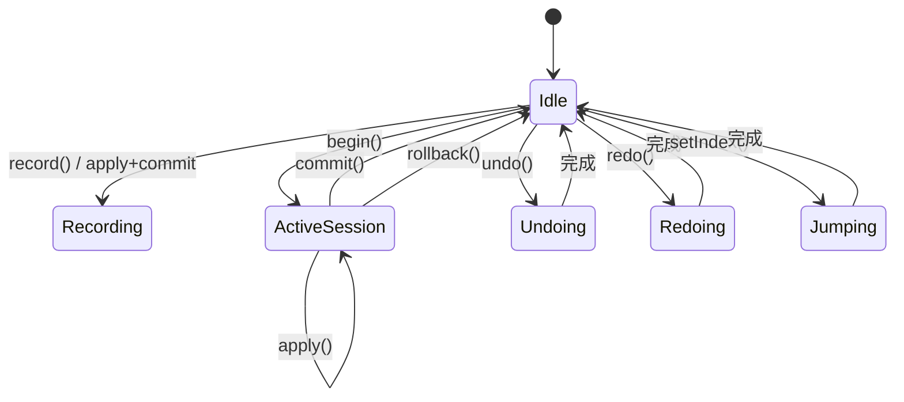
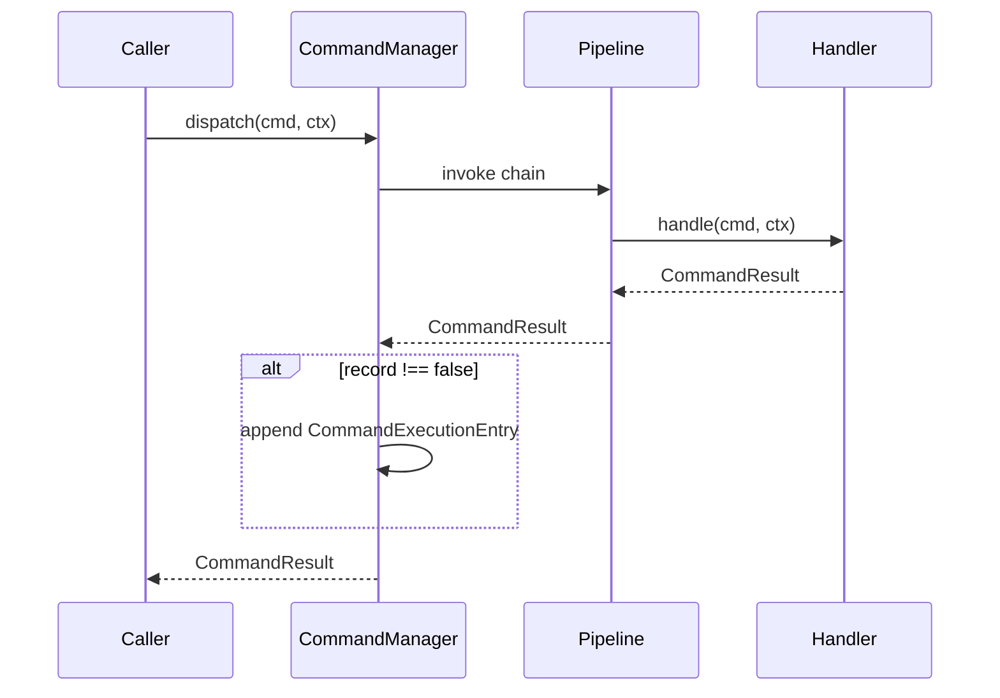
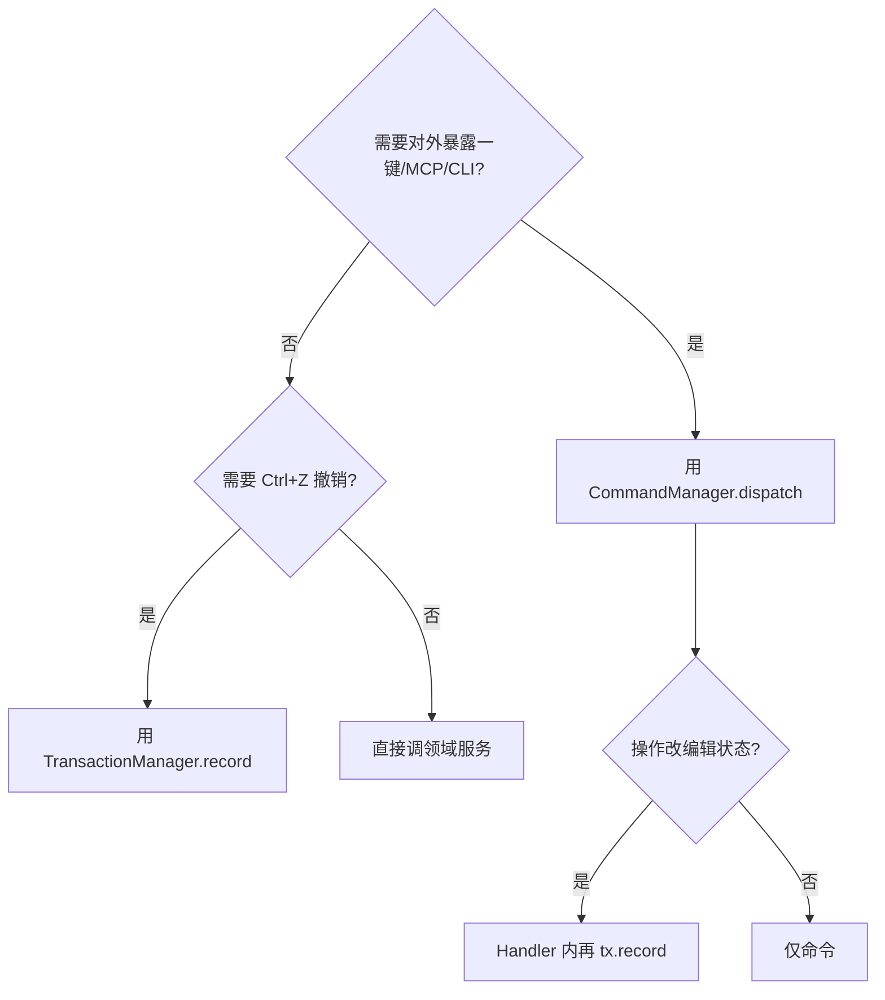

# 命令机制 & 事务机制 — 详细设计（TRD）

| 项 | 内容 |
|----|------|
| 文档版本 | v3.2 |
| 日期 | 2026-06-14 |
| 模块位置 | `src/app/command/` · `src/app/transaction/` |
| 状态 | **设计稿 · 待确认后开发** |
| 核心原则 | **两个完全独立的机制**；彼此零依赖、零共享类型、零耦合 |

---

## 文档导读（目录）

| 章节 | 内容 |
|------|------|
| **§0** | 总览、设计哲学、业界参考 |
| **Part A** | 命令机制（封装、分发、执行记录、Catalog、插件） |
| **Part B** | 事务机制（栈、会话、序列化、高级语义） |
| **Part C** | 业务组合模式（非机制代码） |
| **Part D** | 业界能力对照与取舍 |
| **Part E** | 五种由简到繁使用模式 |
| **Part F** | 性能、边界、测试 |
| **Part G** | 评审清单 |
| **Part H** | 架构深度：生命周期、组合根、实例模型 |
| **Part I** | 状态机与操作时序 |
| **Part J** | 场景矩阵（边界情况全覆盖） |
| **Part K** | 错误码约定 |
| **Part L** | 安全与外部调用（MCP/API） |
| **Part M** | 实现阶段与验收（**确认后开发**） |
| **Part N** | 待决事项（评审填写） |
| **Part O** | 与现有 Wanwu 代码边界与迁移 |
| **Part P** | 选型决策树（何时用哪套机制） |
| **Part Q** | 反模式与常见误区 |
| **附录** | 版本变更、JSON 示例、命名对照、开发确认书（附录 J） |

> **重要**：本文档为 TRD，**不代表已实现**。开发须在评审确认 **Part G、Part M 与 Part N（及附录 J 确认书）** 后进行。

## 0. 总览

### 0.1 为什么是两套机制

「命令」与「事务/撤销」解决的是 **不同问题**：

| 问题域 | 典型场景 | 参考框架 |
|--------|----------|----------|
| **命令** | 封装操作 + **记录已执行命令**（名称、参数）；一键、CLI、MCP、插件 | MediatR、GoF Command |
| **事务** | 多步原子提交、undo/redo、状态可逆、栈持久化 | Unit of Work、VS Code `UndoRedoService`、Qt `QUndoStack` |

业界常见误区是把二者焊在一起（如 Qt 的 `QUndoCommand` 同时承担「封装执行」与「撤销记录」）。  
本设计 **刻意拆分**：命令只管 **封装与分发**；事务只管 **可逆变更的生命周期与栈管理**。

```
┌─────────────────────┐       ┌─────────────────────┐
│  src/app/command    │       │ src/app/transaction │
│  （命令机制）        │  ✕    │  （事务机制）        │
│  零 import 对方     │ ←──→ │  零 import 对方     │
└─────────────────────┘       └─────────────────────┘
         │                             │
         └──────────┬──────────────────┘
                    ▼
           业务 / 插件层（自行组合）
```

### 0.2 机制层共同约束

| 约束 | 说明 |
|------|------|
| 无业务语义 | 不出现 patch、canvas、property 等领域词 |
| 非单例 | 每个上下文独立实例 |
| 可扩展 | Command：`HandlerRegistry` + `Pipeline` + `CommandManager`；Transaction：`UnitRegistry` + `Codec` |
| 无 UI / IPC | 机制层纯逻辑 |

### 0.3 非目标（两套机制均不做）

跨窗口协同 OT/CRDT、全局单例、内置 UI 控件、应用层 IPC 实现。  
多资源 Workspace 撤销、执行日志落盘等以 **可选扩展点** 保留，默认不启用。

### 0.4 设计哲学（简单 vs 可扩展）

| 原则 | 落地 |
|------|------|
| **默认简单** | 90% 场景：`CommandManager.dispatch` / `TransactionManager.record` 即可 |
| **渐进增强** | 需要时再接入 Pipeline、begin/commit、UnitRegistry、持久化 |
| **机制不含业务** | 领域命令/单元在业务模块注册；机制只提供「槽位」 |
| **对外一致** | UI、CLI、MCP、插件都走同一 `type + payload` 面 |

```
简单路径：dispatch(cmd) / record(unit)
高级路径：Pipeline + Catalog + begin/commit + merge + snapshot
```

### 0.5 业界参考索引

| 产品/框架 | 命令侧借鉴 | 事务侧借鉴 |
|-----------|-----------|-----------|
| **VS Code** | `registerCommand`、`executeCommand`、命令贡献点、enablement | `UndoRedoService`、资源级栈、Workspace 级组合撤销 |
| **IntelliJ Platform** | `CommandProcessor.executeCommand` 嵌套、命名、groupId 合并 | `UndoManager`、`transparent` 命令、不可撤销动作 |
| **Qt Undo** | —（执行与撤销分离的反面教材） | `QUndoStack` index、clean 状态、`mergeWith`、macro |
| **Blender Operators** | Operator 封装、repeat、属性保留 | 相对栈、skipped 步、成功才 push、undo_history 跳转 |
| **MediatR** | Pipeline、Handler 单一职责 | — |
| **Unit of Work** | — | begin/commit/rollback 会话边界 |

---

# Part A — 命令机制（`src/app/command/`）

> 参考：MediatR `IRequest` / `IRequestHandler`、GoF Command（**封装 + 执行**）

## A.1 命令机制解决什么问题

**核心目的：封装。**

将模块内部的一系列逻辑 **打包成一个命名操作**。对外只需：

```
给定命令类型 + 参数 → dispatch → 得到结果
```

调用方 **不必知道** 内部经过哪些步骤、调了哪些服务。这对以下场景尤为重要：

| 场景 | 价值 |
|------|------|
| **一键执行** | UI 按钮、工具栏、快捷键绑定一个命令即可 |
| **命令行 / 脚本** | CLI 解析参数后构造 `ICommand` 并 dispatch |
| **MCP / 外部 API** | 远程传入 `{ type, payload }`，本地路由到已注册 Handler |
| **插件扩展** | 插件注册新 `commandType` + Handler，对外暴露统一调用面 |



**机制层做三件事**：封装与分发、**记录已执行命令**、提供查询。不做撤销栈。

## A.2 职责边界

| 机制层提供 | 机制层不提供 |
|------------|--------------|
| 命令类型 + 参数（`ICommand`） | 撤销 / redo（属事务机制） |
| Handler 注册与路由 | 可逆状态变更记录 |
| 执行结果（`CommandResult`） | 命令/单元的 Codec 重放体系 |
| **`CommandManager` 执行记录**（名称、参数、时间、结果） | 事务栈持久化 |
| 管道中间件（日志、校验等） | 业务领域逻辑 |
| 组合命令（`CompositeCommand`） | |

### 执行记录 vs 事务栈（勿混淆）

| | 命令执行记录 | 事务撤销栈 |
|--|-------------|-----------|
| **记什么** | 调用过哪些命令、传了什么参数 | 哪些状态变更可撤销 |
| **用途** | 最近命令、审计、命令面板、重复执行 | Ctrl+Z / Ctrl+Y |
| **机制** | `CommandManager` + `CommandExecutionLog` | `TransactionManager` |
| **是否可撤销** | 否（仅日志） | 是 |

> **关于 MCP JSON 解析**：仍由业务适配层构造 `ICommand`；执行成功后 `CommandManager` 自动写入记录（名称 + payload）。

## A.3 核心概念

| 概念 | 说明 |
|------|------|
| `ICommand` | 封装单元：**名称 + 类型 + 参数** |
| `ICommandHandler` | 封装体：内部可包含任意多步逻辑 |
| `CommandDispatcher` | 按 `type` 路由并执行（纯分发） |
| **`CommandManager`** | **对外主入口**：`dispatch` + 自动记入执行日志 |
| **`CommandExecutionLog`** | 已执行命令的有序记录（名称、参数、结果） |
| `CommandPipeline` | 横切中间件（可选） |
| `HandlerRegistry` | 注册扩展点（插件注册 Handler） |

## A.4 架构



## A.5 目录结构

```
src/app/command/
  domain/
    ICommand.ts
    CommandContext.ts
    CommandMeta.ts
    CommandResult.ts
    CommandExecutionEntry.ts    # ★ 单条执行记录 DTO
  manager/
    CommandManager.ts             # ★ 对外主入口
    CommandManagerOptions.ts
  log/
    CommandExecutionLog.ts
  catalog/
    CommandDescriptor.ts
    CommandCatalog.ts
  extension/
    ICommandContributor.ts
  dispatch/
    CommandDispatcher.ts
    ICommandHandler.ts
    HandlerRegistry.ts
  pipeline/
    ICommandMiddleware.ts
    CommandPipeline.ts
  objects/
    CompositeCommand.ts
    CallableCommand.ts
  index.ts
```

**不设** 命令级 `Codec` / `Record` 重放体系；执行记录仅保存 **名称 + 参数快照** 供查询，非撤销栈。

## A.6 接口定义

```ts
/** 命令上下文：机制层只提供不透明服务袋 */
export interface CommandContext {
  readonly scopeId: string
  readonly services: Readonly<Record<string, unknown>>
}

export interface CommandMeta {
  readonly name: string
  readonly type: string
  readonly issuedAt: string
  readonly source?: 'ui' | 'api' | 'script' | 'system'
  readonly extras?: Record<string, unknown>
}

export type CommandResult<T = unknown> =
  | { ok: true; data?: T }
  | { ok: false; code: string; message: string }

/**
 * 命令：对外暴露的封装入口。
 * - type：路由键，如 "diagram.export"
 * - payload：调用方传入的参数（结构由业务定义）
 */
export interface ICommand<TPayload = unknown> {
  readonly meta: CommandMeta
  readonly payload: TPayload
}

/**
 * 命令处理器：封装内部逻辑的黑盒。
 * Handler 内可任意组合服务调用、事务 record、文件 IO 等——机制不限制。
 */
export interface ICommandHandler<TCmd extends ICommand, TResult = unknown> {
  readonly commandType: string
  handle(command: TCmd, ctx: CommandContext): CommandResult<TResult> | Promise<CommandResult<TResult>>
}

/**
 * ★ 单条执行记录：dispatch 完成后写入日志。
 * 保存名称与参数快照，供用户查看「执行过什么」。
 */
export interface CommandExecutionEntry {
  readonly id: string
  /** 用户可见名称，来自 meta.name */
  readonly name: string
  /** 路由类型，来自 meta.type */
  readonly type: string
  /** 执行时传入的参数（结构由业务定义，宜 JSON 可表示） */
  readonly payload: unknown
  readonly issuedAt: string
  readonly source?: CommandMeta['source']
  readonly result: 'success' | 'failure'
  readonly errorCode?: string
  readonly errorMessage?: string
}
```

## A.7 CommandManager（对外主入口）

```ts
export interface CommandManagerOptions {
  /** 日志最大条数；0 = 无限。默认 200 */
  maxLogEntries?: number
  /** 记录策略。默认 'all' */
  recordPolicy?: 'all' | 'success-only' | 'failure-only'
}

export class CommandManager {
  constructor(
    private readonly dispatcher: CommandDispatcher,
    private readonly log: CommandExecutionLog,
    private readonly options?: CommandManagerOptions
  )

  /** 执行命令；完成后自动 append 一条 CommandExecutionEntry */
  dispatch<T>(
    command: ICommand,
    ctx: CommandContext,
    options?: DispatchOptions
  ): Promise<CommandResult<T>>

  /** 用最近一条记录的 payload 再执行 */
  repeatLast(ctx: CommandContext): Promise<CommandResult>

  getLastEntry(): CommandExecutionEntry | null

  /** 批量执行；每条分别记入日志 */
  dispatchBatch(commands: ICommand[], ctx: CommandContext): Promise<CommandResult[]>

  // —— 执行记录查询 ——
  getLog(): readonly CommandExecutionEntry[]
  getRecent(limit?: number): readonly CommandExecutionEntry[]
  findByType(type: string): readonly CommandExecutionEntry[]
  clearLog(): void
  onLogChange(listener: (entries: readonly CommandExecutionEntry[]) => void): () => void
}
```

**记入日志的时机**：`dispatch` 返回后（无论成功失败），从 `ICommand.meta` 与 `payload` 生成条目。  
**不记入**：路由失败且未进入 Handler 的异常（可配置是否记 `failure`）。

```ts
export class CommandExecutionLog {
  append(entry: CommandExecutionEntry): void
  getAll(): readonly CommandExecutionEntry[]
  getRecent(limit: number): readonly CommandExecutionEntry[]
  clear(): void
  onChange(listener: ...): () => void
}
```

## A.8 分发器与管道

```ts
export interface ICommandMiddleware {
  readonly order: number
  invoke(
    command: ICommand,
    ctx: CommandContext,
    next: () => Promise<CommandResult>
  ): Promise<CommandResult>
}

export class CommandDispatcher {
  constructor(
    private readonly registry: HandlerRegistry,
    private readonly pipeline: CommandPipeline
  ) {}

  /** 执行单个命令 */
  dispatch<T>(command: ICommand, ctx: CommandContext): Promise<CommandResult<T>>

  /** 批量执行（顺序），遇错即停 */
  dispatchBatch(commands: ICommand[], ctx: CommandContext): Promise<CommandResult[]>
}
```

**管道用途**（参考 MediatR `IPipelineBehavior`）：日志、权限、参数校验——与事务机制无关。

**推荐**：业务代码统一通过 `CommandManager.dispatch`，而非直接调 `CommandDispatcher`（除非明确不需要记日志）。

## A.9 注册

```ts
export interface ICommandHandlerFactory {
  readonly commandType: string
  createHandler(ctx: CommandContext): ICommandHandler
}

export class HandlerRegistry {
  register(handler: ICommandHandler): void
  registerFactory(factory: ICommandHandlerFactory): void
  resolve(type: string): ICommandHandler
  has(type: string): boolean
}
```

插件扩展：注册新 `commandType` + `Handler` 即可对外提供新能力，**无需改机制代码**。

## A.10 机制层内置通用类

| 类 | 用途 |
|----|------|
| `CompositeCommand` | 顺序执行多个 `ICommand`，聚合结果 |
| `CallableCommand` | 包装 `handleFn`，测试/临时用 |

**仅此两类**；不含任何领域操作。

## A.11 使用示例

### 一键执行并自动记日志

```ts
const manager = new CommandManager(dispatcher, new CommandExecutionLog())

await manager.dispatch({
  meta: { name: '导出 PNG', type: 'diagram.export', issuedAt: iso(), source: 'ui' },
  payload: { format: 'png', pageId: 'p1' }
}, ctx)

// 用户查看最近执行过的命令
const recent = manager.getRecent(20)
// [{ name: '导出 PNG', type: 'diagram.export', payload: { format: 'png', ... }, ... }]
```

### MCP / 外部 API

```ts
// MCP 收到 JSON：{ "type": "diagram.export", "payload": { "format": "svg" } }
// 由 **业务适配层** 解析 JSON 并构造 ICommand（非命令机制职责）
const cmd = mcpAdapter.toCommand(incomingJson)
await manager.dispatch(cmd, ctx)
```

### 重复执行最近一条（业务层）

```ts
const last = manager.getRecent(1)[0]
if (last) {
  await manager.dispatch({
    meta: { name: last.name, type: last.type, issuedAt: iso(), source: 'ui' },
    payload: last.payload
  }, ctx)
}
```

### 插件注册新命令

```ts
// 插件暴露「一键排版」
handlerRegistry.register({
  commandType: 'plugin.autoLayout',
  handle(cmd, ctx) {
    // 内部多步逻辑封装在此
    alignAll(); distributeAll(); refreshCanvas()
    return { ok: true }
  }
})
```

### 与事务组合（业务 Handler 内，非机制）

```ts
// ExportHandler 内部若需可撤销，自行调用 TransactionManager
// 命令机制本身不感知事务
async handle(cmd, ctx) {
  await doExport(cmd.payload)
  return { ok: true }
}
```

## A.12 命令机制 API 速查

| API | 用途 |
|-----|------|
| **`CommandManager`** | **主入口**：dispatch + 执行记录 |
| `CommandExecutionEntry` | 单条记录：名称、type、payload、结果 |
| `CommandExecutionLog` | 记录容器 |
| `getRecent` / `getLog` / `clearLog` | 查询与清理 |
| `ICommand` | 封装入口：name + type + payload |
| `ICommandHandler` | 封装实现 |
| `CommandDispatcher` | 底层分发（通常由 Manager 持有） |
| `HandlerRegistry.register` | 插件扩展 |
| `CommandPipeline.use` | 中间件 |
| `CompositeCommand` | 组合多个命令 |

**无**：undo/redo、事务栈、`Codec` 重放体系。

## A.13 命令目录（Catalog）— 对外发现

> 借鉴 VS Code `contributes.commands`：不仅执行，还要让 UI/MCP **发现**有哪些命令。

```ts
/** 静态描述：供命令面板、文档、MCP schema 列举，不参与执行逻辑 */
export interface CommandDescriptor {
  readonly type: string
  readonly title: string           // 用户可见标题，≈ meta.name 默认值
  readonly category?: string     // 分组：「流程图」「文件」
  readonly description?: string
  /** 可选：当前上下文是否可执行（机制调用，业务实现 predicate） */
  readonly canExecute?: (ctx: CommandContext) => boolean
}

export class CommandCatalog {
  register(descriptor: CommandDescriptor): void
  unregister(type: string): void
  list(): readonly CommandDescriptor[]
  listExecutable(ctx: CommandContext): readonly CommandDescriptor[]
}
```

**简单用法**：只 `HandlerRegistry.register`，Catalog 可选。  
**完整用法**：插件同时 `catalog.register` + `handler.register`，命令面板读 `listExecutable(ctx)`。

## A.14 插件扩展契约

```ts
/** 插件入口：一次注册命令能力 */
export interface ICommandContributor {
  readonly id: string
  contribute(reg: CommandContributorContext): void
}

export interface CommandContributorContext {
  readonly catalog: CommandCatalog
  readonly handlers: HandlerRegistry
  readonly pipeline: CommandPipeline
}
```

| 插件做什么 | 调什么 |
|-----------|--------|
| 暴露新操作 | `handlers.register` + `catalog.register` |
| 加校验/日志 | `pipeline.use(middleware)` |
| 不提供撤销 | 仅命令侧；事务由 Handler 内自选接入 |

## A.15 dispatch 选项（简便与灵活）

```ts
export interface DispatchOptions {
  /** 是否写入执行日志。默认 true */
  record?: boolean
  /** 失败时是否仍记入日志。默认遵循 CommandManagerOptions.recordPolicy */
  recordOnFailure?: boolean
}

dispatch<T>(command: ICommand, ctx: CommandContext, options?: DispatchOptions)
```

| 场景 | 建议 |
|------|------|
| 用户点击按钮 | 默认 `record: true` |
| 内部子步骤调用 | `record: false`，避免日志膨胀 |
| MCP 批量 | 每条独立 dispatch，各自记日志 |

## A.16 内置 Pipeline 建议（机制提供通用中间件）

| 中间件 | 顺序 | 作用 |
|--------|------|------|
| `ValidationMiddleware` | 10 | 调用 Handler 前校验 payload 形状（业务注入 validator） |
| `TimingMiddleware` | 90 | 记录耗时，写入 `CommandExecutionEntry.extras.durationMs` |
| `GuardMiddleware` | 5 | 检查 `catalog.canExecute`，不可执行则短路 |

业务自定义中间件：`order` 越小越先执行（对齐 MediatR）。

## A.17 重复执行与「上次参数」

> 借鉴 Blender **Repeat Last / Adjust Last Operation**：机制提供数据，UI 决定呈现。

```ts
// CommandManager 便捷 API
repeatLast(ctx: CommandContext): Promise<CommandResult>   // 用最近一条 payload 再 dispatch
getLastEntry(): CommandExecutionEntry | null
```

不自动弹「参数调整面板」——那是业务 UI；机制只保证 **最近名称+参数可查、可重放**。

## A.18 命令机制能力总表

| 能力 | API | 默认 | 参考 |
|------|-----|------|------|
| 封装执行 | `dispatch` | ✅ | GoF、Blender Operator |
| 执行记录 | `CommandExecutionLog` | ✅ | IDE 命令历史 |
| 命令发现 | `CommandCatalog` | 可选 | VS Code contributes |
| 插件注册 | `ICommandContributor` | 可选 | VS Code extension |
| 横切 | `CommandPipeline` | 可选 | MediatR |
| 批量 | `dispatchBatch` | ✅ | MCP 脚本 |
| 重复执行 | `repeatLast` | ✅ | Blender repeat |
| 撤销 | — | ❌ | 走 Transaction |

---


> 参考：Martin Fowler **Unit of Work**（begin/commit/rollback）、VS Code **`IUndoRedoElement` + `UndoRedoService`**（历史元素与执行分离）、Qt **`QUndoStack`**（时间线，而非 QUndoCommand）

## B.1 职责

管理 **可逆变更** 的生命周期：

- 活跃会话（ACID）：`begin` / `commit` / `rollback`
- 事务栈导航：`undo` / `redo`
- 事务单元的序列化与持久化

**不负责**：命令分发、Handler 路由、MCP 脚本执行。

## B.2 核心概念与命名约定

| 概念 | 类/类型名 | 说明 |
|------|-----------|------|
| 事务单元 | `ITransactionUnit` | 最小原子可逆操作；**序列化原子** |
| 事务步 | `TransactionStep` | 一次 undo/redo（Ctrl+Z）；含 1..N 个单元 |
| 活跃会话 | `ActiveTransaction` | `begin`～`commit` 间的开放累积区 |
| 作用域 | `TransactionScope` | 嵌套 `begin` 的句柄（扁平化标记） |
| 事务栈 | `TransactionStack` | 已提交步列表 + `index` 指针 |
| 管理器 | `TransactionManager` | 对外唯一入口：会话、栈导航、持久化 |

```
TransactionManager
  └── TransactionStack
        └── TransactionStep[]     ← 一步撤销
              └── ITransactionUnit[]  ← 原子单元（各自序列化）
```

**命名原则**：

- 管理器统一叫 `TransactionManager`，不加 History 等后缀。
- 已提交步叫 `TransactionStep`，避免与「开放会话」`ActiveTransaction` 混淆。
- 栈结构叫 `TransactionStack`（对齐 Qt `QUndoStack`），不用 Timeline/History。
- 持久化 DTO 用 `Snapshot` / `Record` 后缀，方法用 `exportSnapshot` / `importSnapshot`。
- 处于 `transaction` 包内的通用实现类可省略 `Transaction` 前缀（如 `CompositeUnit`）。

## B.3 架构



## B.4 目录结构

```
src/app/transaction/
  domain/
    ITransactionUnit.ts
    TransactionContext.ts
    UnitMeta.ts
    OperationResult.ts
    UnitRecord.ts                 # ★ 单元级序列化 DTO
    TransactionStep.ts            # 一步（运行时）
    StepRecord.ts                 # 一步的序列化 DTO
    TransactionSnapshot.ts        # 完整栈快照
  session/
    ActiveTransaction.ts
    TransactionScope.ts
  stack/
    TransactionStack.ts
  manager/
    TransactionManager.ts
    TransactionManagerOptions.ts
  objects/
    UnitBase.ts
    CompositeUnit.ts              # 通用：组合子单元
    CallableUnit.ts               # 通用：回调（不可序列化）
  registry/
    IUnitFactory.ts
    UnitRegistry.ts
  codec/
    IUnitCodec.ts
    JsonUnitCodec.ts
    UnitCodecRegistry.ts
  serialization/
    ISnapshotCodec.ts
    JsonSnapshotCodec.ts
  persistence/
    ITransactionPersistence.ts
    FileTransactionPersistence.ts
  index.ts
```

## B.5 接口定义

```ts
export interface TransactionContext {
  readonly resourceId: string
  readonly services: Readonly<Record<string, unknown>>
}

export interface UnitMeta {
  readonly label: string
  readonly unitType: string
  readonly createdAt: string
  readonly extras?: Record<string, unknown>
}

/**
 * 事务单元：可逆操作的原子抽象。
 * 与 command 包的 ICommand 无任何继承或别名关系。
 */
export interface ITransactionUnit {
  readonly meta: UnitMeta

  apply(ctx: TransactionContext): OperationResult | Promise<OperationResult>
  revert(ctx: TransactionContext): OperationResult | Promise<OperationResult>
  reapply?(ctx: TransactionContext): OperationResult | Promise<OperationResult>

  tryMerge?(previous: ITransactionUnit): ITransactionUnit | null

  /** true：不单独成步，并入相邻步（IntelliJ transparent） */
  readonly transparent?: boolean
  /** false：apply 失败或显式标记时不入栈 */
  readonly recordable?: boolean

  toRecord(): UnitRecord
}

/** ★ 持久化最小单元 */
export interface UnitRecord {
  unitType: string
  codecId: string
  schemaVersion: number
  body: string
  meta: UnitMeta
}

/** 已提交的一步（运行时） */
export interface TransactionStep {
  readonly id: string
  readonly label: string
  readonly committedAt: string
  readonly units: readonly ITransactionUnit[]
  /** 默认 'normal'；'hidden' 不在用户历史面板显示（Blender skipped） */
  readonly visibility?: 'normal' | 'hidden'
  readonly groupId?: string | number
}

/** 一步的序列化 DTO */
export interface StepRecord {
  id: string
  label: string
  committedAt: string
  units: UnitRecord[]
}

/** 事务栈：已提交步 + 当前指针 */
export interface TransactionStack {
  readonly steps: readonly TransactionStep[]
  readonly index: number  // 0..steps.length
}

/** 栈状态变更事件 */
export interface TransactionChangeEvent {
  canUndo: boolean
  canRedo: boolean
  undoLabel: string | null
  redoLabel: string | null
  stepCount: number
  index: number
  isClean: boolean
}

/** 事务栈完整快照（持久化 DTO） */
export interface TransactionSnapshot {
  format: 'wanwu-transaction'
  formatVersion: 1
  resourceId: string
  index: number
  cleanIndex: number
  exportedAt: string
  steps: StepRecord[]
}
```

## B.6 TransactionManager API

```ts
export class TransactionManager {
  constructor(
    private readonly ctx: TransactionContext,
    private readonly unitRegistry: UnitRegistry,
    private readonly unitCodecRegistry: UnitCodecRegistry,
    private readonly options?: TransactionManagerOptions
  )

  // —— 开放会话（Unit of Work） ——
  begin(label: string): TransactionScope
  apply(scope: TransactionScope, unit: ITransactionUnit): Promise<OperationResult>
  commit(scope: TransactionScope): Promise<OperationResult>
  rollback(scope: TransactionScope): Promise<OperationResult>

  // —— 快捷：单单元一步 ——
  record(unit: ITransactionUnit): Promise<OperationResult>

  // —— 栈导航 ——
  undo(): Promise<OperationResult>
  redo(): Promise<OperationResult>
  canUndo(): boolean
  canRedo(): boolean

  // —— 状态 ——
  getStack(): Readonly<TransactionStack>
  markClean(): void
  isClean(): boolean
  clear(): void
  onChange(listener: (e: TransactionChangeEvent) => void): () => void

  // —— 持久化 ——
  exportSnapshot(): TransactionSnapshot
  importSnapshot(snapshot: TransactionSnapshot, options?: ImportOptions): Promise<OperationResult>
}
```

**语义**：

- `record(unit)`：无活跃会话时，`apply` 后立即 commit 为单单元 `TransactionStep`。
- `apply(scope, unit)`：在 `ActiveTransaction` 中累积；`commit` 时整体成为一步。
- `undo`：对栈顶步（`index-1`）内单元 **逆序** `revert`。
- 新步提交：截断 `index` 之后 redo 分支。

## B.7 ACID（编辑会话）

| 属性 | 保障 |
|------|------|
| **A** | 一步内单元整体 undo/redo；`rollback` 逆序 revert |
| **C** | 单元实现者保证；机制在失败时停止 |
| **I** | 仅 `commit` 入栈 |
| **D** | `TransactionSnapshot` + `ITransactionPersistence` |

## B.8 嵌套：扁平化（默认）

嵌套 `begin` 不建新栈；`scope.startUnitIndex` 标记起点。子 `rollback` 逆序 revert 并截断；仅最外层 `commit` 生成 `TransactionStep`。

## B.9 序列化逻辑

### 单元级（核心）

每个 `ITransactionUnit.toRecord()` 产出 `UnitRecord`。  
机制对 `body` **透明**；`codecId` 由单元或 Factory 决定（`json`、`xml`、插件自定义）。

### 步级

`StepRecord.units[]` 收集本步所有单元记录。

### 栈级

`TransactionSnapshot.steps[]` 由 `JsonSnapshotCodec`（默认）编码为文件。

### 反序列化管线

```
UnitRecord
  → UnitCodecRegistry.decode(codecId, body)
  → UnitRegistry.create(unitType, decoded)
  → ITransactionUnit
```

### 混合格式示例

```json
{
  "steps": [{
    "id": "step-1",
    "label": "一步",
    "units": [
      {
        "unitType": "moduleA.delta",
        "codecId": "json",
        "schemaVersion": 1,
        "body": "{\"k\":1}"
      },
      {
        "unitType": "moduleB.layout",
        "codecId": "xml",
        "schemaVersion": 1,
        "body": "<root/>"
      }
    ]
  }]
}
```

导入后文档状态：**机制不自动重放**；业务 reset 基准后 `redo()` 到 `index`。

## B.10 机制层内置通用类

| 类 | 用途 |
|----|------|
| `CompositeUnit` | 顺序 apply / 逆序 revert；`body` 为子 `UnitRecord[]` |
| `CallableUnit` | `applyFn`/`revertFn`；`toRecord()` 抛 `NOT_SERIALIZABLE` |

## B.11 使用示例（纯事务）

```ts
const tx = new TransactionManager(ctx, unitRegistry, unitCodecRegistry)

await tx.record(myUnit)
await tx.undo()
await tx.redo()
```

```ts
const scope = tx.begin('组合')
await tx.apply(scope, unitA)
await tx.apply(scope, unitB)
await tx.commit(scope)
```

## B.12 事务机制 API 速查

| API | 用途 |
|-----|------|
| `TransactionManager` | 管理器入口 |
| `record(unit)` | 单单元一步 |
| `begin / apply / commit / rollback` | 活跃会话 |
| `undo / redo` | 栈导航 |
| `exportSnapshot / importSnapshot` | 持久化 |
| `UnitRegistry` / `UnitCodecRegistry` | 扩展 |

## B.13 事务步的高级语义

> 综合 Qt `mergeWith`、IntelliJ `groupId`、Blender「成功才 push」。

### B.13.1 合并（Merge）

同类型单元在入栈前 `tryMerge`：连续拖拽、连续输入合并为一步。  
业务在 `ITransactionUnit` 实现；机制在 `record` / `apply` 时调用。

### B.13.2 分组 ID（groupId）

```ts
export interface TransactionScope {
  readonly groupId?: string | number  // 同 groupId 的步可合并（可选策略）
}
```

借鉴 IntelliJ：同一 `groupId` 的连续步可合并为一步（业务可选启用）。

### B.13.3 透明单元（Transparent）

> IntelliJ `runUndoTransparentAction`：不产生独立撤销步，并入相邻非透明步。

```ts
export interface ITransactionUnit {
  readonly transparent?: boolean  // 默认 false
}
```

`transparent: true` 的单元：不单独成步，附在前后步的 `TransactionStep.units` 内，undo 时随宿主步一起 revert。

### B.13.4 不可入栈（Non-Recordable）

```ts
/** 或单元 meta 标记 recordable: false */
```

借鉴 Blender `OPERATOR_CANCELLED` 不入栈、IntelliJ `nonundoableActionPerformed`：  
`apply` 失败或 `recordable: false` → 不生成 `TransactionStep`。

### B.13.5 隐藏步（Skipped）

借鉴 Blender skipped steps：中间态不入用户可见历史，仅栈内存在。  
`TransactionStep.visibility: 'normal' | 'hidden'`；历史面板 UI 可过滤 hidden。

## B.14 栈导航增强

```ts
export class TransactionManager {
  // 已有 undo/redo ...

  /** 撤销/重做显示名（菜单「撤销 改标题」） */
  undoLabel(): string | null
  redoLabel(): string | null

  /** 跳转到指定 index（历史面板点击某步） */
  setIndex(targetIndex: number): Promise<OperationResult>

  /** 重入保护 */
  isUndoInProgress(): boolean
  isRedoInProgress(): boolean

  /** 释放资源；回滚未提交的活跃会话 */
  dispose(): void
}
```

| API | 参考 |
|-----|------|
| `undoLabel` / `redoLabel` | Qt `createUndoAction`、IntelliJ `getUndoActionName` |
| `setIndex` | Blender `undo_history(item)` |
| `markClean` / `isClean` | Qt `QUndoStack::setClean` |
| `isUndoInProgress` | IntelliJ `isUndoInProgress` |
| `dispose` | 文档关闭生命周期 |

## B.15 TransactionManagerOptions 详表

```ts
export interface TransactionManagerOptions {
  maxSteps?: number              // 0=无限；超出淘汰最旧
  evictionPolicy?: 'drop-oldest'
  enableMerge?: boolean            // 默认 true
  nestMode?: 'flat'                // 严格嵌套预留 'strict'
  allowSetIndex?: boolean          // 是否允许 jump（默认 true）
}
```

## B.16 多资源栈（可选扩展）

> VS Code `IWorkspaceUndoRedoElement`：一步撤销可跨多个 resource。

默认：**每 `resourceId` 一个 `TransactionManager` 实例**（简单）。  
可选：业务层 `TransactionCoordinator` 协调多 Manager（**不在机制包内**）。

## B.17 持久化与恢复策略

| 阶段 | 行为 |
|------|------|
| `exportSnapshot` | 内存步 → `TransactionSnapshot` 文件 |
| `importSnapshot` | 校验 → 重建栈结构 |
| 文档状态 | 业务 reset 基准 + `redo()` 到 `index` |
| 失败 | 不部分应用；返回 `TX_REHYDRATE_FAILED` |

### B.17.1 快照导入完整流程（业务 + 机制协作）



| 步骤 | 负责方 | 说明 |
|------|--------|------|
| 1. 加载文档基准 | 业务 | 快照 **不含** 完整文档正文，仅含可逆步 |
| 2. `importSnapshot` | 机制 | 反序列化 `StepRecord` → 运行时 `TransactionStep` |
| 3. 重放到 `index` | 业务触发 redo 或机制 `replayTo(index)` | 内存态与关闭前一致 |
| 4. `cleanIndex` | 机制 + 业务 | 保存成功后业务调 `markClean()` |

**禁止**：import 中途对外暴露半成品栈（原子性：全成功或全失败）。

```ts
export interface ImportOptions {
  /** 未知 unitType 时跳过该单元而非整体失败 */
  skipUnknown?: boolean
  /** 导入后是否自动 replay 到 snapshot.index */
  autoReplay?: boolean   // 默认 false，由业务显式 redo
}
```

## B.18 事务机制能力总表

| 能力 | API | 默认 | 参考 |
|------|-----|------|------|
| 单步入栈 | `record` | ✅ | Qt push |
| 开放会话 | `begin/commit/rollback` | ✅ | UoW |
| 栈导航 | `undo/redo` | ✅ | QUndoStack |
| 合并 | `tryMerge` | 可选 | Qt mergeWith |
| 透明单元 | `transparent` | 可选 | IntelliJ |
| 隐藏步 | `visibility` | 可选 | Blender skipped |
| 跳转 | `setIndex` | 可选 | Blender history |
| 保存点 | `markClean` | ✅ | Qt clean |
| 步标签 | `undoLabel` | ✅ | Qt/IntelliJ |
| 持久化 | `exportSnapshot` | 可选 | VS Code 部分 |
| 多资源 | Coordinator | ❌ 业务层 | VS Code workspace |

---

# Part C — 业务层如何组合（非机制）

> 两机制 **不要求** 一起使用。以下仅为常见集成模式，代码位于业务模块，不在 `src/app/command` 或 `src/app/transaction`。

## C.0 组合原则

| 规则 | 说明 |
|------|------|
| 机制包零互引 | `command` 与 `transaction` 源码不 import 对方 |
| 桥接在 Handler | 需要可撤销时，Handler 内 `tx.record(unit)` |
| 上下文注入 | `services` 袋注入 store、tx 等依赖 |
| 类型独立 | `ICommand` 与 `ITransactionUnit` 无继承关系 |

## C.1 只用命令

菜单/快捷键/CLI/MCP 通过 `CommandManager.dispatch()`；执行后自动记入 `CommandExecutionLog`。

## C.2 只用事务

手绘编辑器直接 `tx.record(unit)`，不经命令层。

## C.3 组合使用（推荐模式）



要点：

- `AddNodeCommand` 与 `AddNodeUnit` 是 **两个独立类型**，由业务 Handler 桥接。
- 命令层 **不知道** 事务层的存在；事务层 **不知道** 命令层的存在。
- 若某命令不可撤销，Handler 不调用 `record` 即可。

## C.4 插件扩展（两套独立注册）

```ts
// 插件 A：只扩展命令
handlerRegistry.register(new ExportHandler())

// 插件 B：只扩展事务
unitRegistry.register({ unitType: 'plugin.layout', create: ... })
unitCodecRegistry.register(new XmlUnitCodec())

// 插件 C：两者都扩展 — 在插件 Handler 内桥接
```

## C.5 多资源 Workspace 撤销（业务 Coordinator）

机制层 **不提供** 跨 `resourceId` 的全局撤销。多文档「一步撤销」由业务层 `WorkspaceUndoCoordinator` 实现（参考 VS Code `UndoRedoService` 的 workspace 元素）：



| 职责 | 归属 |
|------|------|
| 比较各文档栈顶 `committedAt` / 全局序号 | Coordinator |
| 调用对应 `TransactionManager.undo()` | Coordinator |
| 栈存储与单元 revert | 各 `TransactionManager` |

**首期不实现** Coordinator；流程图单文档试点仅需 per-resource `TransactionManager`。

## C.6 Handler 内事务 record 顺序与补偿

| 模式 | 顺序 | 适用 |
|------|------|------|
| **先变更后 record**（推荐） | 1) 修改内存状态 2) `tx.record(unit)` 的 `apply` 为 no-op 或确认态 | 单元 `apply` 即写入、`revert` 回滚 |
| **先 record 后变更** | 1) `record` 2) Handler 内其他 IO | 仅当 `apply` 封装全部副作用 |
| **会话批量** | `begin` → 多次 `apply` → `commit` | 多步合成一步撤销 |

**补偿原则**（X2 场景）：

```ts
async handle(cmd, ctx) {
  const tx = ctx.services.tx as TransactionManager
  try {
    const unit = buildUnit(cmd.payload)
    const r = await tx.record(unit)
    if (!r.ok) return r
    return { ok: true }
  } catch (e) {
    // 若 record 前已改状态，须自行 revert 或勿提前改状态
    return { ok: false, code: 'DIAGRAM_OP_FAILED', message: String(e) }
  }
}
```

命令 `dispatch` 失败时 **不** 应留下已入栈事务；`record` 应放在成功路径末尾或委托给单元的 `apply`。

---

# Part D — 业界参考与能力采纳详表

## D.1 命令机制对照

| 能力 | VS Code | IntelliJ | Blender | 本设计 | 采纳方式 |
|------|---------|----------|---------|--------|----------|
| 命令 ID + 处理函数 | `registerCommand` | `executeCommand` | Operator | `ICommand` + Handler | ✅ 核心 |
| 对外标题/分类 | `contributes.commands` | `@NlsContexts.Command` | `bl_label` | `CommandDescriptor` | ✅ Catalog |
| 条件可执行 | `when` / `enablement` | — | poll 属性 | `canExecute(ctx)` | ✅ 可选 |
| 程序化调用 | `executeCommand` | API | `bpy.ops` | `dispatch` | ✅ |
| 执行历史 | — | — | Repeat | `CommandExecutionLog` | ✅ |
| 管道/拦截 | — | — | — | `CommandPipeline` | ✅ MediatR |
| 嵌套命令作用域 | — | `executeCommand` 嵌套 | — | 不内置；Handler 内组合 | 业务层 |
| 撤销 | — | `UndoManager` | undo push | **Transaction 包** | 分离 |

## D.2 事务机制对照

| 能力 | Qt | VS Code | IntelliJ | Blender | 本设计 |
|------|-----|---------|----------|---------|--------|
| 栈 + index | ✅ | ✅ | ✅ | ✅ | `TransactionStack` |
| undo/redo 标签 | ✅ | 部分 | ✅ | ✅ | `undoLabel` |
| clean/脏标记 | ✅ | — | — | — | `markClean` |
| 命令合并 | `mergeWith` | 编辑合并 | `groupId` | — | `tryMerge` |
| 宏/多步一步 | `beginMacro` | `pushStackElement` | 外层 command | — | `begin/commit` |
| 透明子操作 | — | — | `transparent` | — | `transparent` |
| 失败不入栈 | — | — | 异常回滚 | `CANCELLED` | apply 失败不入栈 |
| 隐藏中间步 | — | — | — | skipped | `visibility: hidden` |
| 历史跳转 | `setIndex` | — | — | `undo_history` | `setIndex` |
| 多文档一步撤销 | — | Workspace | global command | — | 业务 Coordinator |
| 持久化 | — | 部分 | — | memfile | `exportSnapshot` |

## D.3 本设计的刻意取舍

| 不内置 | 原因 | 替代 |
|--------|------|------|
| Qt 式 QUndoCommand | 与命令封装耦合 | Command + Transaction 分包 |
| 命令级 Codec 重放 | 非封装职责 | 执行日志 + 业务适配 |
| 全局单例 Manager | 多文档污染 | 每上下文实例 |
| UI 命令面板 | 机制层不含 UI | 读 `CommandCatalog` 自建 |
| 协同 OT | 复杂度 | 未来独立模块 |

---

# Part E — 典型使用模式（由简到繁）

## E.1 模式 1：最小命令（5 行）

```ts
handlers.register({ commandType: 'app.hello', handle: () => ({ ok: true }) })
await manager.dispatch({ meta: { name: '你好', type: 'app.hello', issuedAt: iso() }, payload: {} }, ctx)
```

## E.2 模式 2：命令 + 执行记录查询

```ts
await manager.dispatch(exportCmd, ctx)
const recent = manager.getRecent(10)  // 命令面板数据源
```

## E.3 模式 3：可撤销编辑

```ts
// Handler 内
async handle(cmd, ctx) {
  const unit = createMoveNodeUnit(cmd.payload)
  await tx.record(unit)
  return { ok: true }
}
// UI
await manager.dispatch(moveCmd, ctx)
await tx.undo()
```

## E.4 模式 4：插件一次性注册

```ts
export const diagramsCommands: ICommandContributor = {
  id: 'wanwu.diagrams',
  contribute({ catalog, handlers }) {
    catalog.register({ type: 'diagram.export', title: '导出', category: '流程图' })
    handlers.register(exportHandler)
  }
}
```

## E.5 模式 5：多步排版（事务会话）

```ts
const scope = tx.begin('自动排版')
await tx.apply(scope, alignUnit)
await tx.apply(scope, distributeUnit)
await tx.commit(scope)  // 用户一次 Ctrl+Z 撤销
```

---

# Part F — 性能、边界、测试

## F.1 性能与内存预算

| 机制 | 策略 | 建议默认值 |
|------|------|-----------|
| Command | Handler 无状态；Pipeline 链尽量短 | 中间件 ≤ 5 个 |
| Command 日志 | `maxLogEntries` 淘汰最旧 | 200 条 |
| Transaction | `maxSteps` 淘汰 | 500 步（可配置 0=无限） |
| Transaction | `tryMerge` 合并连续同类操作 | 拖拽/输入场景开启 |
| Transaction | `toRecord` 惰性 | export 时才算 body |
| 快照体积 | 业务控制 `body` 大小 | 单步 body < 256KB 建议 |

## F.2 边界

| 场景 | Command | Transaction |
|------|---------|-------------|
| 执行/apply 失败 | 返回错误，不传播 | 不入栈 |
| 不可序列化 | `CallableCommand` 可 dispatch | `CallableUnit` 不可 export |
| 重入 | undo/redo 中禁止 dispatch | undo/redo 中禁止 record；`isUndoInProgress` |
| 快照 replay | — | import 后须达 `index` 再允许用户编辑 |

## F.3 机制层测试矩阵

| 类别 | Command 用例 | Transaction 用例 |
|------|-------------|-----------------|
| 路由 | C1 未知 type | — |
| 日志 | C3 record:false、C8 不可序列化 payload | — |
| 管道 | C5 canExecute、C2 异常 | — |
| 栈基础 | — | T1 apply 失败、T5 截断 redo、T14 空栈 |
| 会话 | — | T2/T3 嵌套 rollback、I.3 commit 失败 |
| 高级 | C4 repeatLast、C6 batch | T11 transparent、T12 merge、T7 setIndex |
| 持久化 | — | T8 skipUnknown、快照 export/import 往返 |
| 生命周期 | — | T10 dispose、H.4 并发串行 |
| 隔离 | `command` 包不 import `transaction` | 反向亦然（CI 脚本） |

## F.4 机制层测试（摘要）

**Command**：Manager 记日志、getRecent、dispatch 路由、Pipeline、batch。

**Transaction**：record → undo → redo、活跃会话 commit/rollback、混合 codec 导入、扁平嵌套 rollback、merge、transparent、hidden 步、setIndex、`markClean`、快照往返。

---

# Part H — 架构深度设计

## H.1 实例所有权模型



| 实例 | 粒度 | 生命周期 | 说明 |
|------|------|----------|------|
| `CommandRuntime` | 应用 / Shell | 应用启动～退出 | 聚合 Registry、Pipeline、Catalog、Contributor |
| `CommandManager` | 同 Runtime | 同上 | 对外 `dispatch`；持有一个 `CommandExecutionLog` |
| `CommandExecutionLog` | 同 Manager 或按 scopeId | 可配置 | 多编辑器可共享或各有一份 |
| `TransactionManager` | **每 `resourceId`** | 文档打开～关闭 | 一图一栈，禁止全局单例 |

**Wanwu 建议映射**（业务层，非机制强制）：

| 资源 | resourceId / scopeId | Manager |
|------|---------------------|---------|
| 流程图文档 | `diagram:{fileId}` | 每打开的编辑器一个 `TransactionManager` |
| 命令执行 | `shell` 或 `module:diagrams` | 一个 `CommandManager` 供 Shell/模块共用 |

## H.2 组合根（Composition Root）

机制层 **不提供** 全局 DI 容器；由 `src/app/bootstrap/` 或各模块 bootstrap 组装：

```ts
// 伪代码：应用启动时一次
function createCommandRuntime(): CommandRuntime {
  const registry = new HandlerRegistry()
  const pipeline = new CommandPipeline()
  const catalog = new CommandCatalog()
  pipeline.use(new GuardMiddleware(catalog))
  pipeline.use(new TimingMiddleware())

  const dispatcher = new CommandDispatcher(registry, pipeline)
  const log = new CommandExecutionLog({ maxEntries: 200 })
  const manager = new CommandManager(dispatcher, log)

  for (const contributor of commandContributors) {
    contributor.contribute({ catalog, handlers: registry, pipeline })
  }
  return { manager, catalog, registry, pipeline }
}

// 文档打开时
function openDiagramEditor(fileId: string) {
  const tx = new TransactionManager(
    { resourceId: `diagram:${fileId}`, services: { ... } },
    unitRegistry,
    unitCodecRegistry
  )
  return { commandManager: appCommandRuntime.manager, transactionManager: tx }
}

// 文档关闭时
function closeDiagramEditor(tx: TransactionManager) {
  tx.dispose()  // rollback 未 commit 会话、清监听
}
```

## H.3 dispose 与资源释放

| 对象 | dispose 行为 |
|------|-------------|
| `CommandManager` | 清 `onLogChange` 监听；可选清 log |
| `TransactionManager` | 若有开放 `ActiveTransaction` → 自动 `rollback`；清 `onChange` |
| `HandlerRegistry` | 注销所有 handler（插件 unload 时） |

## H.4 异步与串行化

| 规则 | Command | Transaction |
|------|---------|-------------|
| Handler 可 async | ✅ | Unit apply/revert 可 async |
| 并发 dispatch 同一 Manager | **串行队列**（默认）或明确拒绝 `BUSY` | **必须串行** |
| undo 进行中 | 允许读 `getLog` | 禁止 `record`/`apply`/`commit` |
| 多文档 | 各 Manager 独立，可并行 | 各 `TransactionManager` 独立 |

机制层内部：`TransactionManager` 使用 `mutex`/`queue` 保证同一实例操作串行。

## H.5 类型与命名约定

**命令 type**（路由键）：

```
{module}.{action}          例：diagram.export
{pluginId}.{action}        例：acme.autoLayout
```

- 全小写，点分隔，禁止空格
- 插件命令必须带插件前缀，防冲突

**事务 unitType**：

```
{module}.{verb}            例：diagram.moveNode
core.composite             机制内置
core.callable              机制内置（不可持久化）
```

**错误码**：`{MECHANISM}_{REASON}`，见 Part K。

## H.6 事件与可观测性

| 事件 | 触发时机 | 订阅方 |
|------|----------|--------|
| `CommandManager.onLogChange` | 执行记录 append | 命令面板 UI |
| `TransactionManager.onChange` | 栈 index/步数/clean 变化 | 工具栏撤销/重做按钮 |
| Pipeline 中间件 | 每次 dispatch 前后 | 日志、性能监控 |

机制层不绑定 Vue/React；UI 自行订阅。

## H.7 包边界强制（CI）

通过 ESLint `no-restricted-imports` 或自定义脚本保证零耦合：

```js
// eslint 片段（示意）
'no-restricted-imports': ['error', {
  patterns: [
    { group: ['**/app/transaction/**'], importNames: ['*'], message: 'command 包禁止 import transaction' }
  ]
}]
```

| 检查项 | 验收 |
|--------|------|
| `src/app/command/**` 无 `transaction` 路径 import | CI grep / eslint |
| `src/app/transaction/**` 无 `command` 路径 import | 同上 |
| 无共享 `src/app/shared/command-transaction-*` 类型包 | 目录不存在 |

---

# Part I — 状态机与操作时序

## I.1 TransactionManager 状态（单实例）



| 状态 | 允许的操作 |
|------|-----------|
| `Idle` | record, begin, undo, redo, setIndex, export |
| `ActiveSession` | apply, commit, rollback（同 scope） |
| `Undoing` / `Redoing` / `Jumping` | **仅** 等待完成；拒绝其他变更操作 |

## I.2 dispatch 时序（命令）



## I.3 活跃会话 commit 失败

若 `commit` 时某单元 `apply` 已成功但后续失败：

1. 机制对开放区内已 apply 单元 **逆序 revert**
2. 返回 `COMMIT_FAILED`
3. 不生成 `TransactionStep`
4. 开放会话关闭

## I.4 快照导入失败回滚

若 `autoReplay` 或业务手动 `redo` 中途失败：

1. 机制将 `index` 回退到 replay 开始前
2. 对已 apply 的步执行逆序 revert（与 undo 相同逻辑）
3. 返回 `TX_REHYDRATE_FAILED`；栈置空或保留 import 前状态（实现二选一，**默认置空**）
4. 业务重新 `loadBaseDocument` 并提示用户

---

# Part J — 场景矩阵

## J.1 命令机制

| # | 场景 | 预期行为 |
|---|------|----------|
| C1 | 未知 `type` | `{ ok: false, code: 'CMD_UNKNOWN_TYPE' }`，不记日志 |
| C2 | Handler 抛异常 | 捕获为 `CMD_HANDLER_THROW`；按 `recordPolicy` 决定是否记日志 |
| C3 | `dispatch` + `record: false` | 执行但不 append 日志 |
| C4 | `repeatLast` 无历史 | `CMD_NO_LAST_ENTRY` |
| C5 | `canExecute` 返回 false | Pipeline Guard 短路 `CMD_NOT_EXECUTABLE` |
| C6 | `dispatchBatch` 中途失败 | 默认停止后续；可选 `continueOnError`（业务配置） |
| C7 | 插件卸载 | `registry.unregister(type)`；Catalog 同步移除 |
| C8 | payload 含循环引用 | 记日志时 `structuredClone` 失败 → 存 `{ _error: 'UNSERIALIZABLE_PAYLOAD' }` |
| C9 | 同一 type 重复注册 | 后注册覆盖或抛 `CMD_DUPLICATE_TYPE`（实现时二选一，默认覆盖并 warn） |

## J.2 事务机制

| # | 场景 | 预期行为 |
|---|------|----------|
| T1 | `record` 时 `apply` 失败 | 不入栈；返回错误 |
| T2 | 开放会话中 `rollback` 子 scope | 仅 revert 子区间单元 |
| T3 | 最外层 `rollback` | revert 全部开放单元；丢弃会话 |
| T4 | `undo` 中某单元 `revert` 失败 | 停止；`index` 不变；`TX_UNDO_FAILED` 事件 |
| T5 | 新 `record` 截断 redo 分支 | `index` 后步丢弃（Qt 语义） |
| T6 | `maxSteps` 淘汰 | 删最旧步；`cleanIndex` 相应下调 |
| T7 | `setIndex` 目标非法 | `TX_INVALID_INDEX` |
| T8 | `importSnapshot` 未知 unitType | 默认失败；`skipUnknown: true` 跳过该单元 |
| T9 | `CallableUnit` 在 snapshot 中 | 导出时排除或整步标记不可导出 |
| T10 | 文档关闭时有开放会话 | `dispose` → 自动 rollback |
| T11 | `transparent` 单元单独 record | 附到当前或下一非透明步；无宿主则暂存缓冲区 |
| T12 | `merge` 成功 | 替换栈顶/开放区末单元，不增加步数 |
| T13 | `markClean` 后 undo | `isClean` 变为 false |
| T14 | 空栈 undo/redo | no-op，返回 `{ ok: true }` |
| T15 | import 后 replay 中途失败 | 回退 index；`TX_REHYDRATE_FAILED`；默认清空栈（I.4） |

## J.3 跨机制（业务层）

| # | 场景 | 建议 |
|---|------|------|
| X1 | 命令成功但未 record 事务 | 允许；不可撤销 |
| X2 | 命令失败但事务已 record | **禁止**；事务 record 应在命令成功路径 |
| X3 | undo 后命令日志 | 日志 **不** 回滚（执行记录是审计轨迹） |
| X4 | MCP 调命令触发编辑 | Handler 内 record 事务；MCP 不直接调 Transaction |
| X5 | 保存文件 + markClean | 业务：先持久化文档 → `tx.markClean()` |

---

# Part K — 错误码约定

## K.1 命令机制 `CMD_*`

| 码 | 含义 |
|----|------|
| `CMD_UNKNOWN_TYPE` | 无注册 Handler |
| `CMD_NOT_EXECUTABLE` | Catalog `canExecute` 未通过 |
| `CMD_HANDLER_THROW` | Handler 未捕获异常 |
| `CMD_BUSY` | 串行队列占用（可选） |
| `CMD_NO_LAST_ENTRY` | `repeatLast` 无记录 |
| `CMD_DUPLICATE_TYPE` | 重复注册（若启用严格模式） |
| `CMD_PIPELINE_ABORT` | 中间件中断 |

## K.2 事务机制 `TX_*`

| 码 | 含义 |
|----|------|
| `TX_APPLY_FAILED` | 单元 apply 失败 |
| `TX_REVERT_FAILED` | 单元 revert 失败 |
| `TX_UNDO_FAILED` | undo 中途失败 |
| `TX_REDO_FAILED` | redo 中途失败 |
| `TX_REENTRANT` | 栈导航中禁止变更 |
| `TX_INVALID_INDEX` | setIndex 越界 |
| `TX_COMMIT_FAILED` | commit 失败已回滚开放区 |
| `TX_ROLLBACK_FAILED` | rollback 失败 |
| `TX_REHYDRATE_FAILED` | 导入快照失败 |
| `TX_UNKNOWN_UNIT_TYPE` | 未知 unitType |
| `TX_UNKNOWN_CODEC` | 未知 codecId |
| `TX_NOT_SERIALIZABLE` | CallableUnit 导出 |
| `TX_ACTIVE_SESSION` | 有未关闭会话时禁止部分操作（可选） |

业务错误使用 `{module}_*` 前缀，不占用 `CMD_` / `TX_`。

---

# Part L — 安全与外部调用

## L.1 MCP / API 命令

机制层 **不** 做鉴权；业务在 Pipeline 或 Handler 入口处理：

| 层 | 职责 |
|----|------|
| 业务适配层 | JSON schema 校验、type 白名单 |
| `GuardMiddleware` | 检查 Catalog 是否允许该 type |
| Handler | 校验 payload 业务规则、资源归属 |
| 事务 | 仅接受受信代码构造的 Unit |

## L.2 执行记录隐私

`CommandExecutionLog` 可能含敏感 payload；`maxLogEntries` 限制内存；可选业务层落盘前脱敏。

## L.3 快照文件

`TransactionSnapshot` 含完整编辑历史；存用户数据目录；机制不加密（由应用层决定）。

---

# Part G — 评审清单

- [ ] `command` 与 `transaction` **互相零 import**（含 H.7 CI 检查）
- [ ] 无共享接口、无类型别名（`ICommand` ≠ `ITransactionUnit`）
- [ ] 命令机制有 `CommandManager` + 执行记录（名称、参数）
- [ ] 命令执行记录 **≠** 事务撤销栈
- [ ] 命令机制 **无** undo/redo、**无** Unit 级 Codec 重放
- [ ] 事务机制 **无** dispatch/handler/pipeline
- [ ] 两机制均无非通用业务类
- [ ] 事务序列化原子为 `UnitRecord`（命令机制无对应物）
- [ ] 业务组合仅在 Part C，不污染机制包
- [ ] 提供 `CommandCatalog` + `ICommandContributor` 插件契约
- [ ] Part H 实例模型与 Wanwu 映射已确认
- [ ] Part O 与现有 DiagramCommandBus 边界已确认
- [ ] Part J 场景矩阵覆盖可接受
- [ ] Part M 分阶段实现计划已批准
- [ ] Part N 待决事项已填写
- [ ] **确认前不启动开发**

---

# Part M — 实现阶段与验收（确认后开发）

> **请评审确认本节后方可编码。** 建议分阶段交付，每阶段可独立验收。

### 阶段 M1：命令机制最小可用（约 1 PR）

| 交付 | 验收 |
|------|------|
| `ICommand` / `ICommandHandler` / `CommandResult` | 类型导出 |
| `HandlerRegistry` + `CommandDispatcher` | 路由执行 |
| `CommandManager` + `CommandExecutionLog` | dispatch 记日志、getRecent |
| 单测：C1/C4 场景 | CI 通过 |

**不含**：Catalog、Pipeline、Contributor

### 阶段 M2：命令机制完整（约 1 PR）

| 交付 | 验收 |
|------|------|
| `CommandPipeline` + 内置 Timing/Guard | 中间件链 |
| `CommandCatalog` + `ICommandContributor` | 插件注册 |
| `repeatLast` / `DispatchOptions` | 场景 C3/C4 |
| 单测覆盖 Part J.1 | CI 通过 |

### 阶段 M3：事务机制最小可用（约 1 PR）

| 交付 | 验收 |
|------|------|
| `ITransactionUnit` / `TransactionStack` | 类型与栈 |
| `TransactionManager.record/undo/redo` | T1/T5/T14 |
| `CompositeUnit` / `CallableUnit` | 通用类 |
| `command` 与 `transaction` 零 import | 依赖检查脚本 |

### 阶段 M4：事务机制完整（约 1 PR）

| 交付 | 验收 |
|------|------|
| `begin/apply/commit/rollback` 扁平嵌套 | T2/T3 |
| `tryMerge` / `undoLabel` / `markClean` | T12/T13 |
| `UnitRegistry` + `JsonUnitCodec` | 反序列化管线 |
| `exportSnapshot` / `importSnapshot` | T8 场景 |

### 阶段 M5：事务高级 + 文档化（约 1 PR）

| 交付 | 验收 |
|------|------|
| `setIndex` / transparent / hidden | T11/T7 |
| `dispose` / 串行队列 | H.3/H.4 |
| `FileTransactionPersistence`（可选） | 侧车文件读写 |
| 本 TRD 与实现一致性审查 | 评审签字 |

### 阶段 M6：业务接入（业务 PR，非机制）

| 交付 | 验收 |
|------|------|
| 模块 bootstrap 注册 Contributor | 至少一模块示例 |
| 编辑器 `open/close` 绑定 TransactionManager | 流程图试点 |
| UI 订阅 onChange / onLogChange | 撤销按钮、命令面板 |

---

# Part N — 待决事项（评审填写）

| ID | 问题 | 选项 | 推荐（供参考） | 决定 |
|----|------|------|----------------|------|
| N1 | `CommandExecutionLog` 粒度 | A) 全局一份 B) 每 scopeId 一份 | **A** — Shell 级一份即可；模块内子日志用 `record:false` | 待填 |
| N2 | Handler 重复注册 | A) 覆盖+warn B) 抛错 | **A** — 插件热更新需覆盖 | 待填 |
| N3 | 命令日志是否落盘 | A) 仅内存 B) 可选 Persistence | **A** — M1～M5 仅内存；Persistence 作扩展点 | 待填 |
| N4 | 事务快照默认策略 | A) 不自动 B) 随文档侧车 `.tx.json` | **A** — 首期不自动；M5 提供 `FileTransactionPersistence` 可选 | 待填 |
| N5 | `dispatchBatch` 失败策略 | A) 停止 B) 可配置 continue | **A** 默认停止；`continueOnError` 作 Options 扩展 | 待填 |
| N6 | M1～M5 阶段是否同意 | 同意 / 调整 | 同意按文档分 5 PR | 待填 |
| N7 | 首期试点模块 | 流程图 / 其他 | **流程图** — 已有 DiagramCommandBus 可桥接 | 待填 |

---

# Part O — 与现有 Wanwu 代码边界与迁移

> **机制层 PR 不修改下列现有代码**；迁移在 M6 及后续业务 PR 进行。

## O.1 概念对照

| 现有 | 层级 | 新机制 | 关系 |
|------|------|--------|------|
| `DiagramCommandBus` | 模块应用层 `diagrams/app/commandBus/` | `CommandManager` | **不同层**；Bus 是流程图领域路由，Manager 是应用级封装框架 |
| `CommandRouter` + `*CommandHandler` | 业务 Handler | `ICommandHandler` | 概念对齐；可逐步委托给 Manager |
| `DiagramCommandEnvelope` | 业务 DTO | `ICommand` | 字段不同；适配层转换 |
| LogicFlow 内置 undo | 第三方画布 | `TransactionManager` + Unit | **替换**为自管栈；LogicFlow undo 应关闭 |
| `diagramClipboard*` 等 | 业务领域 | 不变 | 可在 Handler/Unit 内调用 |

## O.2 三层模型

```
┌─────────────────────────────────────────────┐
│  UI / 快捷键 / MCP 适配层                      │
├─────────────────────────────────────────────┤
│  模块应用层（DiagramCommandBus、适配器）        │  ← 现有，M6 演进
├─────────────────────────────────────────────┤
│  机制层（src/app/command · transaction）      │  ← 本文档范围 M1～M5
├─────────────────────────────────────────────┤
│  领域（diagrams/domain、stores、LogicFlow）    │
└─────────────────────────────────────────────┘
```

## O.3 迁移路径（建议，非 M1～M5 范围）

| 阶段 | 动作 |
|------|------|
| M1～M5 | 仅新增 `src/app/command`、`src/app/transaction`，零改动 diagrams |
| M6 | 流程图 `openEditor` 创建 `TransactionManager`；关闭 `dispose` |
| M6+ | 新增 `DiagramCommandContributor` 向 `CommandCatalog` 注册 |
| 后续 | `DiagramCommandBus.dispatch` 薄包装 → `CommandManager.dispatch` |
| 后续 | 画布操作 Handler 内 `tx.record(MoveNodeUnit)`；禁用 LogicFlow undo |

## O.4 共存期规则

- 同一编辑器 **不同时** 使用 LogicFlow undo 与 `TransactionManager`（避免双栈）。
- `DiagramCommandBus.onResult` 监听 **不等于** `CommandExecutionLog`；迁移后统一读 Manager 日志。
- 模块内 `commandType` 命名与机制层 `type` 可对齐（如 `diagram.align`），但注册表独立。

---

# Part P — 选型决策树



| 场景 | 命令 | 事务 | 说明 |
|------|------|------|------|
| 导出 PNG | ✅ | ❌ | 无副作用或不可撤销 |
| 移动节点 | ✅ | ✅ | UI 走命令，Handler record 单元 |
| 拖拽连续移动 | 可选 | ✅ + merge | 内部可直接 record，不必每次 dispatch |
| 自动保存 | ❌ | ❌ | 领域服务；保存后 `markClean` |
| MCP 批量排版 | ✅ batch | ✅ session | `begin/commit` 在 Handler 内 |
| 单元测试临时操作 | `CallableCommand` | `CallableUnit` | 不可持久化 |

---

# Part Q — 反模式与常见误区

| 反模式 | 为何错误 | 正确做法 |
|--------|----------|----------|
| 用 `CommandExecutionLog` 做撤销 | 日志是审计，无 revert | `TransactionManager.undo` |
| `ICommand` 实现 `revert()` | 混淆两机制 | 独立 `ITransactionUnit` |
| 机制层 import `diagrams/*` | 污染机制 | Handler 在业务模块 |
| 全局单例 `TransactionManager` | 多文档栈混乱 | 每 `resourceId` 实例 |
| undo 时删除命令日志 | 日志与状态无关 | 保留日志（X3） |
| 在 `apply` 外改状态再 record | X2 风险 | 状态变更封装进 Unit |
| LogicFlow undo + Transaction 双开 | 两套历史 | 关闭 LogicFlow undo |
| 共享 `OperationResult` 类型包 | 假耦合 | 两包各自定义，结构可对齐 |
| MCP 直接 `importSnapshot` | 绕过鉴权 | 仅受信代码调事务 API |
| 命令级 Codec 重放栈 | 超出职责 | 事务 `UnitRecord` |

---

## 附录 A：v3.2 变更摘要

| 新增/修订 | 内容 |
|-----------|------|
| Part C.5/C.6 | 多资源 Coordinator、Handler 补偿顺序 |
| B.17.1 | 快照导入完整流程与 `ImportOptions` |
| F.1～F.4 | 性能预算、测试矩阵 |
| H.7 | ESLint 包边界强制 |
| I.4 | 快照 replay 失败回滚 |
| Part G 前置 | 评审清单移至 M 之前 |
| Part O | 与 DiagramCommandBus / LogicFlow 迁移边界 |
| Part P | 选型决策树 |
| Part Q | 反模式清单 |
| Part N | 增加「推荐」列 |
| 修复 | B.14 API 块、C.0/C.1 结构 |

## 附录 B：v3.1 变更摘要

| 新增 | 内容 |
|------|------|
| 文档导读目录 | 全文章节索引 |
| Part H | 组合根、实例所有权、dispose、异步串行、命名约定 |
| Part I | 状态机与时序图 |
| Part J | 命令/事务/跨机制场景矩阵 |
| Part K | 统一错误码 |
| Part L | MCP 安全边界 |
| Part M | 分阶段实现与验收（**确认后开发**） |
| Part N | 待决事项表 |

## 附录 C：v3.0 变更摘要

| 新增章节 | 内容 |
|----------|------|
| §0.4–0.5 | 设计哲学、业界参考索引 |
| §A.13–A.18 | Catalog、Contributor、dispatch 选项、Pipeline、repeatLast |
| §B.13–B.18 | merge、transparent、hidden、setIndex、能力总表 |
| Part D | VS Code / IntelliJ / Qt / Blender 详表 |
| Part E | 五种由简到繁使用模式 |

## 附录 D：v2.3 命令管理器

| 新增 | 说明 |
|------|------|
| `CommandManager` | 对外主入口：dispatch + 自动记日志 |
| `CommandExecutionEntry` | 名称、type、payload、时间、成功/失败 |
| `CommandExecutionLog` | 有序记录容器，`getRecent` / `clearLog` |

执行记录用于「用户查看执行过什么、重复执行、命令面板」；**不是**撤销栈。

## 附录 E：v2.2 命令机制变更

| 移除 | 原因 |
|------|------|
| `CommandRecord` / `ISerializableCommand` | 序列化不是命令机制职责 |
| `ICommandCodec` / `CommandCodecRegistry` | 同上 |
| `dispatchRecord()` | MCP/CLI 由业务适配层构造 `ICommand` |

| 强化 | 说明 |
|------|------|
| §A.1 封装定位 | 一键执行、CLI、MCP、插件对外暴露 |
| Handler 黑盒 | 内部多步逻辑、事务、IO 均由 Handler 自行决定 |

## 附录 F：命名对照（v2.1 事务机制）

| v2.0 | v2.1 | 说明 |
|------|------|------|
| `TransactionHistoryManager` | `TransactionManager` | 唯一管理器入口 |
| `HistoryTimeline` | `TransactionStack` | 已提交步 + index |
| `Transaction`（一步） | `TransactionStep` | 避免与机制名混淆 |
| `OpenTransaction` | `ActiveTransaction` | 开放中的会话 |
| `HistorySnapshot` | `TransactionSnapshot` | 栈级持久化 DTO |
| `TransactionRecord` | `StepRecord` | 一步的序列化 DTO |
| `TransactionUnitRecord` | `UnitRecord` | 单元序列化 DTO |
| `IHistoryCodec` | `ISnapshotCodec` | 快照编解码 |
| `IHistoryPersistence` | `ITransactionPersistence` | 持久化接口 |
| `exportHistory` / `importHistory` | `exportSnapshot` / `importSnapshot` | 方法名与 DTO 一致 |
| `CompositeTransactionUnit` | `CompositeUnit` | 包内省略前缀 |
| `CallableTransactionUnit` | `CallableUnit` | 包内省略前缀 |
| `TransactionUnitBase` | `UnitBase` | 包内省略前缀 |
| `ITransactionUnitFactory` | `IUnitFactory` | 包内省略前缀 |
| `ITransactionUnitCodec` | `IUnitCodec` | 包内省略前缀 |

## 附录 G：v2.0 相对 v1.2 的变更

| 变更 | 说明 |
|------|------|
| 拆为 Part A / Part B 独立文档体例 | 两套机制分别完整设计 |
| 删除「command 依赖 transaction」 | 改为零关系 |
| Command 新增 Dispatcher / Handler / Pipeline | 对齐 MediatR |
| Transaction 术语统一为 Unit | 避免与 Command 混淆 |
| `TransactionManager` 管理 `ITransactionUnit` | 事务层入口，与 command 零耦合 |
| 新增 Part C 组合模式 | 业务桥接，非机制 |

## 附录 H：完整栈快照 JSON 示例（事务机制）

```json
{
  "format": "wanwu-transaction",
  "formatVersion": 1,
  "resourceId": "doc-8f3a",
  "index": 1,
  "cleanIndex": 1,
  "exportedAt": "2026-06-14T12:00:00.000Z",
  "steps": [
    {
      "id": "step-001",
      "label": "编辑",
      "committedAt": "2026-06-14T11:58:00.000Z",
      "units": [
        {
          "unitType": "moduleA.change",
          "codecId": "json",
          "schemaVersion": 1,
          "body": "{\"field\":\"title\",\"before\":\"A\",\"after\":\"B\"}",
          "meta": {
            "label": "改标题",
            "unitType": "moduleA.change",
            "createdAt": "2026-06-14T11:58:00.000Z"
          }
        }
      ]
    }
  ]
}
```

事务 `UnitRecord` 用于 **撤销栈持久化**。

命令侧对应物为内存中的 `CommandExecutionEntry[]`（名称 + 参数 + 结果），**不**与事务栈混用。

## 附录 I：`CommandExecutionEntry` 示例（命令机制）

```json
{
  "id": "cmd-log-001",
  "name": "导出 PNG",
  "type": "diagram.export",
  "payload": { "format": "png", "pageId": "p1" },
  "issuedAt": "2026-06-14T12:00:00.000Z",
  "source": "ui",
  "result": "success"
}
```

失败时 `result: "failure"`，并附带 `errorCode` / `errorMessage`。  
此为 **执行日志**，用户可据此查看或重复执行；撤销编辑状态仍走 `TransactionManager`。

---

## 附录 J：开发确认书（模板）

```
评审结论：[ ] 通过  [ ] 修改后再审  [ ] 驳回

确认项：
[ ] Part G 评审清单全部勾选
[ ] Part M 阶段划分
[ ] Part N 待决事项已决议（可采纳推荐列或另选）
[ ] Part O 与 DiagramCommandBus 迁移边界已确认
[ ] 首期试点模块：___________
[ ] 机制层范围（不扩业务逻辑）

签字/日期：___________
```

**未填写确认前，不合并机制层实现 PR。**
