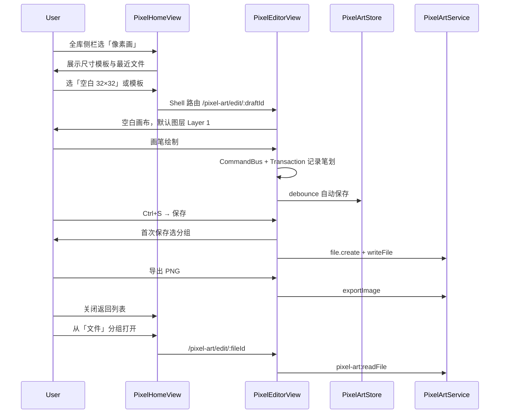

# 全库 · 像素画模块 — 用户需求文档（v1.2.6）

| 项 | 内容 |
|----|------|
| 文档版本 | v1.0 |
| 日期 | 2026-06-21 |
| 目标版本 | Wanwu **v1.2.6** |
| 项目代号 | `library-pixel-art` |
| 用户可见名 | **像素画** |
| 状态 | **待评审 · 未开发** |
| 关联设计 | [pixel-art-detailed-design-v1.2.6.md](../design/pixel-art-detailed-design-v1.2.6.md) |

---

## 0. 导读

### 0.1 文档目的

定义 v1.2.6 全库子模块「像素画」的产品范围、用户场景、界面与功能需求，作为设计与实现的验收依据。

### 0.2 已确认决策

| 项 | 决策 |
|----|------|
| 入口形态 | **独立首页 + 独立编辑器 Shell**，与流程图模块一致 |
| 动画 | **v1.2.6 仅单帧 UI**；`.wpp` 数据模型预留 `frames[]`，动画时间轴/GIF 导出放 v1.2.7+ |
| SVG 导出 | **两种模式均支持**：① 内嵌 raster（base64 PNG）；② 按像素生成 `rect`/`path` 矢量 |
| 模块位置 | 全库 major `order: 25`，位于流程图（20）与图鉴（30）之间 |
| 文档格式 | `.wpp`（Wanwu Pixel Picture，万物像素文档），基于 documentPackage |

### 0.3 读本文档的顺序

1. **§1 产品定位** — 理解模块在全库中的角色
2. **§2 用户场景** — 主流程与分支
3. **§4 UI 规范** — 页面线框与交互
4. **§5 功能分级** — Must / Should / Out
5. **§8 验收标准** — 开发完成判定

---

## 1. 产品定位

### 1.1 一句话描述

在全库中新增 **「像素画」** 大分类，提供本地像素图创作、整理与导出能力，数据与便笺/链接/流程图一样落在用户数据目录，纳入备份。

### 1.2 用户价值

| 价值 | 说明 |
|------|------|
| 创作 | 绘制图标、头像、小插画、UI 像素素材 |
| 整理 | 分组、最近打开、回收站，与全库其他模块体验一致 |
| 导出 | PNG/JPEG 插入文档；SVG 用于网页/UI；`.wpp` 保留完整工程 |
| 本地优先 | 无需第三方 SaaS；离线可用 |

### 1.3 与万物定位的关系

万物是「本地个人整理与查阅」工具。像素画模块补足 **栅格创作** 能力，与流程图的矢量表达形成互补。

---

## 2. 用户场景与主流程

### 2.1 角色

- **个人用户**：在本地创建、编辑像素图，偶尔导出分享或插入其他文档。

### 2.2 主流程（Happy Path）



### 2.3 分支流程

| 场景 | 行为 |
|------|------|
| 未保存关闭 | 提示保存/丢弃；丢弃则删除内存草稿 |
| 移入回收站 | `softDelete`；列表不可见，回收站可恢复 |
| 永久删除 | 仅回收站内；二次确认；删除 DB 行 + 媒体目录 |
| 移动文件到其他分组 | `moveFile` 更新 `folder_id` |
| 新建自定义分组 | `createFolder`；侧栏 `pa:folder:{id}` |
| 删除自定义分组 | 组内文件必须先移走或一并移入回收站 |
| 保存冲突 | `updatedAt` 不一致时提示重新加载或另存为 |
| 离开编辑器 | 销毁画布实例，flush 自动保存 |
| 导出 SVG 矢量 | 大画布时提示文件体积；默认推荐 raster 模式 |

### 2.4 典型场景清单

| # | 场景 | 期望结果 |
|---|------|----------|
| S1 | 空白新建 16×16 图标 | 进入编辑器，透明底，单图层 |
| S2 | 从最近打开继续编辑 | 恢复图层、调色板、视口（可选） |
| S3 | 多图层绘制后导出 PNG | 合并可见层，透明底保留 |
| S4 | 填充封闭区域 | Scanline flood fill，支持容差 |
| S5 | 两色线性渐变填充选区 | 平滑或抖动渐变 |
| S6 | 撤销连续笔划 | 一次撤销整段笔划（merge） |
| S7 | 另存为 JPEG | 弹出质量选项，白底合成（无透明） |
| S8 | 导出 SVG 两种模式 | 用户可选 raster 嵌入或矢量 rect |
| S9 | 侧栏分组管理多个作品 | 与流程图分组语义一致 |

---

## 3. 信息架构与路由

### 3.1 全库侧栏树

顺序（`major.order`）：

1. 闲读 `leisure-read` (0)
2. 便笺 `notes` (5)
3. 链接 `links` (10)
4. 流程图 `diagrams` (20)
5. **像素画 `pixel-art`** (25) ← 新增
6. 图鉴 `illustrated-handbook` (30)

树节点 key 约定：

| 类型 | key 格式 | 示例 |
|------|----------|------|
| major 行 | `major:pixel-art` | 点击进首页 |
| 系统分组 | `pa:sys:{id}` | `pa:sys:pa-files` |
| 自定义分组 | `pa:folder:{id}` | `pa:folder:pa-custom-abc` |

### 3.2 路由表

| path | name | 组件 | 说明 |
|------|------|------|------|
| `pixel-art` | `library-pixel-art-home` | `PixelHomeView` | 嵌套于 `/library` |
| `pixel-art/f/:folderId` | `library-pixel-art-folder` | `PixelFileListView` | 分组文件列表 |
| `/pixel-art/edit/:fileId` | `pixel-art-editor` | `PixelEditorView` | **Shell Outlet**，`hideSubPanel: true` |

编辑器**不**嵌套在 LibraryShellView 内，与流程图编辑器一致，避免 remount 导致画布状态丢失。

### 3.3 系统分组语义

| 分组 ID | 名称 | 行为 |
|---------|------|------|
| `pa-home` | 首页 | **虚拟入口**，不存文件；路由 `/library/pixel-art` |
| `pa-files` | 文件 | 用户正式保存的默认目标 |
| `pa-recycle` | 回收站 | 软删除文件；可恢复/清空 |
| `pa-custom-{uuid}` | 用户自定义 | 用户创建；可重命名/删除 |

---

## 4. UI 规范

### 4.1 设计原则

- **简约高级**：扁平、低装饰；使用 `tokens.css` / `theme-dark.css` 的 `--ww-*` 变量
- **三栏编辑器**：左工具 / 中画布 / 右属性，与流程图编辑器布局密度一致
- **复用共享组件**：`WwButton`、`WwIconButton`、`WwColorInput`、`WwNumberInput`、`WwGlassDialog`、`WwContextMenu`
- **适度动效**：面板折叠 150–200ms ease；选区蚂蚁线 CSS animation；对话框 backdrop 高斯模糊
- **禁止**：密集图标墙、非主题硬编码色、过度装饰

### 4.2 页面线框

**首页（PixelHomeView）**

```
┌─────────────────────────────────────────────────────────────┐
│ PageHeader: 像素画 · 本地像素创作与整理                        │
├─────────────────────────────────────────────────────────────┤
│ [ 空白新建 ▾ ]  [ 16×16 ] [ 32×32 ] [ 64×64 ] [ 自定义… ]    │
│ 最近打开 ─────────────────────────────────────────────────  │
│   名称 · 分组 · 尺寸 · 修改时间                               │
└─────────────────────────────────────────────────────────────┘
```

**分组文件列表（PixelFileListView）**

```
┌─────────────────────────────────────────────────────────────┐
│ PageHeader: {分组名}  [新建] [搜索]                          │
├─────────────────────────────────────────────────────────────┤
│ 列表/网格：缩略图 | 名称 | 尺寸 | 更新时间 | ⋯菜单            │
└─────────────────────────────────────────────────────────────┘
```

**编辑器（PixelEditorView）**

```
┌─────────────────────────────────────────────────────────────┐
│ 菜单：文件 | 编辑 | 视图 | 帮助                               │
│ 顶栏：← 返回 | 未命名.wpp ▾ | 保存 | 另存为 ▾ | 导出 ▾ | ⋯  │
├──────┬──────────────────────────────────────────┬───────────┤
│ 工具 │                                          │ [属性]    │
│ 栏   │              像素画布                     │ [图层]    │
│      │         [棋盘格] [网格] [缩放控件]          │ [调色板]  │
│ 画笔 │                                          │ [文档]    │
│ 橡皮 │                                          │ 可折叠    │
│ 填充 │                                          │           │
│ 形状 │                                          │           │
│ 选区 │                                          │           │
│ 吸管 │                                          │           │
│ 平移 │                                          │           │
├──────┴──────────────────────────────────────────┴───────────┤
│ 32×32 | 400% | 画笔 | (12, 8) | #FF6B6B                    │
└─────────────────────────────────────────────────────────────┘
```

### 4.3 左侧工具栏（Must）

| 工具 | 图标语义 | 说明 |
|------|----------|------|
| 画笔 | pencil | 方形/圆形笔刷，1–8px |
| 橡皮 | eraser | 擦除为透明 |
| 填充 | bucket | Scanline flood fill，可调容差 |
| 直线 | line | Bresenham，空心 |
| 矩形 | rect | 空心/实心切换 |
| 椭圆 | ellipse | 空心/实心切换 |
| 渐变 | gradient | 两色线性渐变（选区或全层） |
| 虚线框选 | marquee | 矩形选区，蚂蚁线边框 |
| 吸管 | eyedropper | 取当前合成色；Alt+点击 |
| 平移 | hand | 拖动画布视口 |
| 缩放 | zoom | 点击放大/缩小；滚轮缩放 |

工具栏支持：单击选中；长按或右键显示尺寸/模式子选项（紧凑 popover）。

### 4.4 右侧面板 Tab（Must）

| Tab | 内容 |
|-----|------|
| **属性** | 当前工具参数：笔刷大小/形状、填充容差、渐变起止色、形状空心/实心 |
| **图层** | 图层列表：可见/锁定/重命名/排序/新增/删除/合并可见层；**v1.2.6 仅编辑 frame-0** |
| **调色板** | 前景/背景色切换；预设色板；自定义色添加/删除 |
| **文档** | 画布尺寸（只读或 Should 可调）、背景色、网格/棋盘格开关 |

### 4.5 顶部菜单（Must）

**文件**

- 新建（尺寸选择）
- 打开最近文件（子菜单，最近 10 条）
- 保存 / 另存为
  - 另存为 `.wpp`
  - 另存为 PNG / JPEG / SVG
- 导出（当前合成结果）
- 关闭

**编辑**

- 撤销 / 重做
- 复制 / 粘贴 / 删除（选区或图层内容，Should 完善）
- 全选（Should）

**视图**

- 显示/隐藏像素网格
- 显示/隐藏棋盘格（透明预览）
- 缩放：放大、缩小、适应窗口、100%、400%、800%
- 居中画布

### 4.6 底部状态栏（Must）

| 区域 | 内容 |
|------|------|
| 文档 | 画布尺寸 `W×H`、图层数 |
| 视图 | 当前缩放比例 |
| 工具 | 当前工具名 |
| 指针 | 鼠标所在像素坐标 `(x, y)`；超出画布显示 `-` |
| 颜色 | 当前前景色 `#RRGGBB` / `#RRGGBBAA` |

### 4.7 主题适配

| 模式 | 编辑器 chrome | 画布外区域 | 网格线 |
|------|---------------|------------|--------|
| 浅色 | `--ww-surface` | `--ww-inset` | `--ww-border-faint` |
| 深色 | `--ww-surface` (dark) | `--ww-inset` (dark) | 低对比 |

棋盘格使用固定 8×8px 浅灰/深灰交替，不随主题反转（行业惯例，保证透明预览可读）。

---

## 5. 功能需求分级

### 5.1 Must（v1.2.6 必须交付）

| 类别 | 内容 |
|------|------|
| 全库集成 | major 注册（order 25）、侧栏树、子路由、Shell Outlet |
| 文件管理 | 系统分组 + 用户自定义分组；新建/重命名/移动/软删除/恢复/永久删除 |
| 首页 | 空白新建、尺寸预设（16/32/64/自定义）、最近打开列表 |
| 画布 | 整数缩放（100%–3200%）、平移、像素网格、棋盘格透明底 |
| 绘制工具 | 画笔（1–8px 方/圆）、橡皮、填充、直线、矩形、椭圆、渐变、虚线框选、吸管 |
| 导航工具 | 平移、缩放（滚轮 + 控件 + 快捷键） |
| 图层 | 多图层；可见/锁定/重命名/排序/新增/删除；合并可见层导出 |
| 颜色 | 前景/背景色；≥2 套内置预设调色板；自定义色 |
| 撤销/重做 | 命令 + 事务；连续笔划 merge |
| 持久化 | SQLite 元数据 + `.wpp` documentPackage；debounce 自动保存（≈2s） |
| 保存/另存为 | `.wpp`、PNG、JPEG、SVG（raster + vector 两种） |
| 导出 | PNG、JPEG、SVG（两种模式）；合并可见层 |
| 主题 | 深浅模式跟随应用 |
| 快捷键 | 见 §6 |
| 命令化 | 所有编辑操作经 CommandBus；预留 `executeCommands` API |

### 5.2 Should（v1.2.6 有余力则做）

| 类别 | 内容 |
|------|------|
| 导入 | PNG/GIF 导入为新图层 |
| 对称 | 水平/垂直镜像绘制 |
| 画布 | resize（9 锚点） |
| 选区 | 移动/复制/删除选区内容 |
| 调色板 | 导入 `.gpl` / `.hex` |
| 首页 | 1–2 个示例模板；文件缩略图 |
| 文档设置 | 修改画布尺寸（扩展或裁剪） |

### 5.3 Out of Scope（v1.2.6 明确不做）

| 项 | 说明 |
|----|------|
| 动画时间轴 UI | 数据模型预留 `frames[]`，UI 与 GIF 导出放 v1.2.7+ |
| Onion skin | — |
| Tilemap / 自动拼贴 | — |
| 骨骼动画 / 3D 层 | — |
| 魔棒选区 / 套索选区 | v1.2.7+ 评估 |
| 图层混合模式（16 种） | v1.2.7+ 评估；v1.2.6 仅 normal |
| 实时多人协同 | — |
| 插件市场 | — |
| Aseprite / Pyxel / Lospec `.lpe` 导入 | — |
| macOS/Linux 专项优化 | Windows 优先 |
| 完整 MCP Server | 仅预留命令 API |

---

## 6. 快捷键（Must）

| 快捷键 | 动作 |
|--------|------|
| `Ctrl+N` | 新建 |
| `Ctrl+O` | 打开最近（或文件选择，Should） |
| `Ctrl+S` | 保存 |
| `Ctrl+Shift+S` | 另存为 |
| `Ctrl+Z` | 撤销 |
| `Ctrl+Y` / `Ctrl+Shift+Z` | 重做 |
| `Ctrl+C` / `Ctrl+V` / `Delete` | 复制/粘贴/删除（选区，Should 完善） |
| `B` | 画笔 |
| `E` | 橡皮 |
| `G` | 填充 |
| `L` | 直线 |
| `U` | 矩形 |
| `O` | 椭圆 |
| `I` | 吸管 |
| `M` | 框选 |
| `H` | 平移 |
| `Z` | 缩放工具 |
| `[` / `]` | 减小/增大笔刷 |
| `X` | 交换前景/背景色 |
| `Ctrl+0` | 缩放 100% |
| `Ctrl+1` | 适应窗口 |
| `Ctrl++` / `Ctrl+-` | 放大/缩小 |
| `Space`（按住） | 临时平移 |
| `Alt+点击` | 吸管取色 |

所有快捷键**必须**映射为 CommandBus 命令，不得绕过。

---

## 7. 非功能需求

| 项 | 要求 |
|----|------|
| 模块边界 | 业务代码 **100%** 位于 `src/modules/library/pixel-art/` |
| 共享层扩展 | 仅允许 `WanwuDocType` 新增 `'pixel-art'` |
| 默认画布 | 32×32 |
| 最大画布 | 512×512（`domain/constants.ts` 可配置） |
| 最大图层 | 32 层/帧 |
| 性能 | 512×512×4 层内交互响应流畅；笔划延迟 < 16ms（目标） |
| 自动保存 | debounce 2s；离开编辑器 flush |
| 无障碍 | 工具栏按钮具备 `title` / `aria-label` |
| 国际化 | v1.2.6 仅中文 UI 文案；字符串集中 `domain/i18n.ts` 便于后续 |

---

## 8. 验收标准

### 8.1 功能验收

- [ ] 侧栏「像素画」位于流程图与图鉴之间
- [ ] 首页可空白新建 16/32/64/自定义尺寸并进入编辑器
- [ ] 编辑器三栏布局完整：工具 / 画布 / 面板 / 状态栏
- [ ] 全部 Must 工具可用且可撤销
- [ ] 多图层增删改排序正常；锁定层不可编辑
- [ ] 保存为 `.wpp` 后关闭重开内容一致
- [ ] 导出 PNG/JPEG/SVG 两种模式结果正确
- [ ] 自动保存与 Ctrl+S 手动保存均有效
- [ ] 分组/回收站/移动/重命名与流程图语义一致
- [ ] 深浅模式切换 UI 与画布 chrome 正常

### 8.2 架构验收

- [ ] `scripts/check-mechanism-boundaries.mjs` 通过（模块外无 pixel-art 业务 import）
- [ ] 编辑操作均经 CommandBus
- [ ] 撤销/重做经 TransactionManager
- [ ] `.wpp` 符合 documentPackage 规范，`docType: pixel-art`

### 8.3 体验验收

- [ ] UI 风格与全库其他模块一致，无「花里胡哨」装饰
- [ ] 面板折叠/展开动画流畅
- [ ] 状态栏坐标与颜色实时更新
- [ ] 512×512 画布绘制无明显卡顿

---

## 9. 参考来源

### 9.1 内部

| 来源 | 借鉴点 |
|------|--------|
| [diagrams 模块](../../src/modules/library/diagrams/) | 模块结构、Shell Outlet、CommandBus、文件管理 |
| [documentPackage 规范](../wanwu-document-package.md) | `.wpp` 容器格式 |
| [transaction-command-architecture.md](../design/transaction-command-architecture.md) | 命令与事务组合 |

### 9.2 本地参考项目（`D:\Work\Code\git\pixeleditor`）

| 项目 | 借鉴点 |
|------|--------|
| Lospec pixel-editor | 三栏 UI、ToolManager、Scanline fill、多 Canvas 层叠 |
| Slate | fillalgorithms、QUndoStack 模式、SplitView 面板 |
| PixelCraft | Bresenham/圆/椭圆算法、GIF 帧结构（v1.2.7 参考） |

### 9.3 外部

| 来源 | URL | 借鉴点 |
|------|-----|--------|
| Pixalo | https://pixalo.app/ | 工具集对照、导出管线 |
| Pixelorama | https://github.com/alikin12/Pixelorama | 图层/调色板 UX |
| Aseprite 工作流 | https://dinogame.gg/blog/how-to-use-aseprite-pixel-art/ | 画布尺寸与导出最佳实践 |
| Sprite 导出格式 | https://www.sprite-ai.art/guides/sprite-export-formats | PNG 为主、nearest-neighbor 原则 |

---

## 10. 修订记录

| 版本 | 日期 | 说明 |
|------|------|------|
| v1.0 | 2026-06-21 | 初稿：问卷确认入口/动画/SVG 决策；Must/Should/Out 分级 |
